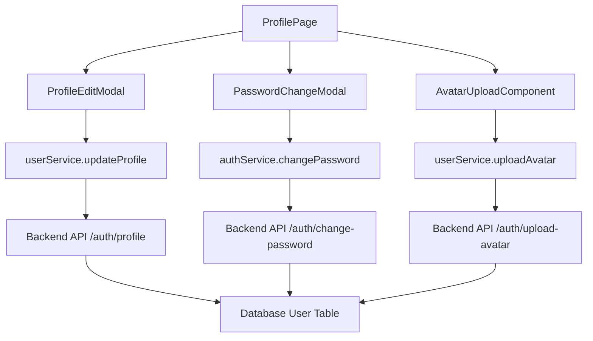

# Design Document

## Overview

사용자 프로필 관리 기능은 ReadZone 플랫폼에서 사용자가 자신의 개인정보를 안전하게 조회하고 수정할 수 있는 기능입니다. 현재 ProfilePage는 기본적인 UI만 구현되어 있고 실제 프로필 수정 기능은 미구현 상태입니다.

이 설계는 기존 인증 시스템과 사용자 관리 시스템을 활용하여 안전하고 사용자 친화적인 프로필 관리 인터페이스를 제공합니다.

## Architecture

### 시스템 구성 요소



### 데이터 플로우

1. **프로필 조회**: ProfilePage → authStore → 현재 사용자 정보 표시
2. **닉네임 수정**: 인라인 편집 → userService.updateProfile → 즉시 반영
3. **비밀번호 변경**: 모달 → 현재 비밀번호 확인 → 새 비밀번호 설정
4. **아바타 업로드**: 파일 선택 → 이미지 검증 → 업로드 → 프로필 업데이트

## Components and Interfaces

### 1. ProfilePage (수정)

기존 ProfilePage를 확장하여 프로필 편집 기능을 추가합니다.

```typescript
interface ProfilePageProps {}

interface ProfilePageState {
  isEditingDisplayName: boolean;
  showPasswordModal: boolean;
  showAvatarUpload: boolean;
  loading: boolean;
  error: string | null;
}
```

### 2. ProfileEditSection (신규)

닉네임 인라인 편집을 위한 컴포넌트입니다.

```typescript
interface ProfileEditSectionProps {
  user: User;
  onUpdateProfile: (data: Partial<User>) => Promise<void>;
  loading?: boolean;
}
```

### 3. PasswordChangeModal (신규)

비밀번호 변경을 위한 모달 컴포넌트입니다.

```typescript
interface PasswordChangeModalProps {
  isOpen: boolean;
  onClose: () => void;
  onSuccess: () => void;
}

interface PasswordChangeForm {
  currentPassword: string;
  newPassword: string;
  confirmPassword: string;
}
```

### 4. AvatarUpload (신규)

아바타 이미지 업로드를 위한 컴포넌트입니다.

```typescript
interface AvatarUploadProps {
  currentAvatar?: string;
  onUpload: (file: File) => Promise<string>;
  onRemove: () => Promise<void>;
  loading?: boolean;
}
```

### 5. 백엔드 API 확장

기존 authController에 새로운 엔드포인트를 추가합니다.

```typescript
// 새로 추가할 엔드포인트
PUT /api/auth/profile - 프로필 정보 업데이트 (닉네임, bio 등)
POST /api/auth/change-password - 비밀번호 변경
POST /api/auth/upload-avatar - 아바타 이미지 업로드
DELETE /api/auth/avatar - 아바타 이미지 삭제
```

## Data Models

### User 모델 (기존)

```typescript
interface User {
  id: string;
  email: string;           // 읽기 전용
  username: string;        // 읽기 전용 (로그인 ID)
  nickname: string;        // 수정 가능 (표시명)
  bio?: string;           // 수정 가능
  avatar?: string;        // 수정 가능
  isPublic: boolean;      // 수정 가능
  emailVerified: boolean; // 읽기 전용
  isActive: boolean;      // 읽기 전용
  createdAt: string;      // 읽기 전용
  updatedAt: string;      // 읽기 전용
}
```

### 프로필 업데이트 요청

```typescript
interface UpdateProfileRequest {
  nickname?: string;
  bio?: string;
  isPublic?: boolean;
}
```

### 비밀번호 변경 요청

```typescript
interface ChangePasswordRequest {
  currentPassword: string;
  newPassword: string;
}
```

## Error Handling

### 클라이언트 에러 처리

1. **네트워크 에러**: 재시도 옵션과 함께 에러 메시지 표시
2. **검증 에러**: 필드별 에러 메시지 표시
3. **권한 에러**: 로그인 페이지로 리다이렉트
4. **파일 업로드 에러**: 파일 크기/형식 에러 메시지

### 서버 에러 처리

1. **AUTH_006**: 현재 비밀번호 불일치
2. **VALIDATION_001**: 필수 필드 누락
3. **VALIDATION_003**: 비밀번호 복잡성 요구사항 미충족
4. **FILE_001**: 지원하지 않는 파일 형식
5. **FILE_002**: 파일 크기 초과

## Testing Strategy

### 단위 테스트

1. **ProfileEditSection**: 닉네임 편집 기능
2. **PasswordChangeModal**: 비밀번호 변경 폼 검증
3. **AvatarUpload**: 파일 업로드 및 검증
4. **userService**: API 호출 및 에러 처리

### 통합 테스트

1. **프로필 업데이트 플로우**: 닉네임 변경 → API 호출 → UI 업데이트
2. **비밀번호 변경 플로우**: 현재 비밀번호 확인 → 새 비밀번호 설정
3. **아바타 업로드 플로우**: 파일 선택 → 업로드 → 프로필 반영

### E2E 테스트

1. **전체 프로필 관리 시나리오**: 로그인 → 프로필 페이지 → 정보 수정 → 저장
2. **보안 테스트**: 잘못된 현재 비밀번호로 변경 시도
3. **파일 업로드 테스트**: 다양한 파일 형식 및 크기 테스트

## Security Considerations

### 인증 및 권한

1. **JWT 토큰 검증**: 모든 프로필 수정 요청에 대해 유효한 토큰 확인
2. **현재 비밀번호 확인**: 비밀번호 변경 시 반드시 현재 비밀번호 입력 요구
3. **세션 관리**: 비밀번호 변경 후 다른 세션 무효화 옵션

### 데이터 검증

1. **클라이언트 검증**: 실시간 입력 검증으로 사용자 경험 향상
2. **서버 검증**: 모든 입력에 대한 서버 측 검증 수행
3. **파일 검증**: 업로드 파일의 형식, 크기, 내용 검증

### 개인정보 보호

1. **민감 정보 마스킹**: 이메일 주소 부분 마스킹 표시
2. **로그 관리**: 비밀번호 등 민감 정보는 로그에 기록하지 않음
3. **HTTPS 통신**: 모든 프로필 관련 통신은 HTTPS로 암호화

## Performance Optimization

### 프론트엔드 최적화

1. **이미지 최적화**: 아바타 이미지 리사이징 및 압축
2. **지연 로딩**: 프로필 편집 모달은 필요시에만 로드
3. **캐싱**: 사용자 프로필 정보 로컬 캐싱

### 백엔드 최적화

1. **파일 업로드**: 멀티파트 업로드 및 진행률 표시
2. **이미지 처리**: 서버 측에서 이미지 리사이징 및 최적화
3. **데이터베이스**: 사용자 정보 업데이트 시 필요한 필드만 수정

## Accessibility

### 키보드 네비게이션

1. **Tab 순서**: 논리적인 탭 순서로 모든 요소 접근 가능
2. **키보드 단축키**: Enter로 편집 모드 진입, Escape로 취소

### 스크린 리더 지원

1. **ARIA 레이블**: 모든 폼 요소에 적절한 레이블 제공
2. **상태 알림**: 성공/실패 메시지를 스크린 리더에 알림
3. **의미있는 HTML**: 시맨틱 HTML 요소 사용

### 시각적 접근성

1. **색상 대비**: WCAG 2.1 AA 기준 준수
2. **포커스 표시**: 명확한 포커스 인디케이터
3. **텍스트 크기**: 확대 시에도 레이아웃 유지