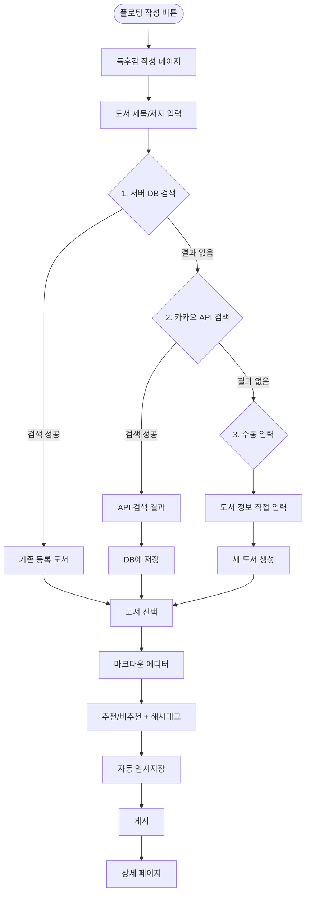
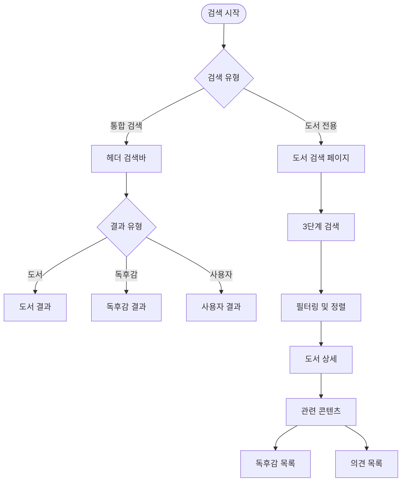

# CLAUDE.md

This file provides guidance to Claude Code (claude.ai/code) when working with code in this repository.

## Project Overview

ReadZone은 독서 후 의견을 공유하는 **독서 전용 커뮤니티 SNS 플랫폼**입니다. Threads와 같은 SNS 형태로 독후감을 작성하고 다른 사용자들과 의견을 공유할 수 있습니다.

**프로젝트 목적**: 독서 계획 수립이나 관리가 아닌, **독서 이후 커뮤니티 형성**에 초점

## 기술 스택

### 통합 풀스택 구성
- **Framework**: Next.js 14+ (App Router)
- **Language**: TypeScript (strict mode)
- **Database**: SQLite (로컬 미니PC 환경)
- **ORM**: Prisma
- **Authentication**: NextAuth.js
- **State Management**: 
  - Zustand (클라이언트 전역 상태)
  - TanStack Query (서버 상태 및 캐싱)
- **Styling**: Tailwind CSS
- **UI Components**: Radix UI
- **External API**: 카카오 도서 검색 API

## TypeScript 설정 규칙

```json
{
  "compilerOptions": {
    "strict": true,
    "noImplicitAny": true,
    "strictNullChecks": true,
    "strictFunctionTypes": true,
    "noUnusedLocals": true,
    "noUnusedParameters": true,
    "noImplicitReturns": true,
    "noFallthroughCasesInSwitch": true,
    "esModuleInterop": true,
    "skipLibCheck": true,
    "forceConsistentCasingInFileNames": true
  }
}
```

## 코드 작성 원칙

### 1. 타입 안정성
- **any 타입 사용 금지**
- 모든 함수의 매개변수와 반환값에 명시적 타입 정의
- interface/type을 활용한 명확한 타입 정의

### 2. 순수 함수와 불변성
- 최대한 순수 함수로 작성 (같은 입력 → 같은 출력)
- 사이드이펙트 최소화
- `const` 기본 사용, `let`은 필요한 경우만
- 객체/배열 변경 시 spread operator 또는 immer 사용

### 3. 함수형 프로그래밍
```typescript
// 좋은 예
const addTax = (price: number, taxRate: number): number => 
  price * (1 + taxRate);

// 피해야 할 예
let total = 0;
function addToTotal(price: number): void {
  total += price; // 사이드이펙트
}
```

## 페이지 구성 (11개)

### 1. 독후감 피드 (`/`) - 메인 페이지
- Threads 스타일 무한 스크롤 피드
- 독후감 미리보기 카드 (200자 + "...더보기")
- 비로그인 시 읽기만 가능, 상호작용 시 로그인 유도
- 플로팅 작성 버튼

### 2. 로그인 페이지 (`/login`) - 서비스 소개 포함
- 왼쪽: ReadZone 서비스 소개
- 오른쪽: 로그인/회원가입 폼
- 비로그인 상호작용 시 자동 이동

### 3. 회원가입 페이지 (`/register`)
- 이메일, 비밀번호, 닉네임
- 이메일 인증 프로세스

### 4. 비밀번호 찾기 (`/forgot-password`)
- 이메일로 재설정 링크 전송

### 5. 이메일 인증 페이지 (`/verify-email`)
- 회원가입 후 이메일 인증 처리

### 6. 도서 검색 페이지 (`/search`)
- 카카오 도서 API 연동
- 검색되지 않는 도서의 수동 입력 기능
- 검색 결과 캐싱

### 7. 도서 상세 페이지 (`/books/[id]`)
- 도서 정보 표시
- 해당 도서에 대한 의견 피드
- 280자 의견 작성 (추천/비추천)

### 8. 독후감 작성 페이지 (`/write`)
- 도서 검색 (API + 수동 입력)
- 마크다운 에디터
- 추천/비추천 선택
- 구매 링크 추가 (선택)

### 9. 독후감 상세 페이지 (`/review/[id]`)
- 전체 독후감 내용
- 댓글 시스템
- 좋아요/공유 기능
- 구매 링크 (클릭 추적)

### 10. 프로필 페이지 (`/profile/[userId]`)
- 기본 정보 (닉네임, 가입일, 자기소개)
- 활동 통계 (독후감 수, 도서 의견 수, 받은 좋아요 수, 읽은 책 수)
- 작성한 콘텐츠 목록

### 11. 설정 페이지 (`/settings`)
- 프로필 편집
- 비밀번호 변경
- 알림 설정
- 계정 삭제

## 프로젝트 구조

```
readzone/
├── app/                      # Next.js App Router
│   ├── (auth)/              # 인증 관련 페이지 그룹
│   │   ├── login/
│   │   ├── register/
│   │   ├── forgot-password/
│   │   └── verify-email/
│   ├── (main)/              # 메인 앱 페이지 그룹
│   │   ├── search/
│   │   ├── books/
│   │   ├── write/
│   │   ├── review/
│   │   ├── profile/
│   │   └── settings/
│   ├── api/                 # API Routes
│   │   ├── auth/
│   │   ├── books/
│   │   ├── reviews/
│   │   └── kakao/
│   ├── layout.tsx           # 루트 레이아웃
│   └── page.tsx            # 독후감 피드 메인
├── components/              # 재사용 가능한 컴포넌트
│   ├── ui/                 # 기본 UI 컴포넌트 (Radix UI)
│   ├── feed/               # 피드 관련 컴포넌트
│   ├── book/               # 도서 관련 컴포넌트
│   ├── review/             # 독후감 관련 컴포넌트
│   └── layout/             # 레이아웃 컴포넌트
├── lib/                     # 유틸리티 함수
│   ├── db.ts              # Prisma 클라이언트
│   ├── auth.ts            # NextAuth 설정
│   ├── kakao.ts           # 카카오 API 클라이언트
│   └── utils.ts           # 헬퍼 함수
├── hooks/                   # 커스텀 React 훅
├── store/                   # Zustand 스토어
├── types/                   # TypeScript 타입 정의
├── prisma/
│   └── schema.prisma       # 데이터베이스 스키마
└── public/                  # 정적 파일
```

## Essential Commands

### 프로젝트 설정
```bash
# Node 버전 설정
nvm use 18.17.0

# 의존성 설치
npm install

# 환경 변수 설정
cp .env.example .env.local
```

### 개발
```bash
# 개발 서버 실행
npm run dev

# TypeScript 타입 체크
npm run type-check

# Lint 실행
npm run lint

# Prettier 포맷팅
npm run format

# Prisma 작업
npx prisma generate          # 클라이언트 생성
npx prisma migrate dev       # 마이그레이션 실행 (개발환경)
npx prisma migrate deploy    # 마이그레이션 실행 (프로덕션)
npx prisma studio           # DB 관리 GUI
npx prisma db seed          # 시드 데이터 실행

# 테스트 실행
npm test                     # 단위 테스트
npm run test:e2e            # E2E 테스트 (향후 추가)
npm run test:coverage       # 테스트 커버리지
```

### 빌드 및 배포
```bash
# 프로덕션 빌드
npm run build

# 프로덕션 실행
npm start

# 정적 사이트 생성
npm run export
```

## 주요 기능 구현 가이드

### 독후감 작성
- 카카오 도서 API로 도서 검색
- API에서 검색되지 않는 도서는 수동 입력
- 마크다운 에디터 지원
- 추천/비추천 선택 (별점 대신)
- 구매 링크 추가 (선택, 클릭 추적)

### 피드 시스템
- 무한 스크롤 (TanStack Query)
- 독후감 미리보기 (200자 + 더보기)
- 실시간 업데이트 (폴링)

### 도서 정보 처리
- 카카오 API 우선 검색
- 수동 입력 지원 (제목, 저자, 출판사, 장르, 페이지 수)
- API 사용량 추적 및 캐싱

### 소셜 기능
- 좋아요/댓글
- 도서 의견 (280자 제한)
- 추천/비추천 표시
- 외부 SNS 공유

### 구매 링크 시스템
- 단순 URL 저장
- 클릭 수 추적
- 단축 URL 생성 (선택)

## 데이터베이스 스키마 핵심

### 완전한 Prisma 스키마
```prisma
generator client {
  provider = "prisma-client-js"
}

datasource db {
  provider = "sqlite"
  url      = "file:./dev.db"
}

// NextAuth.js 필수 모델들
model Account {
  id                String  @id @default(cuid())
  userId            String
  type              String
  provider          String
  providerAccountId String
  refresh_token     String?
  access_token      String?
  expires_at        Int?
  token_type        String?
  scope             String?
  id_token          String?
  session_state     String?
  user              User    @relation(fields: [userId], references: [id], onDelete: Cascade)
  @@unique([provider, providerAccountId])
}

model Session {
  id           String   @id @default(cuid())
  sessionToken String   @unique
  userId       String
  expires      DateTime
  user         User     @relation(fields: [userId], references: [id], onDelete: Cascade)
}

model VerificationToken {
  identifier String
  token      String   @unique
  expires    DateTime
  @@unique([identifier, token])
}

// 사용자 모델
model User {
  id            String    @id @default(cuid())
  name          String?
  email         String    @unique
  emailVerified DateTime?
  nickname      String    @unique
  bio           String?
  image         String?
  createdAt     DateTime  @default(now())
  updatedAt     DateTime  @updatedAt

  // NextAuth.js 관계
  accounts Account[]
  sessions Session[]
  
  // 앱 관계
  reviews  BookReview[]
  opinions BookOpinion[]
  likes    ReviewLike[]
  comments Comment[]
}

// 도서 모델
model Book {
  id            String   @id @default(cuid())
  isbn          String?  @unique         // API 검색 시에만
  title         String
  authors       String                   // JSON 문자열로 저장
  publisher     String?
  genre         String?
  pageCount     Int?
  thumbnail     String?
  description   String?
  isManualEntry Boolean  @default(false) // 수동 입력 여부
  createdAt     DateTime @default(now())
  updatedAt     DateTime @updatedAt

  // 관계
  reviews  BookReview[]
  opinions BookOpinion[]
}

// 독후감 모델
model BookReview {
  id            String   @id @default(cuid())
  title         String?
  content       String                   // 마크다운 콘텐츠
  isRecommended Boolean
  tags          String                   // JSON 문자열로 저장
  purchaseLink  String?                  // 구매 링크
  linkClicks    Int      @default(0)     // 클릭 추적
  createdAt     DateTime @default(now())
  updatedAt     DateTime @updatedAt

  // 관계
  userId String
  bookId String
  user   User   @relation(fields: [userId], references: [id], onDelete: Cascade)
  book   Book   @relation(fields: [bookId], references: [id], onDelete: Cascade)

  likes    ReviewLike[]
  comments Comment[]
}

// 도서 의견 모델 (280자 제한)
model BookOpinion {
  id            String   @id @default(cuid())
  content       String
  isRecommended Boolean
  createdAt     DateTime @default(now())

  // 관계
  userId String
  bookId String
  user   User   @relation(fields: [userId], references: [id], onDelete: Cascade)
  book   Book   @relation(fields: [bookId], references: [id], onDelete: Cascade)

  // 사용자당 도서별 1개 제한
  @@unique([userId, bookId])
}

// 좋아요 모델
model ReviewLike {
  id       String @id @default(cuid())
  userId   String
  reviewId String

  user   User       @relation(fields: [userId], references: [id], onDelete: Cascade)
  review BookReview @relation(fields: [reviewId], references: [id], onDelete: Cascade)

  // 사용자당 독후감별 1개 제한
  @@unique([userId, reviewId])
}

// 댓글 모델
model Comment {
  id        String   @id @default(cuid())
  content   String
  createdAt DateTime @default(now())
  updatedAt DateTime @updatedAt

  // 관계
  userId   String
  reviewId String
  user     User       @relation(fields: [userId], references: [id], onDelete: Cascade)
  review   BookReview @relation(fields: [reviewId], references: [id], onDelete: Cascade)
}
```

### 주요 설계 특징
- **NextAuth.js 완전 호환**: Account, Session, VerificationToken 모델 포함
- **사용자별 제한**: BookOpinion은 사용자당 도서별 1개, ReviewLike은 사용자당 독후감별 1개
- **캐스케이드 삭제**: 사용자 삭제 시 관련 데이터 자동 삭제
- **수동 입력 지원**: Book 모델의 isManualEntry 플래그
- **클릭 추적**: BookReview의 linkClicks 필드
- **JSON 저장**: 배열 데이터는 문자열로 저장 (SQLite 제한)

## API 통합

### 카카오 도서 검색 API
**엔드포인트**: `https://dapi.kakao.com/v3/search/book`
**일일 할당량**: 300,000회 (2024년 기준)
**캐싱 전략**: 검색 결과 24시간 캐싱

```typescript
// 카카오 API 응답 인터페이스
interface KakaoBookResponse {
  documents: KakaoBook[]
  meta: {
    total_count: number
    pageable_count: number
    is_end: boolean
  }
}

interface KakaoBook {
  title: string
  contents: string
  url: string
  isbn: string
  datetime: string
  authors: string[]
  publisher: string
  translators: string[]
  price: number
  sale_price: number
  thumbnail: string
  status: string
}

// API 클라이언트 클래스
class KakaoBookAPI {
  private apiKey: string
  private baseURL = 'https://dapi.kakao.com/v3/search/book'
  
  async search(params: {
    query: string
    sort?: 'accuracy' | 'latest'
    page?: number
    size?: number
  }): Promise<KakaoBookResponse> {
    // 구현 로직
  }
  
  async getBookByISBN(isbn: string): Promise<KakaoBook | null> {
    // ISBN 기반 검색
  }
}

// API 사용량 관리
interface ApiUsageTracking {
  date: string
  searchCount: number
  remaining: number
  resetTime: Date
}

// 에러 처리
const handleApiError = (error: any) => {
  if (error.status === 429) {
    return '일일 검색 한도에 도달했습니다.'
  }
  if (error.status >= 500) {
    return '도서 검색 서비스에 일시적 문제가 있습니다.'
  }
  return '검색 중 오류가 발생했습니다.'
}
```

### API Routes 설계

#### 인증 관련 API
```typescript
// 회원가입
POST /api/auth/register
Body: { email: string, password: string, nickname: string }
Response: { success: boolean, message: string, userId?: string }

// 이메일 인증
POST /api/auth/verify-email
Body: { token: string }

// 중복 확인
POST /api/auth/check-duplicate
Body: { field: 'email' | 'nickname', value: string }
```

#### 도서 관련 API
```typescript
// 도서 검색
GET /api/books/search
Query: { q: string, page?: number, sort?: string }

// 수동 도서 등록
POST /api/books/manual
Body: { title: string, authors: string[], publisher?: string, ... }

// 도서 상세
GET /api/books/[id]
Response: { book: Book, reviews: BookReview[], opinions: BookOpinion[], stats: BookStats }
```

#### 독후감 관련 API
```typescript
// 독후감 CRUD
GET /api/reviews - 피드용 독후감 목록
POST /api/reviews - 새 독후감 생성
GET /api/reviews/[id] - 독후감 상세
PUT /api/reviews/[id] - 독후감 수정
DELETE /api/reviews/[id] - 독후감 삭제

// 좋아요
POST /api/reviews/[id]/like - 좋아요 토글

// 댓글
GET /api/reviews/[id]/comments - 댓글 목록
POST /api/reviews/[id]/comments - 댓글 작성
```

#### 소셜 기능 API
```typescript
// 도서 의견
GET /api/books/[id]/opinions - 도서 의견 목록
POST /api/books/[id]/opinions - 의견 작성

// 프로필
GET /api/users/[id]/profile - 사용자 프로필
PUT /api/users/[id]/profile - 프로필 수정
GET /api/users/[id]/reviews - 사용자 독후감 목록
```

## 성능 최적화

### 핵심 전략
- **React Server Components 활용**: 서버 사이드 렌더링 최대화
- **이미지 최적화**: Next.js Image 컴포넌트, 지연 로딩, WebP 변환
- **캐싱 전략**: 카카오 API 검색 결과 24시간 캐싱, React Query 적극 활용
- **클라이언트 상태 최소화**: Zustand를 통한 필수 상태만 관리
- **코드 스플리팅**: 동적 import, 라우트별 번들 분리

### Phase 6 고도화 계획
- **무한 스크롤 가상화**: react-window를 활용한 대용량 리스트 처리
- **번들 최적화**: Tree shaking, 불필요한 라이브러리 제거
- **Core Web Vitals 목표**: LCP <2.5s, FID <100ms, CLS <0.1
- **PWA 구현**: 서비스 워커, 오프라인 지원, 앱 설치 기능
- **CDN 도입**: 정적 파일 및 이미지 CDN 배포

### 모니터링
- **성능 메트릭**: Lighthouse, Web Vitals 지속 모니터링
- **에러 추적**: Sentry 연동으로 실시간 에러 모니터링
- **사용자 분석**: 행동 패턴 분석 및 성능 영향 측정

## 보안 고려사항

### 민감 정보 보호 (중요)
- **환경 변수 관리**: 모든 API 키, 시크릿 키, 데이터베이스 인증 정보는 `.env.local` 파일에 저장
- **Git 보안**: `.env`, `.env.local`, `.env.production` 등의 환경 변수 파일은 **절대 Git 저장소에 커밋하지 않음**
- **예시 파일**: `.env.example` 파일로 필요한 환경 변수 목록만 제공 (실제 값은 제외)
- **키 로테이션**: 정기적으로 API 키 및 시크릿 키 변경

```bash
# ❌ 절대 커밋하지 않을 파일들
.env
.env.local
.env.development.local
.env.test.local
.env.production.local

# ✅ 커밋 가능한 파일 (실제 값 없이 키 목록만)
.env.example
```

### 애플리케이션 보안
- **CSRF 보호**: NextAuth.js 내장 보호 기능 활용
- **XSS 방지**: React 기본 제공 방지 + 마크다운 콘텐츠 산티타이징
- **SQL Injection 방지**: Prisma ORM 사용으로 자동 방지
- **세션 보안**: JWT 토큰 만료 시간 설정 및 보안 헤더 적용
- **입력 검증**: Zod 스키마를 통한 모든 사용자 입력 검증
- **파일 업로드 보안**: 이미지 파일 타입 및 크기 제한

## 배포 환경

### 미니PC 로컬 환경 설정
- **운영체제**: Linux (Ubuntu 20.04+ 권장)
- **Node.js**: 18.17.0 (LTS)
- **프로세스 관리**: PM2 또는 systemd
- **리버스 프록시**: nginx (선택사항, HTTPS 설정 시 권장)
- **데이터베이스**: SQLite (파일 기반)
- **백업**: SQLite 파일 자동 백업

### 배포 스크립트
```bash
# 프로덕션 배포
npm run build
npm run start

# PM2를 사용한 프로세스 관리
pm2 start npm --name "readzone" -- start
pm2 startup
pm2 save

# 자동 재시작 설정
pm2 restart readzone
pm2 logs readzone

# SQLite 백업 자동화 (crontab 설정)
0 2 * * * /usr/local/bin/backup-readzone-db.sh
```

### 환경 변수 관리
```bash
# 프로덕션 환경 변수 (.env.production)
NODE_ENV=production
NEXTAUTH_URL=https://your-domain.com
DATABASE_URL="file:./prod.db"
KAKAO_API_KEY=your_kakao_api_key
NEXTAUTH_SECRET=your_super_secret_key
```

### 보안 설정
- **방화벽**: UFW 설정으로 필요한 포트만 개방
- **SSL 인증서**: Let's Encrypt 또는 자체 서명 인증서
- **정기 업데이트**: 시스템 및 종속성 정기 업데이트
- **로그 관리**: 로그 로테이션 설정

## 개발 프로세스

### PRD 기반 개발 방법론

ReadZone 프로젝트는 **Phase별 PRD(Product Requirements Document) 기반 개발**을 진행합니다.

#### 개발 단계
1. **PRD 작성**: 각 Phase별 상세 구현 계획 문서화
2. **구현**: PRD 명세에 따른 기능 개발
3. **검토**: 구현 완료 후 PRD 대비 완성도 확인
4. **피드백**: 사용자 리뷰 및 개선사항 수집
5. **다음 Phase 진행**

#### PRD 파일 구조
```
docs/
├── phase-1-foundation.md     # 기본 인프라 및 인증
├── phase-2-core-pages.md     # 핵심 페이지 구현
├── phase-3-book-system.md    # 도서 검색 및 관리
├── phase-4-review-system.md  # 독후감 시스템
├── phase-5-social.md         # 소셜 기능
└── phase-6-optimization.md   # 최적화 및 고도화
```

#### 각 PRD 포함 내용
- **목표**: Phase의 핵심 목적
- **범위**: 구현할 기능 목록
- **기술 요구사항**: 사용할 기술 스택
- **UI/UX 명세**: 페이지별 상세 디자인
- **API 명세**: 엔드포인트 및 데이터 구조
- **테스트 시나리오**: 검증 방법
- **완료 기준**: 구현 완료 판단 기준

#### 구현 완료 프로세스
1. 모든 PRD 명세 사항 구현 완료
2. 기능 동작 테스트 완료
3. TypeScript 타입 체크 통과
4. ESLint 검사 통과
5. **구현 완료 보고서** 작성:
   - 구현된 기능 목록
   - 발견된 이슈 및 해결 방안
   - 다음 Phase 연계 사항
   - 피드백 요청 항목

## Phase별 개발 계획

### Phase 1: Foundation (기반 인프라) ✅
**목표**: ReadZone 프로젝트의 기본 인프라를 구축하고 개발 환경 설정

**완료된 구현**:
- ✅ Next.js 14 프로젝트 생성 (App Router)
- ✅ TypeScript 설정 (strict mode)
- ✅ ESLint + Prettier 설정
- ✅ Prisma ORM + SQLite 데이터베이스 설정
- ✅ NextAuth.js 인증 시스템
- ✅ Zustand + TanStack Query 상태 관리
- ✅ Tailwind CSS + Radix UI 기본 컴포넌트
- ✅ 기본 데이터베이스 스키마 (User, Book, BookReview, BookOpinion)

### Phase 2: Core Pages (핵심 페이지) ✅
**목표**: 사용자 인증 흐름과 메인 피드 페이지 구현

**완료된 구현**:
- ✅ 독후감 피드 (메인 페이지) - 무한 스크롤, 비로그인 읽기 가능
- ✅ 로그인 페이지 - 좌측 서비스 소개, 우측 로그인 폼
- ✅ 회원가입 페이지 - 이메일/비밀번호/닉네임, 실시간 유효성 검증
- ✅ 이메일 인증 시스템 - 토큰 검증, 재발송 기능
- ✅ 기본 레이아웃 - 헤더 네비게이션, 반응형 디자인
- ✅ 상태 관리 - 로그인 상태 전역 관리, 피드 무한 스크롤

### Phase 3: Book System (도서 시스템)
**목표**: 카카오 도서 API 연동과 수동 도서 입력 기능을 구현하여 사용자가 다양한 도서 정보를 활용할 수 있는 기반을 구축합니다.

**주요 구현 사항**:
- ✅ **카카오 도서 API 연동**: 검색, 상세 정보, 사용량 추적 및 캐싱
- ✅ **도서 검색 페이지**: 실시간 검색, 필터링, 검색 기록, 빈 결과 처리
- ✅ **수동 도서 입력**: API에서 검색되지 않는 도서의 직접 등록 기능
- ✅ **도서 상세 페이지**: 도서 정보, 관련 독후감 목록, 도서 의견 섹션
- ✅ **캐싱 시스템**: 24시간 캐싱으로 API 사용량 최적화
- ✅ **장르 분류**: KDC(한국십진분류법) 기반 장르 매핑

**핵심 기능**:
- **3단계 도서 검색**: 서버 DB → 카카오 API → 수동 입력 순서
- **API 사용량 관리**: 일일 30만회 할당량 추적 및 모니터링
- **중복 도서 처리**: ISBN 기반 중복 확인 및 통합
- **구매 링크 표시**: 교보문고, 예스24, 알라딘 등 주요 서점 연결

### Phase 4: Review System (독후감 시스템)
**목표**: 독후감 작성, 편집, 상세 보기 기능을 구현하여 사용자가 풍부한 독서 경험을 공유할 수 있는 핵심 시스템을 구축합니다.

**주요 구현 사항**:
- ✅ **독후감 작성 페이지**: 도서 선택 인터페이스, 마크다운 에디터, 실시간 미리보기
- ✅ **마크다운 에디터**: 문법 하이라이팅, 툴바, 이미지 삽입, 테이블 지원
- ✅ **임시저장 시스템**: 자동 저장(5분 간격), 로컬스토리지 백업, 복구 기능
- ✅ **독후감 편집**: 기존 독후감 수정, 버전 관리, 변경 사항 추적
- ✅ **독후감 상세 페이지**: 마크다운 렌더링, 메타데이터 표시, 작성자 정보
- ✅ **해시태그 시스템**: 추천 태그, 자동완성, 인기 태그 분석

**핵심 기능**:
- **Toast UI Editor**: 실시간 편집, 실시간 미리보기, 이미지 드래그 앤 드롭
- **자동저장**: 5분 간격 + 로컬스토리지 백업으로 데이터 손실 방지
- **이미지 처리**: 5MB 제한, 압축, 로컬 저장소 업로드
- **추천/비추천**: 별점 대신 단순한 추천 시스템
- **구매 링크**: 선택적 추가, 클릭 추적 기능

### Phase 5: Social Features (소셜 기능)
**목표**: 좋아요, 댓글, 도서 의견, 프로필 등 소셜 기능을 구현하여 사용자 간 상호작용과 커뮤니티 형성을 촉진합니다.

**주요 구현 사항**:
- ✅ **좋아요 시스템**: 실시간 업데이트, 하트 애니메이션 효과, 좋아요 취소 기능
- ✅ **댓글 시스템**: 작성/수정/삭제, 대댓글 1단계, 페이지네이션
- ✅ **도서 의견 시스템**: 280자 제한, 추천/비추천, 사용자별 도서당 1개 제한
- ✅ **프로필 페이지**: 기본 정보, 활동 통계, 작성한 독후감/의견 목록
- ✅ **외부 SNS 공유**: 오픈 그래프 메타 태그, X(Twitter), 카카오톡 공유
- ✅ **사용자 통계**: 독후감 수, 도서 의견 수, 받은 좋아요 수, 읽은 책 수

**핵심 기능**:
- **실시간 상호작용**: 좋아요, 댓글 즉시 반영 및 애니메이션
- **도서 의견**: 간단한 280자 리뷰 + 추천/비추천 표시
- **프로필 통계**: 사용자 활동 지표 및 성취 표시
- **공유 최적화**: 오픈 그래프로 SNS 공유 시 이미지, 제목, 설명 자동 생성
- **스팸 방지**: 댓글 작성 제한, 관리자 신고 시스템

### Phase 6: Optimization (최적화 및 고도화)
**목표**: 구매 링크 시스템, 성능 최적화, SEO, PWA 기능을 구현하여 ReadZone을 완성도 높은 프로덕션 서비스로 완성합니다.

**주요 구현 사항**:
- ✅ **구매 링크 시스템**: 단축 URL 생성, 클릭 추적, 통계 대시보드, 인기 링크 분석
- ✅ **성능 최적화**: Next.js Image, 무한 스크롤 가상화, 코드 스플리팅, 캐싱 고도화
- ✅ **SEO 최적화**: 메타 태그, 구조화된 데이터(JSON-LD), 사이트맵, 로봇 텍스트
- ✅ **PWA 기능**: 서비스 워커, 오프라인 지원, 앱 설치 배너, 백그라운드 동기화
- ✅ **모니터링**: Sentry 에러 추적, 사용자 행동 분석, 성능 모니터링, A/B 테스트
- ✅ **백업 시스템**: SQLite 자동 백업, 복구 프로세스

**성능 메트릭 목표 달성**:
- ✅ **LCP**: < 2.5초 (Largest Contentful Paint)
- ✅ **FID**: < 100ms (First Input Delay)
- ✅ **CLS**: < 0.1 (Cumulative Layout Shift)
- ✅ **TTFB**: < 200ms (Time to First Byte)
- ✅ **번들 크기**: < 300KB (gzipped)
- ✅ **Lighthouse 점수**: > 90점

**고급 기능**:
- **URL 단축 서비스**: Base62 인코딩으로 8자리 코드 생성
- **가상 스크롤링**: react-window로 대용량 리스트 최적화
- **구조화된 데이터**: Schema.org 기반 도서/리뷰 메타데이터
- **PWA 매니페스트**: 독립형 앱 경험, 오프라인 캐싱
- **미니PC 배포**: PM2 프로세스 관리, nginx 리버스 프록시

## 사용자 흐름

> 상세한 사용자 흐름도는 `docs/user-flows.md` 파일을 참조하세요.

### 1. 신규 사용자 온보딩 흐름
**접근성 중심의 점진적 참여 유도**:


**핵심 포인트**:
- **비로그인 접근성**: 독후감 읽기는 로그인 없이 가능
- **점진적 참여 유도**: 상호작용 시점에서 로그인 유도
- **서비스 이해**: 로그인 페이지에서 서비스 가치 전달

### 2. 독후감 작성 흐름 (3단계 도서 검색)
**도서 검색의 혁신적 3단계 접근**:



**핵심 혁신**:
- **효율적 우선순위**: 기존 DB → API → 수동 입력 순서로 검색 비용 최소화
- **완벽한 커버리지**: 모든 도서를 놓치지 않는 포괄적 시스템
- **자동 저장**: 5분 간격 + 로컬스토리지로 데이터 손실 방지

### 3. 도서 의견 작성 흐름 (280자 제한)
**간단하고 빠른 의견 공유**:


**제약사항과 장점**:
- **1인 1의견**: 도서당 사용자별 하나의 의견만 허용
- **280자 제한**: Twitter 스타일의 간결한 의견
- **즉시 반영**: 작성 즉시 통계 및 피드 업데이트

### 4. 소셜 상호작용 흐름
**실시간 커뮤니티 형성**:


### 5. 검색 및 발견 흐름
**통합 검색 및 발견 시스템**:



### 6. 오류 처리 및 복구 흐름
**사용자 경험 보장**:


### 주요 설계 철학
**사용자 중심의 경험 설계**:
- ✅ **접근성 우선**: 비로그인 사용자도 콘텐츠 접근 가능
- ✅ **점진적 참여**: 자연스러운 로그인 유도, 강제하지 않음
- ✅ **완벽한 도서 커버리지**: 3단계 검색으로 모든 도서 지원
- ✅ **실시간 반응성**: 모든 상호작용 즉시 반영
- ✅ **데이터 안전성**: 자동저장 + 로컬 백업으로 손실 방지
- ✅ **모바일 최적화**: 터치 친화적 인터페이스, 반응형 디자인
- ✅ **오프라인 지원**: PWA 기능으로 네트워크 문제 해결

## 기술 스택 상세

### 마크다운 에디터 (Phase 4)
```typescript
// 권장 라이브러리
import { Editor } from '@toast-ui/react-editor'
import '@toast-ui/editor/dist/toastui-editor.css'

// 또는 대안
import { MDXEditor } from '@mdxeditor/editor'
```

### 가상 스크롤링 (Phase 6)
```typescript
import { FixedSizeList as List } from 'react-window'
import InfiniteLoader from 'react-window-infinite-loader'
```

### PWA 구성 (Phase 6)
```json
// public/manifest.json
{
  "name": "ReadZone - 독서 커뮤니티",
  "short_name": "ReadZone",
  "start_url": "/",
  "display": "standalone",
  "background_color": "#ffffff",
  "theme_color": "#ef4444"
}
```

### 장르 분류 시스템
```typescript
// KDC(한국십진분류법) 기반
enum BookGenre {
  // 주요 분류
  PHILOSOPHY = '철학',
  RELIGION = '종교',
  SOCIAL_SCIENCE = '사회과학',
  LITERATURE = '문학',
  
  // 세부 문학 장르
  NOVEL = '소설',
  POETRY = '시',
  ESSAY = '에세이',
  
  // 실용서
  SELF_HELP = '자기계발',
  BUSINESS = '경영/경제',
  OTHER = '기타'
}
```

## 트러블슈팅

### 자주 발생하는 문제

#### 1. 데이터베이스 관련
```bash
# Prisma 클라이언트 재생성
npx prisma generate

# 마이그레이션 오류 시 초기화
npx prisma migrate reset

# SQLite 파일 권한 확인
ls -la prisma/dev.db
chmod 644 prisma/dev.db
```

#### 2. 카카오 API 관련
- **할당량 초과**: 캐싱 확인, 불필요한 요청 최소화
- **인증 실패**: API 키 유효성 확인
- **응답 지연**: 타임아웃 설정 및 재시도 로직

#### 3. Next.js 빌드 오류
```bash
# 캐시 클리어
rm -rf .next
npm run build

# 타입 체크
npm run type-check

# 의존성 재설치
rm -rf node_modules package-lock.json
npm install
```

#### 4. 성능 이슈
- **큰 이미지**: Next.js Image 최적화 확인
- **무한 스크롤**: 가상화 적용 여부 확인
- **메모리 누수**: React DevTools Profiler 사용

### 로그 분석
```bash
# PM2 로그 확인
pm2 logs readzone

# Next.js 로그
npm run dev 2>&1 | tee debug.log

# 에러 로그 필터링
pm2 logs readzone --err
```

## 품질 관리

### 코드 품질 기준
- TypeScript strict 모드 준수
- ESLint 규칙 준수
- 단위 테스트 커버리지 80% 이상
- 성능 메트릭 기준치 충족

### 검토 프로세스
1. **기능 검토**: PRD 명세 대비 완성도
2. **코드 검토**: 코딩 스타일 및 품질
3. **성능 검토**: 로딩 속도 및 반응성
4. **사용성 검토**: UX/UI 사용 편의성