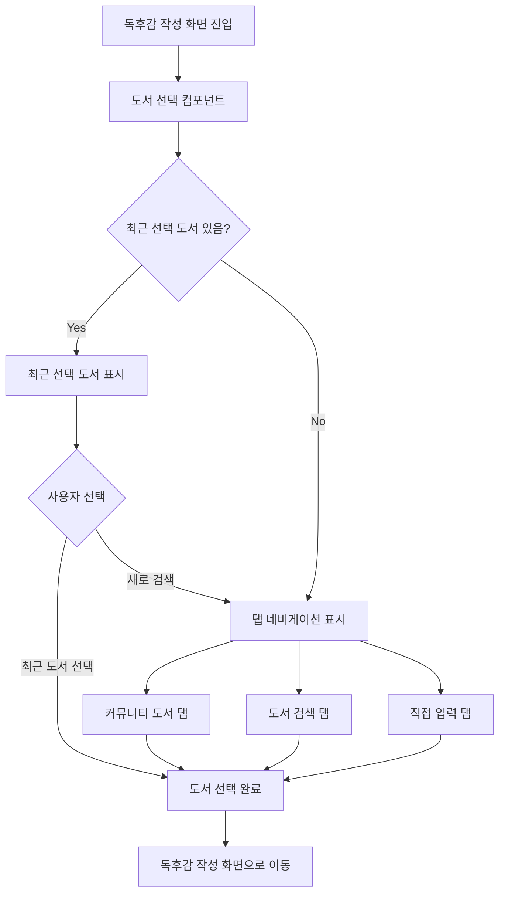
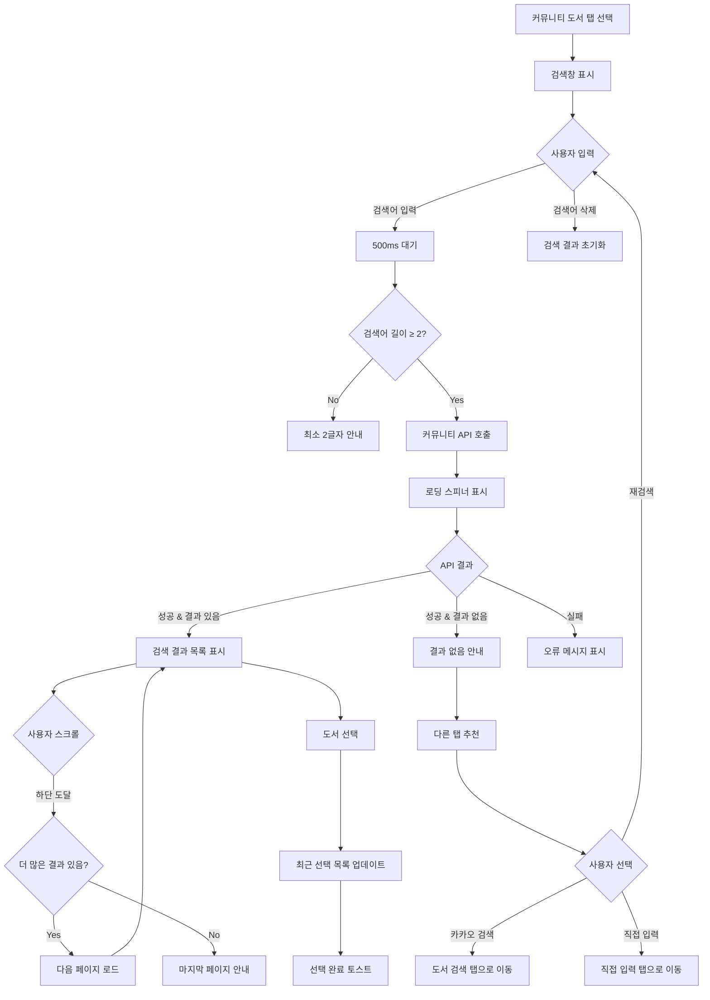
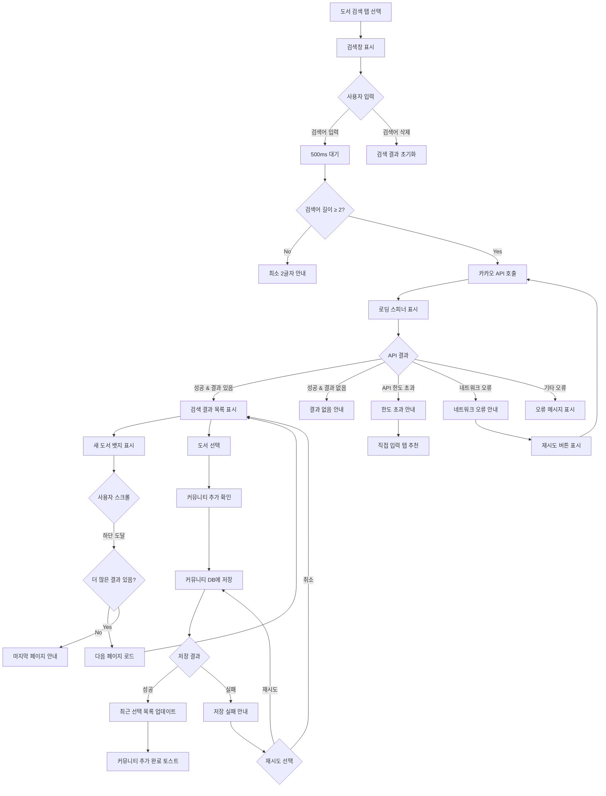
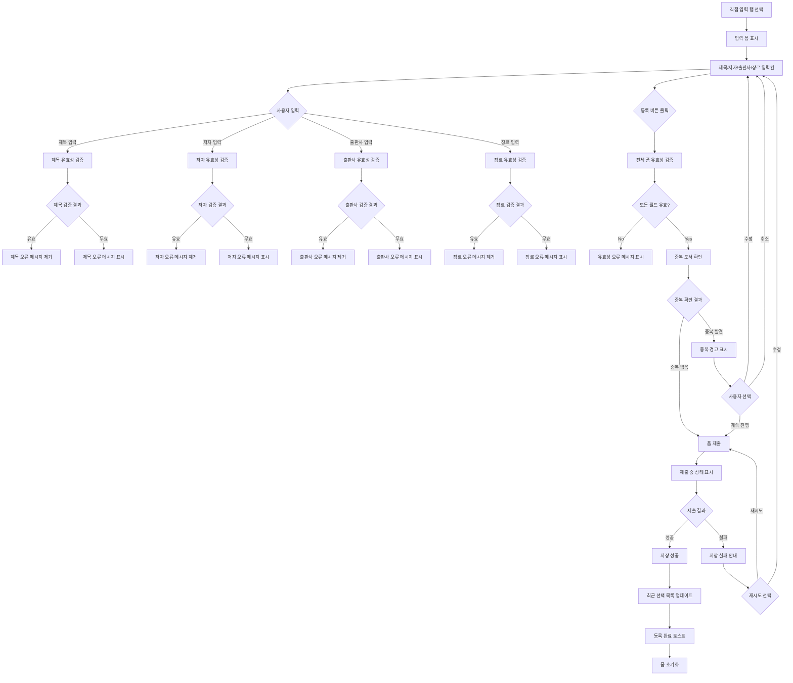
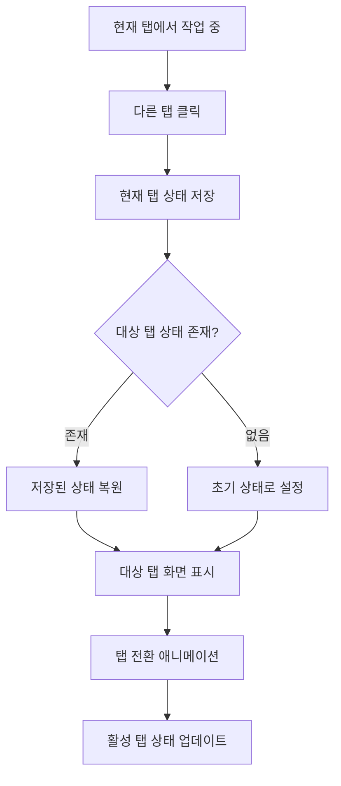
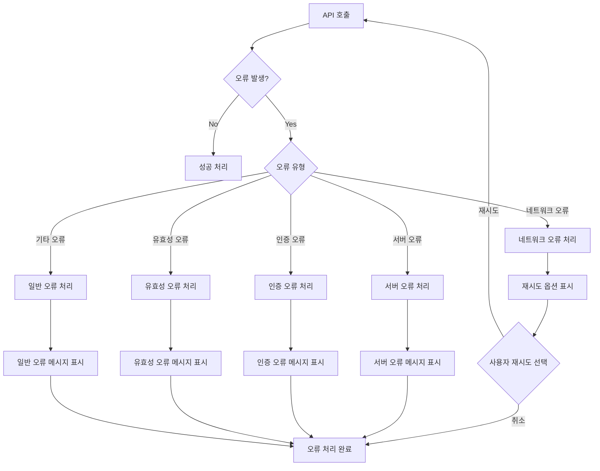
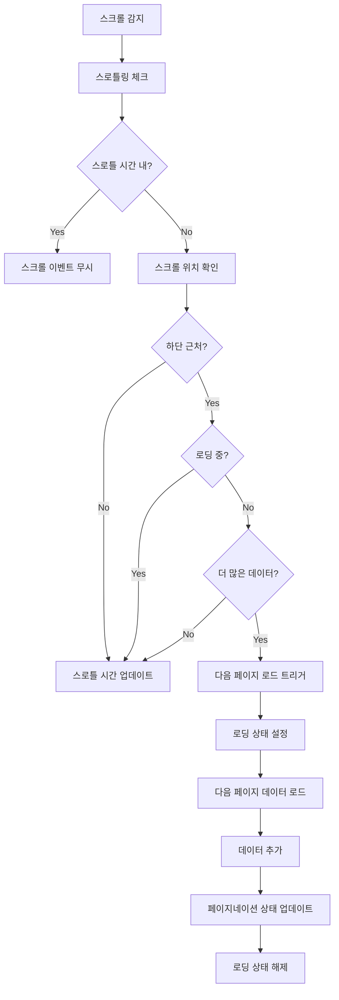
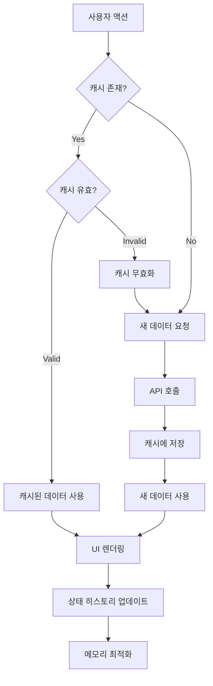

# 도서 검색 시스템 사용자 흐름도

## 1. 전체 시스템 플로우

## 2. 상세 탭별 플로우

### 2.1 커뮤니티 도서 탭 플로우

### 2.2 도서 검색 (카카오 API) 탭 플로우

### 2.3 직접 입력 탭 플로우

## 3. 공통 상호작용 플로우

### 3.1 탭 전환 플로우

### 3.2 오류 처리 플로우

## 4. 성능 최적화 플로우

### 4.1 무한 스크롤 최적화

### 4.2 캐싱 및 상태 관리

이 사용자 흐름도는 새로운 탭 기반 도서 검색 시스템의 모든 시나리오를 상세히 다루며, 사용자 경험과 시스템 동작을 명확히 정의합니다.