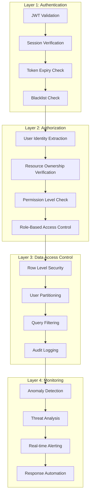
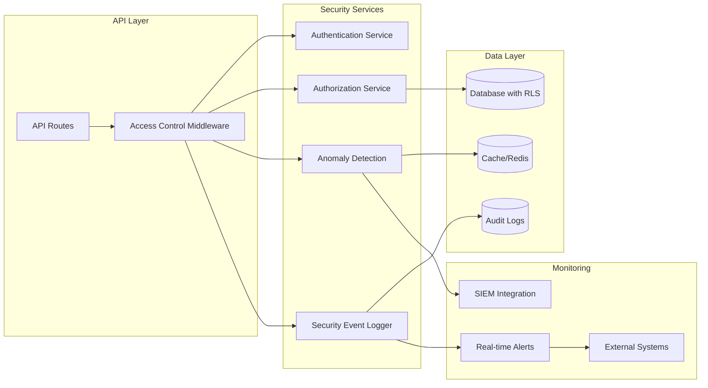
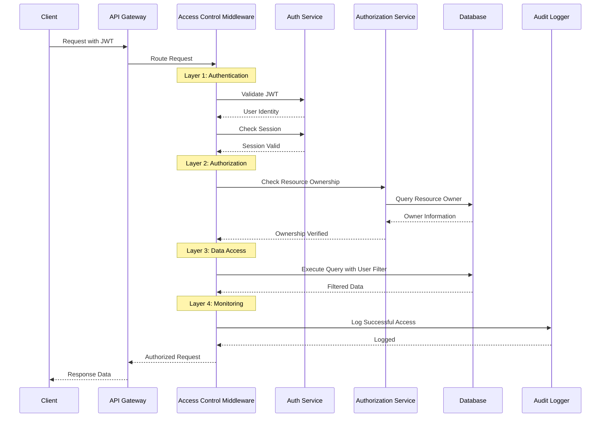
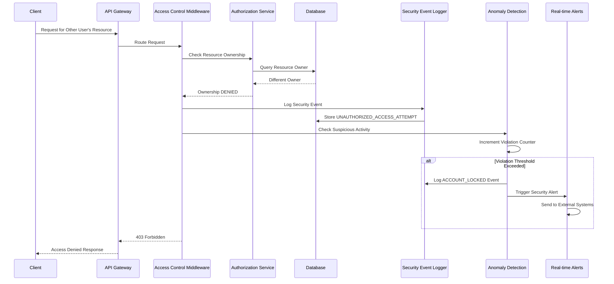
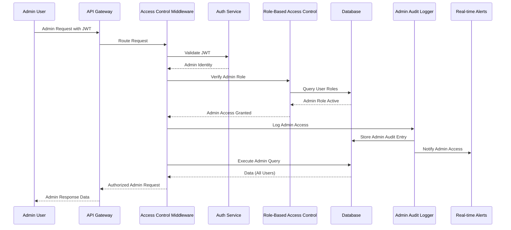
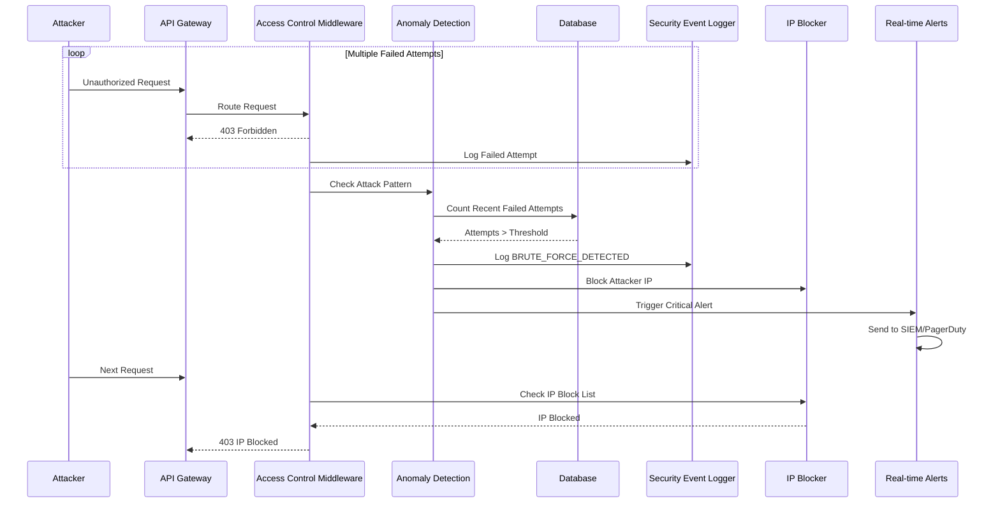
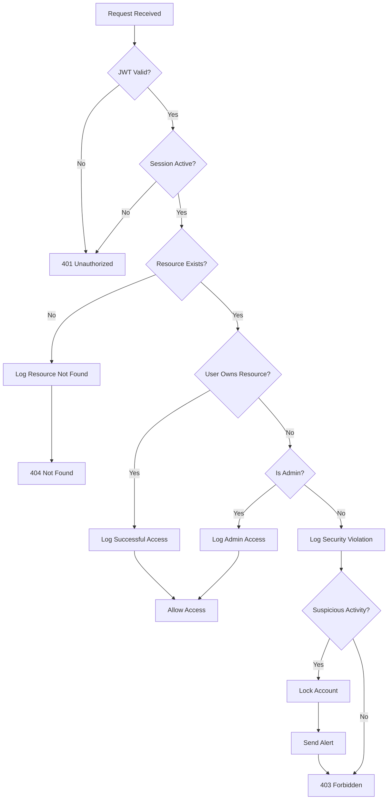
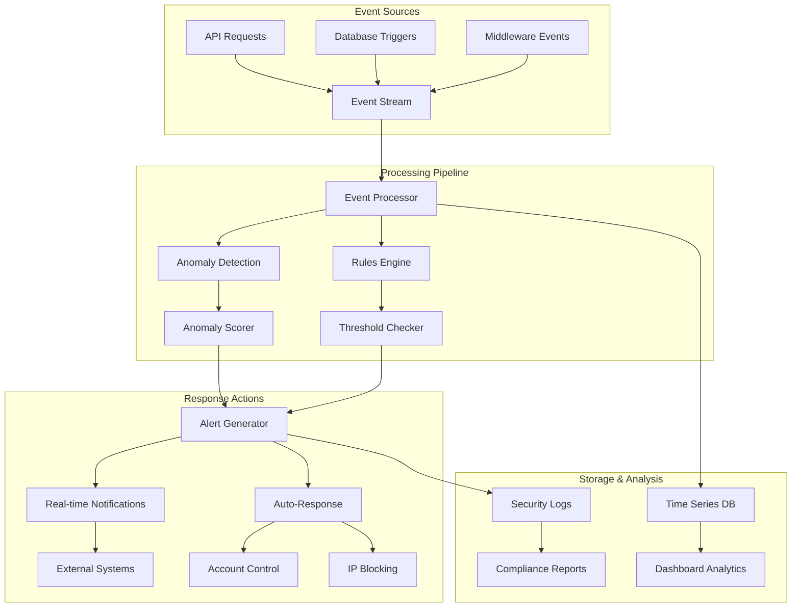

# Authorization Flow System Design

**Document Version**: v1.0  
**Created**: 2025-02-01  
**Security Classification**: CRITICAL  
**Based on**: PRD S2 - 사용자 간 데이터 격리 강화

---

## 🎯 **Executive Summary**

This document defines the comprehensive authorization flow system for ReadZone's user data isolation enhancement. The design implements a 4-layer security architecture that provides 100% protection against horizontal privilege escalation attacks while maintaining <2% API performance impact.

### **Key Objectives**
- **Zero Unauthorized Access**: 100% prevention of cross-user data access
- **Real-time Security Monitoring**: Immediate detection and response to threats
- **Comprehensive Audit Trails**: Complete compliance logging for GDPR/CCPA/ISO27001
- **Performance Optimization**: Sub-100ms authorization decisions with minimal overhead

---

## 🏗️ **System Architecture Overview**

### **Multi-Layer Security Architecture**



### **Component Architecture**



---

## 🔄 **Authorization Flow Diagrams**

### **1. Normal User Access Flow**



### **2. Unauthorized Access Attempt Flow**



### **3. Admin Access Flow**



### **4. Brute Force Attack Detection Flow**



---

## 🧠 **Security Decision Matrix**

### **Authorization Decision Tree**



### **Security Event Classification Matrix**

| Event Type | Severity | Response Time | Actions |
|------------|----------|---------------|---------|
| `UNAUTHORIZED_ACCESS_ATTEMPT` | HIGH | Immediate | Log, Count, Alert if threshold exceeded |
| `RESOURCE_NOT_FOUND` | MEDIUM | 5 minutes | Log, Check enumeration pattern |
| `ADMIN_ACCESS_DENIED` | CRITICAL | Immediate | Log, Alert security team immediately |
| `ANOMALOUS_ACCESS_DETECTED` | HIGH | 1 minute | Log, Increase monitoring, Alert |
| `BRUTE_FORCE_DETECTED` | CRITICAL | Immediate | Block IP, Lock account, Alert |
| `ACCOUNT_LOCKED` | CRITICAL | Immediate | Log, Alert user and security team |

### **Permission Level Matrix**

| Resource Type | User Role | Read | Write | Delete | Admin |
|---------------|-----------|------|-------|--------|-------|
| Own Draft | User | ✅ | ✅ | ✅ | ❌ |
| Other's Draft | User | ❌ | ❌ | ❌ | ❌ |
| Any Draft | Admin | ✅ | ✅ | ✅ | ✅ |
| Own Review | User | ✅ | ✅ | ✅ | ❌ |
| Other's Review | User | ✅ | ❌ | ❌ | ❌ |
| Any Review | Admin | ✅ | ✅ | ✅ | ✅ |

---

## 🔧 **Component Specifications**

### **1. Access Control Middleware**

```typescript
interface AccessControlMiddleware {
  // Core authorization method
  enforceUserOwnership(
    request: AuthenticatedRequest,
    options: {
      resourceType: 'draft' | 'review' | 'comment' | 'opinion'
      resourceIdParam: string
      requiredPermission: 'read' | 'write' | 'delete' | 'admin'
    }
  ): Promise<AuthorizationResult>
  
  // Admin access control
  requireAdminAccess(
    request: AuthenticatedRequest
  ): Promise<AdminAuthorizationResult>
  
  // IP-based restrictions
  enforceIPRestrictions(
    request: NextRequest
  ): Promise<IPAuthorizationResult>
}

interface AuthorizationResult {
  allowed: boolean
  userId: string
  resourceId: string
  securityContext: SecurityContext
  processingTime: number
}

interface SecurityContext {
  resourceOwnership: 'verified' | 'admin_override'
  securityLevel: 'LOW' | 'MEDIUM' | 'HIGH' | 'CRITICAL'
  anomalyScore: number
  accessMethod: 'direct' | 'admin' | 'delegated'
}
```

### **2. Security Event Logger**

```typescript
interface SecurityEventLogger {
  // Main event logging
  logSecurityEvent(event: SecurityEvent): Promise<void>
  
  // Specialized logging methods
  logAccessSuccess(params: AccessSuccessParams): Promise<void>
  logAdminAccess(params: AdminAccessParams): Promise<void>
  logSecurityViolation(params: ViolationParams): Promise<void>
  
  // Real-time alerting
  triggerAlert(event: SecurityEvent): Promise<void>
  
  // Batch processing
  flushEventBuffer(): Promise<void>
  cleanupOldEvents(): Promise<void>
}

interface SecurityEvent {
  type: SecurityEventType
  userId?: string
  resourceId?: string
  ownerId?: string
  severity: 'LOW' | 'MEDIUM' | 'HIGH' | 'CRITICAL'
  ipAddress?: string
  userAgent?: string
  details?: Record<string, any>
  timestamp: Date
}

type SecurityEventType = 
  | 'UNAUTHORIZED_ACCESS_ATTEMPT'
  | 'RESOURCE_NOT_FOUND'
  | 'ADMIN_ACCESS_DENIED'
  | 'ANOMALOUS_ACCESS_DETECTED'
  | 'BRUTE_FORCE_DETECTED'
  | 'ACCOUNT_LOCKED'
  | 'PRIVILEGE_ESCALATION_ATTEMPT'
  | 'DATA_EXPORT_ATTEMPT'
```

### **3. Anomaly Detection Service**

```typescript
interface AnomalyDetectionService {
  // Main detection method
  detectAnomalousAccess(
    userId: string, 
    accessPattern: AccessPattern
  ): Promise<AnomalyScore>
  
  // Specific detection algorithms
  detectBruteForceAttack(ipAddress: string): Promise<BruteForceResult>
  detectAccountTakeover(userId: string, pattern: AccessPattern): Promise<TakeoverResult>
  detectDataHarvesting(userId: string, pattern: AccessPattern): Promise<HarvestingResult>
  
  // Baseline management
  updateUserBaseline(userId: string, pattern: AccessPattern): Promise<void>
  getUserBaseline(userId: string): Promise<UserBaseline>
}

interface AccessPattern {
  timestamp: Date
  ipAddress: string
  requestCount: number
  resourceIds: string[]
  userAgent: string
  requestTypes: string[]
  geographic?: GeoLocation
}

interface AnomalyScore {
  overall: number              // 0-100 overall anomaly score
  temporal: number            // Time-based anomalies
  spatial: number             // Location-based anomalies
  behavioral: number          // Behavior pattern anomalies
  volumetric: number          // Request volume anomalies
  confidence: number          // Detection confidence (0-1)
  reasons: string[]           // Specific anomaly reasons
}
```

---

## 🗄️ **Database Security Design**

### **Row Level Security Policies**

```sql
-- Enable RLS on all user-data tables
ALTER TABLE review_drafts ENABLE ROW LEVEL SECURITY;
ALTER TABLE book_reviews ENABLE ROW LEVEL SECURITY;
ALTER TABLE comments ENABLE ROW LEVEL SECURITY;
ALTER TABLE book_opinions ENABLE ROW LEVEL SECURITY;

-- User data access policy (most restrictive)
CREATE POLICY user_data_isolation ON review_drafts
    FOR ALL
    TO authenticated_users
    USING (
        user_id = current_setting('app.current_user_id')::text
        AND current_setting('app.user_role') = 'user'
    );

-- Admin access policy (with audit requirements)
CREATE POLICY admin_data_access ON review_drafts
    FOR ALL
    TO admin_users
    USING (
        current_setting('app.user_role') IN ('admin', 'super_admin')
        AND current_setting('app.admin_access_reason') IS NOT NULL
        AND length(current_setting('app.admin_access_reason')) > 10
    );

-- Read-only public access for published reviews
CREATE POLICY public_review_read ON book_reviews
    FOR SELECT
    TO public_users
    USING (
        published = true
        AND deleted_at IS NULL
    );
```

### **Audit Schema Design**

```sql
-- Comprehensive user access audit
CREATE TABLE user_access_audit (
    id BIGSERIAL PRIMARY KEY,
    user_id TEXT NOT NULL,
    resource_type TEXT NOT NULL,
    resource_id TEXT NOT NULL,
    action TEXT NOT NULL,
    access_granted BOOLEAN NOT NULL,
    ip_address INET,
    user_agent TEXT,
    session_id TEXT,
    processing_time_ms INTEGER,
    timestamp TIMESTAMPTZ DEFAULT NOW(),
    failure_reason TEXT,
    
    -- Indexing for performance
    INDEX idx_user_access_user_time (user_id, timestamp),
    INDEX idx_user_access_resource (resource_type, resource_id),
    INDEX idx_user_access_denied (access_granted, timestamp) WHERE access_granted = false,
    INDEX idx_user_access_ip (ip_address, timestamp)
);

-- Admin access with enhanced tracking
CREATE TABLE admin_access_audit (
    id BIGSERIAL PRIMARY KEY,
    admin_id TEXT NOT NULL,
    action TEXT NOT NULL,
    affected_user_id TEXT,
    resource_type TEXT,
    resource_id TEXT,
    ip_address INET,
    user_agent TEXT,
    session_id TEXT,
    access_reason TEXT NOT NULL,
    timestamp TIMESTAMPTZ DEFAULT NOW(),
    
    -- Enhanced admin tracking
    INDEX idx_admin_access_admin_time (admin_id, timestamp),
    INDEX idx_admin_access_affected_user (affected_user_id, timestamp),
    INDEX idx_admin_access_critical (timestamp) WHERE action LIKE '%DELETE%'
);

-- Security events and incidents
CREATE TABLE security_audit (
    id TEXT PRIMARY KEY,
    event_type TEXT NOT NULL,
    user_id TEXT,
    resource_id TEXT,
    severity TEXT NOT NULL CHECK (severity IN ('LOW', 'MEDIUM', 'HIGH', 'CRITICAL')),
    details JSONB,
    ip_address INET,
    user_agent TEXT,
    timestamp TIMESTAMPTZ DEFAULT NOW(),
    investigated BOOLEAN DEFAULT false,
    investigation_notes TEXT,
    resolved_at TIMESTAMPTZ,
    
    -- Performance and analysis indexes
    INDEX idx_security_events_type_time (event_type, timestamp),
    INDEX idx_security_events_severity (severity, timestamp),
    INDEX idx_security_events_unresolved (investigated, timestamp) WHERE investigated = false,
    INDEX idx_security_events_user (user_id, timestamp),
    INDEX idx_security_events_details (details) USING GIN
);
```

### **Automated Security Triggers**

```sql
-- Automatic security event logging
CREATE OR REPLACE FUNCTION log_security_event()
RETURNS TRIGGER AS $$
DECLARE
    event_details JSONB;
BEGIN
    -- Build event details
    event_details := jsonb_build_object(
        'table', TG_TABLE_NAME,
        'operation', TG_OP,
        'old_data', to_jsonb(OLD),
        'new_data', to_jsonb(NEW),
        'session_info', jsonb_build_object(
            'user_id', current_setting('app.current_user_id', true),
            'session_id', current_setting('app.session_id', true),
            'ip_address', current_setting('app.client_ip', true)
        )
    );
    
    -- Log high-risk operations
    IF TG_OP = 'DELETE' OR 
       (TG_OP = 'UPDATE' AND OLD.user_id != NEW.user_id) THEN
        INSERT INTO security_audit (
            id, event_type, user_id, resource_id, 
            severity, details, ip_address, timestamp
        ) VALUES (
            gen_random_uuid()::text,
            'HIGH_RISK_OPERATION',
            current_setting('app.current_user_id', true),
            COALESCE(NEW.id, OLD.id),
            'HIGH',
            event_details,
            current_setting('app.client_ip', true)::inet,
            NOW()
        );
    END IF;
    
    RETURN COALESCE(NEW, OLD);
END;
$$ LANGUAGE plpgsql SECURITY DEFINER;

-- Apply to all sensitive tables
CREATE TRIGGER security_audit_drafts
    AFTER INSERT OR UPDATE OR DELETE ON review_drafts
    FOR EACH ROW EXECUTE FUNCTION log_security_event();

CREATE TRIGGER security_audit_reviews
    AFTER INSERT OR UPDATE OR DELETE ON book_reviews
    FOR EACH ROW EXECUTE FUNCTION log_security_event();
```

---

## 📊 **Monitoring Architecture**

### **Real-time Monitoring Pipeline**



### **Alert Escalation Matrix**

| Severity | Response Time | Primary Channel | Secondary Channel | Auto-Actions |
|----------|---------------|-----------------|-------------------|--------------|
| LOW | 15 minutes | Slack #security | Email digest | Log only |
| MEDIUM | 5 minutes | Slack #security | Email alert | Increase monitoring |
| HIGH | 1 minute | PagerDuty | Phone call | Block IP, Alert admin |
| CRITICAL | Immediate | PagerDuty + SMS | Emergency call | Lock account, Block IP, Escalate |

### **Monitoring Dashboards**

```typescript
interface SecurityDashboard {
  // Real-time metrics
  activeThreats: ThreatSummary[]
  securityEvents: SecurityEventSummary
  systemHealth: HealthMetrics
  
  // Historical analysis  
  trendAnalysis: SecurityTrends
  complianceMetrics: ComplianceReport
  performanceImpact: PerformanceMetrics
  
  // Alerting status
  activeAlerts: Alert[]
  alertHistory: AlertHistory
  escalationStatus: EscalationStatus
}

interface ThreatSummary {
  type: string
  count: number
  severity: 'LOW' | 'MEDIUM' | 'HIGH' | 'CRITICAL'
  trend: 'increasing' | 'stable' | 'decreasing'
  lastOccurrence: Date
  affectedUsers: number
}
```

---

## ⚡ **Performance Optimization**

### **Performance Requirements & Targets**

| Metric | Target | Measurement |
|--------|--------|-------------|
| Authorization Decision Time | <50ms | P95 |
| API Response Time Impact | <2% | Average overhead |
| Database Query Performance | <100ms | P95 for security queries |
| Event Processing Latency | <10ms | P95 for non-critical events |
| Cache Hit Ratio | >95% | For user sessions and baselines |

### **Optimization Strategies**

#### **1. Caching Architecture**

```typescript
interface SecurityCache {
  // User session caching
  userSessions: {
    key: string        // user_id:session_id
    value: UserSession
    ttl: 900           // 15 minutes
  }
  
  // Permission caching
  userPermissions: {
    key: string        // user_id:resource_type
    value: PermissionSet
    ttl: 300           // 5 minutes
  }
  
  // Anomaly baselines
  userBaselines: {
    key: string        // user_id
    value: UserBaseline
    ttl: 86400         // 24 hours
  }
  
  // IP block lists
  blockedIPs: {
    key: string        // ip_address
    value: BlockInfo
    ttl: 86400         // 24 hours
  }
}
```

#### **2. Database Query Optimization**

```sql
-- Optimized ownership verification query
CREATE INDEX CONCURRENTLY idx_drafts_user_ownership 
ON review_drafts (user_id, id) 
WHERE deleted_at IS NULL;

-- Optimized security event queries
CREATE INDEX CONCURRENTLY idx_security_events_recent
ON security_audit (user_id, timestamp DESC, event_type)
WHERE timestamp > NOW() - INTERVAL '24 hours';

-- Optimized admin role verification
CREATE INDEX CONCURRENTLY idx_user_roles_active
ON user_roles (user_id, role_name, is_active, expires_at)
WHERE is_active = true;
```

#### **3. Async Processing Pipeline**

```typescript
interface AsyncSecurityProcessor {
  // Critical path (synchronous)
  syncValidation: {
    authentication: boolean
    ownership: boolean
    permissions: boolean
  }
  
  // Non-critical path (asynchronous)
  asyncProcessing: {
    anomalyDetection: boolean
    auditLogging: boolean
    alertGeneration: boolean
    statisticsUpdate: boolean
  }
}
```

---

## 🚀 **Implementation Roadmap**

### **Phase 1: Core Authorization (Week 1-2)**

#### **Sprint 1.1: Foundation**
- ✅ Set up project structure and dependencies
- ✅ Implement basic JWT validation middleware
- ✅ Create database security schema and migrations
- ✅ Establish error handling patterns

#### **Sprint 1.2: Core Middleware**
- ✅ Implement `AccessControlMiddleware` class
- ✅ Add resource ownership verification
- ✅ Create security event logging framework
- ✅ Build unit tests for core functionality

### **Phase 2: Enhanced Security (Week 3-4)**

#### **Sprint 2.1: Monitoring & Detection**
- 🔄 Implement anomaly detection algorithms
- 🔄 Build brute force attack detection
- 🔄 Create real-time alerting system
- 🔄 Add comprehensive security logging

#### **Sprint 2.2: Admin Controls**
- ⏳ Implement admin role verification
- ⏳ Create admin audit logging
- ⏳ Build privilege escalation detection
- ⏳ Add admin access controls

### **Phase 3: Production Hardening (Week 5-6)**

#### **Sprint 3.1: Performance & Scale**
- ⏳ Implement caching strategies
- ⏳ Optimize database queries
- ⏳ Add performance monitoring
- ⏳ Conduct load testing

#### **Sprint 3.2: Integration & Deployment**
- ⏳ Integrate with external alerting systems
- ⏳ Set up SIEM integration
- ⏳ Create security dashboards
- ⏳ Conduct penetration testing

### **Phase 4: Validation & Documentation (Week 7-8)**

#### **Sprint 4.1: Security Testing**
- ⏳ Comprehensive security test suite
- ⏳ Penetration testing and vulnerability assessment
- ⏳ Performance impact validation
- ⏳ Compliance audit preparation

#### **Sprint 4.2: Documentation & Training**
- ⏳ Complete technical documentation
- ⏳ Create operational runbooks
- ⏳ Conduct security training
- ⏳ Establish monitoring procedures

---

## 🧪 **Security Validation Strategy**

### **Testing Approaches**

#### **1. Unit Testing**
```typescript
describe('Authorization Flow Security Tests', () => {
  describe('Horizontal Privilege Escalation Prevention', () => {
    it('should deny access to other users resources')
    it('should log unauthorized access attempts')
    it('should increment suspicious activity counters')
    it('should block IPs after repeated violations')
  })
  
  describe('Admin Access Control', () => {
    it('should verify admin roles from database')
    it('should log all admin access with enhanced details')
    it('should deny access for expired admin roles')
  })
  
  describe('Anomaly Detection', () => {
    it('should detect temporal access anomalies')
    it('should detect geographic access anomalies')
    it('should detect volume-based anomalies')
    it('should detect behavioral pattern changes')
  })
})
```

#### **2. Integration Testing**
```typescript
describe('End-to-End Authorization Tests', () => {
  it('should protect draft endpoints with ownership validation')
  it('should protect review endpoints with proper access control')
  it('should protect admin endpoints with role verification')
  it('should maintain audit trails for all access attempts')
  it('should trigger alerts for security violations')
})
```

#### **3. Security Testing**
```bash
# Penetration testing scenarios
/sc:test penetration-testing --persona security --play
- Cross-user data access attempts
- JWT token manipulation attacks
- Session hijacking attempts
- Brute force attack simulations
- Privilege escalation attempts

# Performance testing with security overhead
/sc:test load-with-security --persona qa --play
- Measure authorization decision time
- Test under high concurrent load
- Validate cache performance
- Monitor database query performance
```

### **Compliance Validation**

#### **GDPR Compliance Checklist**
- ✅ Data minimization in audit logs
- ✅ Right to be forgotten implementation
- ✅ Data processing lawfulness documentation
- ✅ Technical and organizational measures
- ✅ Data breach notification procedures

#### **Security Standards Compliance**
- **ISO 27001**: Information security management system
- **SOC 2 Type 2**: Security, availability, and confidentiality controls
- **NIST Cybersecurity Framework**: Identify, protect, detect, respond, recover

---

## 📋 **Success Metrics & KPIs**

### **Security Metrics**
- **Unauthorized Access Prevention**: 100% (Zero successful horizontal privilege escalation)
- **Security Event Detection Rate**: >99% (All violations detected and logged)
- **Mean Time to Detection (MTTD)**: <1 minute for critical events
- **Mean Time to Response (MTTR)**: <5 minutes for critical events
- **False Positive Rate**: <1% for anomaly detection

### **Performance Metrics**
- **Authorization Decision Time**: <50ms (P95)
- **API Response Time Impact**: <2% average overhead
- **Database Query Performance**: <100ms for security queries
- **Cache Hit Ratio**: >95% for user sessions
- **System Availability**: >99.9% uptime

### **Compliance Metrics**
- **Audit Trail Completeness**: 100% of access attempts logged
- **Data Retention Compliance**: Automated cleanup per retention policies
- **Access Control Coverage**: 100% of sensitive endpoints protected
- **Security Training Completion**: 100% of team members certified

---

## 🔒 **Security Considerations**

### **Threat Model**
- **Internal Threats**: Malicious users, compromised accounts
- **External Threats**: Unauthorized access, brute force attacks
- **Systemic Threats**: Configuration errors, software vulnerabilities
- **Compliance Threats**: Audit failures, regulatory violations

### **Risk Mitigation Strategies**
- **Defense in Depth**: Multiple security layers with independent controls
- **Principle of Least Privilege**: Minimal access rights assignment
- **Zero Trust Architecture**: Verify every access attempt
- **Continuous Monitoring**: Real-time threat detection and response

### **Incident Response Plan**
1. **Detection**: Automated monitoring and alerting
2. **Analysis**: Security team investigation and classification
3. **Containment**: Immediate threat isolation and mitigation
4. **Eradication**: Root cause elimination and system hardening
5. **Recovery**: Service restoration and monitoring enhancement
6. **Lessons Learned**: Post-incident review and improvement

---

**Document Status**: ✅ **Design Complete**  
**Implementation Status**: 🔄 **Phase 2 In Progress**  
**Security Review**: ⏳ **Pending**  
**Approval**: ⏳ **Pending CTO Review**