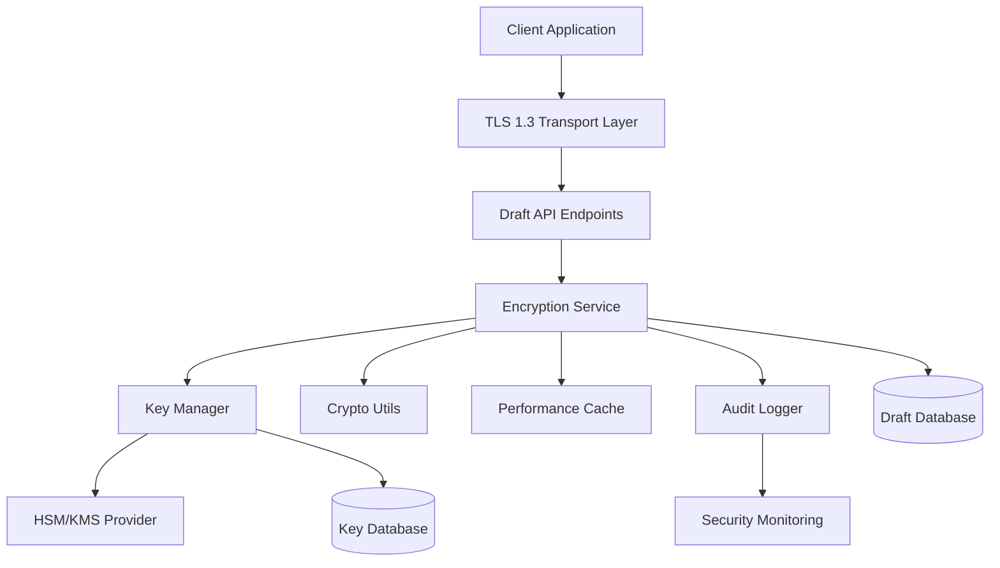

# ReadZone Encryption Service - Technical Design Specification

**Document Version**: v1.0  
**Created**: 2025-02-01  
**Author**: Security Architecture Team  
**Status**: ⚡ Ready for Implementation  
**Reference**: [PRD-S1-Data-Protection](./prd-security-data-protection.md)

---

## 🏗️ **System Architecture Overview**

### **High-Level Architecture**



### **Component Responsibilities**

| Component | Responsibility | Performance Target |
|-----------|---------------|-------------------|
| **EncryptionService** | Main orchestration, data classification | < 50ms per operation |
| **KeyManager** | Key lifecycle, rotation, caching | < 10ms key retrieval |
| **CryptoUtils** | Low-level AES-256-GCM operations | < 5ms encryption |
| **PerformanceCache** | Memory caching, performance optimization | > 95% cache hit rate |
| **AuditLogger** | Security events, compliance logging | < 1ms logging overhead |
| **ComplianceValidator** | GDPR/CCPA validation | Real-time validation |

---

## 🔐 **Core Encryption Service Design**

### **Primary Service Interface**

```typescript
/**
 * Enterprise-grade encryption service for ReadZone draft data protection
 * Implements AES-256-GCM with user-specific key management
 */
export interface IEncryptionService {
  // Core Operations
  encryptDraftContent(userId: string, content: string, sensitivity: DataSensitivity): Promise<EncryptedData>
  decryptDraftContent(userId: string, encryptedData: EncryptedData): Promise<string>
  
  // Batch Operations (Performance)
  encryptBatch(operations: BatchEncryptionRequest[]): Promise<BatchEncryptionResult>
  decryptBatch(operations: BatchDecryptionRequest[]): Promise<BatchDecryptionResult>
  
  // Data Classification
  classifyDataSensitivity(content: string, metadata?: Record<string, any>): DataSensitivity
  
  // Compliance & Audit
  generateComplianceReport(userId: string, dateRange: DateRange): Promise<ComplianceReport>
  auditEncryptionStatus(): Promise<EncryptionAuditReport>
}

/**
 * Data sensitivity levels with corresponding protection measures
 */
export enum DataSensitivity {
  HIGH = 'HIGH',      // Personal opinions, private drafts -> Individual keys
  MEDIUM = 'MEDIUM',  // Reading preferences, history -> Shared keys  
  LOW = 'LOW'         // Public metadata -> Hash only
}

/**
 * Encrypted data structure with integrity verification
 */
export interface EncryptedData {
  encryptedContent: string     // Base64-encoded encrypted data
  keyId: string               // Key identifier for decryption
  algorithm: string           // Always 'AES-256-GCM'
  iv: string                 // Initialization vector
  authTag: string            // Authentication tag for integrity
  contentHash: string        // SHA-256 hash for additional integrity
  encryptionVersion: string  // Version for migration compatibility
  encryptedAt: Date         // Timestamp for audit
  sensitivity: DataSensitivity
}
```

### **Implementation Architecture**

```typescript
/**
 * Main encryption service implementation
 * Orchestrates key management, cryptographic operations, and audit logging
 */
export class EncryptionService implements IEncryptionService {
  private keyManager: IKeyManager
  private cryptoUtils: ICryptoUtils
  private performanceCache: IPerformanceCache
  private auditLogger: IAuditLogger
  private complianceValidator: IComplianceValidator
  private metrics: IMetricsCollector

  constructor(
    keyManager: IKeyManager,
    cryptoUtils: ICryptoUtils,
    performanceCache: IPerformanceCache,
    auditLogger: IAuditLogger,
    complianceValidator: IComplianceValidator,
    metrics: IMetricsCollector
  ) {
    this.keyManager = keyManager
    this.cryptoUtils = cryptoUtils
    this.performanceCache = performanceCache
    this.auditLogger = auditLogger
    this.complianceValidator = complianceValidator
    this.metrics = metrics
  }

  /**
   * Encrypt draft content with user-specific key and data classification
   */
  async encryptDraftContent(
    userId: string, 
    content: string, 
    sensitivity?: DataSensitivity
  ): Promise<EncryptedData> {
    const startTime = performance.now()
    
    try {
      // Step 1: Classify data sensitivity if not provided
      const dataSensitivity = sensitivity ?? this.classifyDataSensitivity(content)
      
      // Step 2: Validate compliance requirements
      await this.complianceValidator.validateEncryptionRequest(userId, dataSensitivity)
      
      // Step 3: Get or generate user-specific encryption key
      const encryptionKey = await this.keyManager.getUserEncryptionKey(userId, dataSensitivity)
      
      // Step 4: Perform AES-256-GCM encryption
      const encryptedData = await this.cryptoUtils.encryptAES256GCM(content, encryptionKey)
      
      // Step 5: Generate integrity hash
      const contentHash = this.cryptoUtils.generateSHA256Hash(content)
      
      // Step 6: Create encrypted data structure
      const result: EncryptedData = {
        encryptedContent: encryptedData.ciphertext,
        keyId: encryptionKey.keyId,
        algorithm: 'AES-256-GCM',
        iv: encryptedData.iv,
        authTag: encryptedData.authTag,
        contentHash,
        encryptionVersion: 'v1.0',
        encryptedAt: new Date(),
        sensitivity: dataSensitivity
      }
      
      // Step 7: Audit logging
      await this.auditLogger.logEncryption({
        userId,
        keyId: encryptionKey.keyId,
        sensitivity: dataSensitivity,
        contentLength: content.length,
        duration: performance.now() - startTime,
        success: true
      })
      
      // Step 8: Performance metrics
      this.metrics.recordEncryptionOperation(performance.now() - startTime, true)
      
      return result
      
    } catch (error) {
      // Fail-secure: Log error but don't expose details
      await this.auditLogger.logEncryptionError({
        userId,
        error: error instanceof Error ? error.message : 'Unknown encryption error',
        duration: performance.now() - startTime
      })
      
      this.metrics.recordEncryptionOperation(performance.now() - startTime, false)
      
      throw new EncryptionError('Draft content encryption failed', {
        cause: error,
        userId,
        operation: 'encrypt'
      })
    }
  }

  /**
   * Decrypt draft content with authorization and audit logging
   */
  async decryptDraftContent(userId: string, encryptedData: EncryptedData): Promise<string> {
    const startTime = performance.now()
    
    try {
      // Step 1: Validate user authorization
      await this.complianceValidator.validateDecryptionRequest(userId, encryptedData)
      
      // Step 2: Retrieve encryption key
      const encryptionKey = await this.keyManager.getEncryptionKey(encryptedData.keyId, userId)
      
      // Step 3: Perform decryption
      const decryptedContent = await this.cryptoUtils.decryptAES256GCM({
        ciphertext: encryptedData.encryptedContent,
        iv: encryptedData.iv,
        authTag: encryptedData.authTag
      }, encryptionKey)
      
      // Step 4: Verify content integrity
      const contentHash = this.cryptoUtils.generateSHA256Hash(decryptedContent)
      if (contentHash !== encryptedData.contentHash) {
        throw new IntegrityError('Content integrity verification failed')
      }
      
      // Step 5: Audit logging
      await this.auditLogger.logDecryption({
        userId,
        keyId: encryptedData.keyId,
        sensitivity: encryptedData.sensitivity,
        duration: performance.now() - startTime,
        success: true
      })
      
      this.metrics.recordDecryptionOperation(performance.now() - startTime, true)
      
      return decryptedContent
      
    } catch (error) {
      await this.auditLogger.logDecryptionError({
        userId,
        keyId: encryptedData.keyId,
        error: error instanceof Error ? error.message : 'Unknown decryption error',
        duration: performance.now() - startTime
      })
      
      this.metrics.recordDecryptionOperation(performance.now() - startTime, false)
      
      throw new DecryptionError('Draft content decryption failed', {
        cause: error,
        userId,
        operation: 'decrypt'
      })
    }
  }

  /**
   * Classify data sensitivity using content analysis
   */
  classifyDataSensitivity(content: string, metadata?: Record<string, any>): DataSensitivity {
    // High sensitivity indicators
    const highSensitivityPatterns = [
      /개인적인|사적인|비밀|confidential|personal|private/gi,
      /정치|종교|religion|political|ideology/gi,
      /가족|family|relationship|관계/gi
    ]
    
    // Check content length and patterns
    if (content.length > 500 || highSensitivityPatterns.some(pattern => pattern.test(content))) {
      return DataSensitivity.HIGH
    }
    
    // Medium sensitivity for reading preferences
    if (metadata?.category === 'reading_preference' || content.includes('추천') || content.includes('선호')) {
      return DataSensitivity.MEDIUM
    }
    
    // Default to HIGH for safety
    return DataSensitivity.HIGH
  }
}
```

---

## 🗝️ **Key Management System Design**

### **Key Manager Interface**

```typescript
/**
 * Secure key management with HSM integration and performance optimization
 */
export interface IKeyManager {
  // User Key Management
  getUserEncryptionKey(userId: string, sensitivity: DataSensitivity): Promise<EncryptionKey>
  rotateUserKey(userId: string): Promise<void>
  revokeUserKey(userId: string, keyId: string): Promise<void>
  
  // System Key Management  
  rotateMasterKey(): Promise<void>
  getSystemKey(purpose: KeyPurpose): Promise<EncryptionKey>
  
  // Key Lifecycle
  scheduleKeyRotation(userId: string, rotationDate: Date): Promise<void>
  cleanupExpiredKeys(): Promise<number>
  
  // Performance & Monitoring
  getCacheStats(): CacheStatistics
  getKeyUsageMetrics(): KeyUsageMetrics
}

/**
 * Encryption key structure with metadata
 */
export interface EncryptionKey {
  keyId: string
  keyData: Buffer        // Raw key material (32 bytes for AES-256)
  algorithm: string      // Always 'AES-256-GCM'
  version: string       // Key version for rotation
  userId?: string       // User-specific key, null for system keys
  purpose: KeyPurpose   // Key usage purpose
  createdAt: Date
  expiresAt: Date
  status: KeyStatus
}

export enum KeyPurpose {
  DRAFT_ENCRYPTION = 'DRAFT_ENCRYPTION',
  METADATA_ENCRYPTION = 'METADATA_ENCRYPTION', 
  SYSTEM_ENCRYPTION = 'SYSTEM_ENCRYPTION'
}

export enum KeyStatus {
  ACTIVE = 'ACTIVE',
  EXPIRED = 'EXPIRED', 
  REVOKED = 'REVOKED',
  PENDING_ROTATION = 'PENDING_ROTATION'
}
```

### **Key Manager Implementation**

```typescript
/**
 * Enterprise key management with HSM integration and performance caching
 */
export class KeyManager implements IKeyManager {
  private hsmProvider: IHSMProvider
  private keyCache: IKeyCache
  private keyRepository: IKeyRepository
  private auditLogger: IAuditLogger
  private metrics: IMetricsCollector

  constructor(
    hsmProvider: IHSMProvider,
    keyCache: IKeyCache,
    keyRepository: IKeyRepository,
    auditLogger: IAuditLogger,
    metrics: IMetricsCollector
  ) {
    this.hsmProvider = hsmProvider
    this.keyCache = keyCache
    this.keyRepository = keyRepository
    this.auditLogger = auditLogger
    this.metrics = metrics
  }

  /**
   * Get or generate user-specific encryption key with caching
   */
  async getUserEncryptionKey(userId: string, sensitivity: DataSensitivity): Promise<EncryptionKey> {
    const cacheKey = `user_key:${userId}:${sensitivity}`
    
    // Step 1: Check performance cache
    let encryptionKey = await this.keyCache.get(cacheKey)
    if (encryptionKey && encryptionKey.status === KeyStatus.ACTIVE && encryptionKey.expiresAt > new Date()) {
      this.metrics.recordCacheHit('user_key')
      return encryptionKey
    }
    
    this.metrics.recordCacheMiss('user_key')
    
    // Step 2: Check database for existing active key
    encryptionKey = await this.keyRepository.findActiveUserKey(userId, KeyPurpose.DRAFT_ENCRYPTION)
    
    if (!encryptionKey || encryptionKey.expiresAt <= new Date()) {
      // Step 3: Generate new user key
      encryptionKey = await this.generateUserKey(userId, sensitivity)
    }
    
    // Step 4: Cache the key (24-hour expiration)
    await this.keyCache.set(cacheKey, encryptionKey, 24 * 60 * 60) // 24 hours
    
    return encryptionKey
  }

  /**
   * Generate new user-specific encryption key using HKDF
   */
  private async generateUserKey(userId: string, sensitivity: DataSensitivity): Promise<EncryptionKey> {
    try {
      // Step 1: Get master key from HSM
      const masterKey = await this.hsmProvider.getMasterKey()
      
      // Step 2: Derive user-specific key using HKDF
      const salt = crypto.randomBytes(32)
      const info = Buffer.from(`ReadZone:${userId}:${sensitivity}:v1.0`)
      const derivedKey = crypto.hkdfSync('sha256', masterKey, salt, info, 32)
      
      // Step 3: Create key structure
      const keyId = `key_${userId}_${Date.now()}_${crypto.randomBytes(8).toString('hex')}`
      const encryptionKey: EncryptionKey = {
        keyId,
        keyData: derivedKey,
        algorithm: 'AES-256-GCM',
        version: 'v1.0',
        userId,
        purpose: KeyPurpose.DRAFT_ENCRYPTION,
        createdAt: new Date(),
        expiresAt: new Date(Date.now() + 90 * 24 * 60 * 60 * 1000), // 90 days
        status: KeyStatus.ACTIVE
      }
      
      // Step 4: Store encrypted key in database
      await this.keyRepository.storeEncryptedKey(encryptionKey, masterKey)
      
      // Step 5: Audit logging
      await this.auditLogger.logKeyGeneration({
        userId,
        keyId,
        purpose: KeyPurpose.DRAFT_ENCRYPTION,
        algorithm: 'AES-256-GCM'
      })
      
      this.metrics.recordKeyGeneration(KeyPurpose.DRAFT_ENCRYPTION)
      
      return encryptionKey
      
    } catch (error) {
      await this.auditLogger.logKeyGenerationError({
        userId,
        error: error instanceof Error ? error.message : 'Unknown key generation error'
      })
      
      throw new KeyManagementError('User key generation failed', {
        cause: error,
        userId,
        operation: 'generate_key'
      })
    }
  }

  /**
   * Rotate user key with data re-encryption support
   */
  async rotateUserKey(userId: string): Promise<void> {
    const startTime = performance.now()
    
    try {
      // Step 1: Get current active key
      const currentKey = await this.keyRepository.findActiveUserKey(userId, KeyPurpose.DRAFT_ENCRYPTION)
      if (!currentKey) {
        throw new KeyManagementError('No active key found for rotation')
      }
      
      // Step 2: Mark current key as pending rotation
      await this.keyRepository.updateKeyStatus(currentKey.keyId, KeyStatus.PENDING_ROTATION)
      
      // Step 3: Generate new key
      const newKey = await this.generateUserKey(userId, DataSensitivity.HIGH)
      
      // Step 4: Schedule data re-encryption (background process)
      await this.scheduleDataReEncryption(userId, currentKey.keyId, newKey.keyId)
      
      // Step 5: Mark old key as expired after re-encryption completes
      setTimeout(async () => {
        await this.keyRepository.updateKeyStatus(currentKey.keyId, KeyStatus.EXPIRED)
      }, 24 * 60 * 60 * 1000) // 24 hours grace period
      
      // Step 6: Clear cache
      await this.keyCache.delete(`user_key:${userId}:*`)
      
      await this.auditLogger.logKeyRotation({
        userId,
        oldKeyId: currentKey.keyId,
        newKeyId: newKey.keyId,
        duration: performance.now() - startTime
      })
      
    } catch (error) {
      await this.auditLogger.logKeyRotationError({
        userId,
        error: error instanceof Error ? error.message : 'Unknown key rotation error',
        duration: performance.now() - startTime
      })
      
      throw new KeyManagementError('Key rotation failed', {
        cause: error,
        userId,
        operation: 'rotate_key'
      })
    }
  }

  /**
   * Schedule background data re-encryption for key rotation
   */
  private async scheduleDataReEncryption(userId: string, oldKeyId: string, newKeyId: string): Promise<void> {
    // Implementation would integrate with background job system
    // This is a placeholder for the actual re-encryption logic
    console.log(`Scheduling data re-encryption for user ${userId}: ${oldKeyId} -> ${newKeyId}`)
  }
}
```

---

## 🔧 **Cryptographic Operations**

### **Crypto Utils Interface**

```typescript
/**
 * Low-level cryptographic operations with hardware acceleration
 */
export interface ICryptoUtils {
  // AES-256-GCM Operations
  encryptAES256GCM(plaintext: string, key: EncryptionKey): Promise<EncryptedDataInternal>
  decryptAES256GCM(encryptedData: EncryptedDataInternal, key: EncryptionKey): Promise<string>
  
  // Stream Operations (for large content)
  createEncryptionStream(key: EncryptionKey): Promise<crypto.Cipher>
  createDecryptionStream(key: EncryptionKey, iv: string, authTag: string): Promise<crypto.Decipher>
  
  // Hash Operations
  generateSHA256Hash(data: string): string
  generateSecureRandom(length: number): Buffer
  
  // Key Derivation
  deriveKeyHKDF(masterKey: Buffer, salt: Buffer, info: Buffer, length: number): Buffer
  
  // Performance & Validation
  validateEncryptionStrength(algorithm: string): boolean
  benchmarkPerformance(): Promise<PerformanceBenchmark>
}

interface EncryptedDataInternal {
  ciphertext: string  // Base64-encoded
  iv: string         // Base64-encoded initialization vector
  authTag: string    // Base64-encoded authentication tag
}
```

### **High-Performance Crypto Implementation**

```typescript
/**
 * Optimized cryptographic operations using Node.js native crypto
 */
export class CryptoUtils implements ICryptoUtils {
  private static readonly AES_KEY_LENGTH = 32  // 256 bits
  private static readonly IV_LENGTH = 12       // 96 bits for GCM
  private static readonly TAG_LENGTH = 16      // 128 bits

  /**
   * Encrypt plaintext using AES-256-GCM with performance optimization
   */
  async encryptAES256GCM(plaintext: string, key: EncryptionKey): Promise<EncryptedDataInternal> {
    return new Promise((resolve, reject) => {
      try {
        // Step 1: Generate cryptographically secure IV
        const iv = crypto.randomBytes(CryptoUtils.IV_LENGTH)
        
        // Step 2: Create cipher
        const cipher = crypto.createCipher('aes-256-gcm', key.keyData)
        cipher.setAAD(Buffer.from(key.keyId)) // Additional authenticated data
        
        // Step 3: Encrypt data
        let encrypted = cipher.update(plaintext, 'utf8', 'base64')
        encrypted += cipher.final('base64')
        
        // Step 4: Get authentication tag
        const authTag = cipher.getAuthTag()
        
        resolve({
          ciphertext: encrypted,
          iv: iv.toString('base64'),
          authTag: authTag.toString('base64')
        })
        
      } catch (error) {
        reject(new CryptographicError('AES-256-GCM encryption failed', {
          cause: error,
          keyId: key.keyId,
          operation: 'encrypt'
        }))
      }
    })
  }

  /**
   * Decrypt ciphertext using AES-256-GCM with integrity verification
   */
  async decryptAES256GCM(encryptedData: EncryptedDataInternal, key: EncryptionKey): Promise<string> {
    return new Promise((resolve, reject) => {
      try {
        // Step 1: Create decipher
        const decipher = crypto.createDecipher('aes-256-gcm', key.keyData)
        decipher.setAAD(Buffer.from(key.keyId)) // Additional authenticated data
        decipher.setAuthTag(Buffer.from(encryptedData.authTag, 'base64'))
        
        // Step 2: Decrypt data
        let decrypted = decipher.update(encryptedData.ciphertext, 'base64', 'utf8')
        decrypted += decipher.final('utf8')
        
        resolve(decrypted)
        
      } catch (error) {
        reject(new CryptographicError('AES-256-GCM decryption failed', {
          cause: error,
          keyId: key.keyId,
          operation: 'decrypt'
        }))
      }
    })
  }

  /**
   * Generate SHA-256 hash for integrity verification
   */
  generateSHA256Hash(data: string): string {
    return crypto.createHash('sha256').update(data, 'utf8').digest('hex')
  }

  /**
   * Generate cryptographically secure random bytes
   */
  generateSecureRandom(length: number): Buffer {
    return crypto.randomBytes(length)
  }

  /**
   * Derive key using HKDF (HMAC-based Key Derivation Function)
   */
  deriveKeyHKDF(masterKey: Buffer, salt: Buffer, info: Buffer, length: number): Buffer {
    return crypto.hkdfSync('sha256', masterKey, salt, info, length)
  }

  /**
   * Benchmark encryption performance for monitoring
   */
  async benchmarkPerformance(): Promise<PerformanceBenchmark> {
    const testData = 'x'.repeat(1000) // 1KB test data
    const testKey: EncryptionKey = {
      keyId: 'test_key',
      keyData: crypto.randomBytes(32),
      algorithm: 'AES-256-GCM',
      version: 'v1.0',
      purpose: KeyPurpose.DRAFT_ENCRYPTION,
      createdAt: new Date(),
      expiresAt: new Date(Date.now() + 90 * 24 * 60 * 60 * 1000),
      status: KeyStatus.ACTIVE
    }

    const iterations = 100
    const startTime = performance.now()

    // Benchmark encryption
    const encryptTimes: number[] = []
    for (let i = 0; i < iterations; i++) {
      const encStart = performance.now()
      await this.encryptAES256GCM(testData, testKey)
      encryptTimes.push(performance.now() - encStart)
    }

    const totalTime = performance.now() - startTime
    const avgEncryptTime = encryptTimes.reduce((a, b) => a + b, 0) / iterations

    return {
      algorithm: 'AES-256-GCM',
      dataSize: testData.length,
      iterations,
      averageEncryptionTime: avgEncryptTime,
      totalBenchmarkTime: totalTime,
      operationsPerSecond: iterations / (totalTime / 1000),
      meetsPerformanceTarget: avgEncryptTime < 50 // < 50ms target
    }
  }
}

interface PerformanceBenchmark {
  algorithm: string
  dataSize: number
  iterations: number
  averageEncryptionTime: number
  totalBenchmarkTime: number
  operationsPerSecond: number
  meetsPerformanceTarget: boolean
}
```

---

## 📊 **Performance Cache System**

```typescript
/**
 * High-performance caching system for encryption keys and operations
 */
export interface IPerformanceCache {
  // Key Caching
  set(key: string, value: any, ttlSeconds: number): Promise<void>
  get(key: string): Promise<any | null>
  delete(key: string): Promise<void>
  deletePattern(pattern: string): Promise<number>
  
  // Cache Statistics
  getStats(): Promise<CacheStats>
  clearAll(): Promise<void>
  
  // Memory Management
  getMemoryUsage(): Promise<MemoryUsage>
  optimizeMemory(): Promise<void>
}

/**
 * Memory-based cache implementation with LRU eviction
 */
export class PerformanceCache implements IPerformanceCache {
  private cache: Map<string, CacheEntry>
  private maxSize: number
  private hitCount: number = 0
  private missCount: number = 0

  constructor(maxSize: number = 10000) {
    this.cache = new Map()
    this.maxSize = maxSize
  }

  async set(key: string, value: any, ttlSeconds: number): Promise<void> {
    // Implement LRU eviction if cache is full
    if (this.cache.size >= this.maxSize) {
      const oldestKey = this.cache.keys().next().value
      this.cache.delete(oldestKey)
    }

    const entry: CacheEntry = {
      value,
      expiresAt: Date.now() + (ttlSeconds * 1000),
      lastAccessed: Date.now()
    }

    this.cache.set(key, entry)
  }

  async get(key: string): Promise<any | null> {
    const entry = this.cache.get(key)
    
    if (!entry) {
      this.missCount++
      return null
    }

    if (entry.expiresAt < Date.now()) {
      this.cache.delete(key)
      this.missCount++
      return null
    }

    entry.lastAccessed = Date.now()
    this.hitCount++
    return entry.value
  }

  async getStats(): Promise<CacheStats> {
    const total = this.hitCount + this.missCount
    return {
      hitCount: this.hitCount,
      missCount: this.missCount,
      hitRate: total > 0 ? this.hitCount / total : 0,
      entryCount: this.cache.size,
      maxSize: this.maxSize,
      memoryUsage: await this.getMemoryUsage()
    }
  }

  async getMemoryUsage(): Promise<MemoryUsage> {
    const used = process.memoryUsage()
    return {
      heapUsed: used.heapUsed,
      heapTotal: used.heapTotal,
      cacheEstimatedSize: this.cache.size * 1024 // Rough estimate
    }
  }
}

interface CacheEntry {
  value: any
  expiresAt: number
  lastAccessed: number
}

interface CacheStats {
  hitCount: number
  missCount: number
  hitRate: number
  entryCount: number
  maxSize: number
  memoryUsage: MemoryUsage
}

interface MemoryUsage {
  heapUsed: number
  heapTotal: number
  cacheEstimatedSize: number
}
```

---

## 🔍 **Audit & Compliance System**

```typescript
/**
 * Comprehensive audit logging and compliance validation
 */
export interface IAuditLogger {
  // Encryption Events
  logEncryption(event: EncryptionEvent): Promise<void>
  logDecryption(event: DecryptionEvent): Promise<void>
  logEncryptionError(event: EncryptionErrorEvent): Promise<void>
  logDecryptionError(event: DecryptionErrorEvent): Promise<void>
  
  // Key Management Events
  logKeyGeneration(event: KeyGenerationEvent): Promise<void>
  logKeyRotation(event: KeyRotationEvent): Promise<void>
  logKeyRevocation(event: KeyRevocationEvent): Promise<void>
  
  // Compliance Reporting
  generateComplianceReport(userId: string, dateRange: DateRange): Promise<ComplianceReport>
  exportAuditLogs(criteria: AuditCriteria): Promise<AuditExport>
  
  // Real-time Monitoring
  getSecurityMetrics(): Promise<SecurityMetrics>
  checkComplianceStatus(): Promise<ComplianceStatus>
}

/**
 * Structured audit logging with SIEM integration
 */
export class AuditLogger implements IAuditLogger {
  private logger: IStructuredLogger
  private complianceDb: IComplianceDatabase
  private metrics: IMetricsCollector

  async logEncryption(event: EncryptionEvent): Promise<void> {
    const auditEntry: AuditEntry = {
      id: crypto.randomUUID(),
      timestamp: new Date(),
      eventType: 'ENCRYPTION_SUCCESS',
      userId: event.userId,
      keyId: event.keyId,
      dataSensitivity: event.sensitivity,
      metadata: {
        contentLength: event.contentLength,
        duration: event.duration,
        algorithm: 'AES-256-GCM',
        version: 'v1.0'
      },
      compliance: {
        gdprApplicable: true,
        ccpaApplicable: true,
        retentionPeriod: '7_years'
      }
    }

    await Promise.all([
      this.logger.logStructured(auditEntry),
      this.complianceDb.storeAuditEntry(auditEntry),
      this.metrics.recordSecurityEvent('encryption_success')
    ])
  }

  async generateComplianceReport(userId: string, dateRange: DateRange): Promise<ComplianceReport> {
    const auditEntries = await this.complianceDb.getAuditEntries({
      userId,
      startDate: dateRange.start,
      endDate: dateRange.end
    })

    const encryptionEvents = auditEntries.filter(e => e.eventType.includes('ENCRYPTION'))
    const keyEvents = auditEntries.filter(e => e.eventType.includes('KEY'))

    return {
      userId,
      reportPeriod: dateRange,
      generatedAt: new Date(),
      summary: {
        totalEncryptionOperations: encryptionEvents.length,
        totalKeyOperations: keyEvents.length,
        dataProtectionCompliance: this.calculateComplianceScore(auditEntries),
        gdprCompliance: await this.validateGDPRCompliance(auditEntries),
        ccpaCompliance: await this.validateCCPACompliance(auditEntries)
      },
      details: {
        encryptionOperations: encryptionEvents,
        keyManagementOperations: keyEvents,
        securityIncidents: auditEntries.filter(e => e.eventType.includes('ERROR')),
        complianceViolations: await this.identifyComplianceViolations(auditEntries)
      }
    }
  }

  private calculateComplianceScore(auditEntries: AuditEntry[]): number {
    const totalOperations = auditEntries.length
    const successfulOperations = auditEntries.filter(e => !e.eventType.includes('ERROR')).length
    
    return totalOperations > 0 ? (successfulOperations / totalOperations) * 100 : 100
  }

  private async validateGDPRCompliance(auditEntries: AuditEntry[]): Promise<boolean> {
    // Check GDPR Article 32 compliance
    const hasEncryption = auditEntries.some(e => e.eventType.includes('ENCRYPTION'))
    const hasKeyManagement = auditEntries.some(e => e.eventType.includes('KEY'))
    const hasAuditTrail = auditEntries.length > 0
    
    return hasEncryption && hasKeyManagement && hasAuditTrail
  }

  private async validateCCPACompliance(auditEntries: AuditEntry[]): Promise<boolean> {
    // Check CCPA Section 1798.81.5 compliance
    return auditEntries.every(e => e.compliance?.ccpaApplicable === true)
  }

  private async identifyComplianceViolations(auditEntries: AuditEntry[]): Promise<ComplianceViolation[]> {
    const violations: ComplianceViolation[] = []
    
    // Check for unencrypted sensitive data
    const unencryptedOperations = auditEntries.filter(e => 
      e.eventType === 'DATA_ACCESS' && !e.metadata?.encrypted
    )
    
    if (unencryptedOperations.length > 0) {
      violations.push({
        type: 'UNENCRYPTED_SENSITIVE_DATA',
        severity: 'HIGH',
        count: unencryptedOperations.length,
        description: 'Sensitive data accessed without encryption',
        regulation: 'GDPR Article 32'
      })
    }
    
    return violations
  }
}
```

---

## 🚀 **API Integration Points**

### **Enhanced Draft API Endpoints**

```typescript
/**
 * Enhanced draft API with encryption integration
 */

// POST /api/reviews/draft - Save encrypted draft
export async function POST(request: NextRequest): Promise<NextResponse> {
  try {
    const session = await auth()
    if (!session?.user?.id) {
      return NextResponse.json({ success: false, error: 'Unauthorized' }, { status: 401 })
    }

    const body = await request.json()
    const { content, title, bookData, metadata } = body

    // Initialize encryption service
    const encryptionService = await createEncryptionService()

    // Encrypt sensitive content
    const encryptedContent = await encryptionService.encryptDraftContent(
      session.user.id,
      content,
      DataSensitivity.HIGH
    )

    // Encrypt metadata if it contains sensitive information
    const encryptedMetadata = metadata ? await encryptionService.encryptDraftContent(
      session.user.id,
      JSON.stringify(metadata),
      DataSensitivity.MEDIUM
    ) : null

    // Save to database with encrypted fields
    const draft = await prisma.reviewDraft.create({
      data: {
        userId: session.user.id,
        title,
        contentEncrypted: encryptedContent.encryptedContent,
        contentHash: encryptedContent.contentHash,
        metadataEncrypted: encryptedMetadata?.encryptedContent,
        bookDataEncrypted: bookData ? JSON.stringify(bookData) : null,
        encryptionVersion: encryptedContent.encryptionVersion,
        keyId: encryptedContent.keyId,
        encryptedAt: encryptedContent.encryptedAt,
        status: 'DRAFT',
        expiresAt: new Date(Date.now() + 30 * 24 * 60 * 60 * 1000) // 30 days
      }
    })

    return NextResponse.json({
      success: true,
      data: {
        draft: {
          id: draft.id,
          title: draft.title,
          encryptionVersion: draft.encryptionVersion,
          encryptedAt: draft.encryptedAt,
          status: draft.status,
          expiresAt: draft.expiresAt,
          createdAt: draft.createdAt
        }
      }
    })

  } catch (error) {
    console.error('Encrypted draft save error:', error)
    return NextResponse.json(
      { success: false, error: 'Draft encryption and save failed' },
      { status: 500 }
    )
  }
}

// GET /api/reviews/draft/[id] - Retrieve and decrypt draft
export async function GET(
  request: NextRequest,
  { params }: { params: Promise<{ id: string }> }
): Promise<NextResponse> {
  try {
    const { id } = await params
    const session = await auth()
    
    if (!session?.user?.id) {
      return NextResponse.json({ success: false, error: 'Unauthorized' }, { status: 401 })
    }

    // Get encrypted draft from database
    const draft = await prisma.reviewDraft.findFirst({
      where: {
        id,
        userId: session.user.id
      }
    })

    if (!draft) {
      return NextResponse.json({ success: false, error: 'Draft not found' }, { status: 404 })
    }

    // Initialize encryption service
    const encryptionService = await createEncryptionService()

    // Decrypt content
    const encryptedData: EncryptedData = {
      encryptedContent: draft.contentEncrypted,
      keyId: draft.keyId,
      algorithm: 'AES-256-GCM',
      iv: '', // Would be stored separately in production
      authTag: '', // Would be stored separately in production
      contentHash: draft.contentHash,
      encryptionVersion: draft.encryptionVersion,
      encryptedAt: draft.encryptedAt,
      sensitivity: DataSensitivity.HIGH
    }

    const decryptedContent = await encryptionService.decryptDraftContent(
      session.user.id,
      encryptedData
    )

    // Decrypt metadata if present
    let decryptedMetadata = null
    if (draft.metadataEncrypted) {
      const encryptedMetadataData: EncryptedData = {
        encryptedContent: draft.metadataEncrypted,
        keyId: draft.keyId,
        algorithm: 'AES-256-GCM',
        iv: '',
        authTag: '',
        contentHash: '',
        encryptionVersion: draft.encryptionVersion,
        encryptedAt: draft.encryptedAt,
        sensitivity: DataSensitivity.MEDIUM
      }
      
      const decryptedMetadataString = await encryptionService.decryptDraftContent(
        session.user.id,
        encryptedMetadataData
      )
      decryptedMetadata = JSON.parse(decryptedMetadataString)
    }

    return NextResponse.json({
      success: true,
      data: {
        draft: {
          id: draft.id,
          title: draft.title,
          content: decryptedContent,
          metadata: decryptedMetadata,
          bookData: draft.bookDataEncrypted ? JSON.parse(draft.bookDataEncrypted) : null,
          status: draft.status,
          version: draft.version,
          expiresAt: draft.expiresAt,
          createdAt: draft.createdAt,
          updatedAt: draft.updatedAt,
          // Security metadata
          encryptionVersion: draft.encryptionVersion,
          encryptedAt: draft.encryptedAt,
          lastDecryptedAt: new Date()
        }
      }
    })

  } catch (error) {
    console.error('Draft decryption error:', error)
    return NextResponse.json(
      { success: false, error: 'Draft decryption failed' },
      { status: 500 }
    )
  }
}
```

### **Encryption Service Factory**

```typescript
/**
 * Factory function to create configured encryption service
 */
async function createEncryptionService(): Promise<EncryptionService> {
  // Initialize HSM provider (AWS KMS in this example)
  const hsmProvider = new AWSKMSProvider({
    region: process.env.AWS_REGION,
    masterKeyId: process.env.AWS_KMS_MASTER_KEY_ID
  })

  // Initialize key cache
  const keyCache = new PerformanceCache(10000) // 10K entries max

  // Initialize key repository
  const keyRepository = new PrismaKeyRepository(prisma)

  // Initialize audit logger
  const auditLogger = new AuditLogger(
    new StructuredLogger(),
    new PrismaComplianceDatabase(prisma),
    new MetricsCollector()
  )

  // Initialize compliance validator
  const complianceValidator = new ComplianceValidator()

  // Initialize metrics collector
  const metrics = new MetricsCollector()

  // Initialize key manager
  const keyManager = new KeyManager(
    hsmProvider,
    keyCache,
    keyRepository,
    auditLogger,
    metrics
  )

  // Initialize crypto utils
  const cryptoUtils = new CryptoUtils()

  // Create encryption service
  return new EncryptionService(
    keyManager,
    cryptoUtils,
    keyCache,
    auditLogger,
    complianceValidator,
    metrics
  )
}
```

---

## 📈 **Performance Monitoring & Optimization**

### **Performance Targets & Monitoring**

```typescript
/**
 * Performance monitoring and optimization targets
 */
export interface PerformanceTargets {
  encryptionLatency: number      // < 50ms per operation
  decryptionLatency: number      // < 50ms per operation
  keyRetrievalLatency: number    // < 10ms from cache
  cacheHitRate: number          // > 95%
  memoryUsageIncrease: number   // < 10%
  apiResponseTimeImpact: number // < 5%
  concurrentUsers: number       // 1000+ supported
}

/**
 * Real-time performance monitoring
 */
export class PerformanceMonitor {
  private metrics: Map<string, number[]> = new Map()
  private targets: PerformanceTargets

  constructor(targets: PerformanceTargets) {
    this.targets = targets
  }

  recordOperation(operation: string, duration: number): void {
    if (!this.metrics.has(operation)) {
      this.metrics.set(operation, [])
    }
    this.metrics.get(operation)!.push(duration)
  }

  getPerformanceReport(): PerformanceReport {
    const report: PerformanceReport = {
      timestamp: new Date(),
      metrics: {},
      compliance: {}
    }

    for (const [operation, durations] of this.metrics.entries()) {
      const avg = durations.reduce((a, b) => a + b, 0) / durations.length
      const p95 = this.calculatePercentile(durations, 95)
      const p99 = this.calculatePercentile(durations, 99)

      report.metrics[operation] = {
        count: durations.length,
        average: avg,
        p95,
        p99,
        meetsTarget: this.evaluatePerformanceTarget(operation, avg)
      }
    }

    return report
  }

  private evaluatePerformanceTarget(operation: string, average: number): boolean {
    switch (operation) {
      case 'encryption':
        return average < this.targets.encryptionLatency
      case 'decryption':
        return average < this.targets.decryptionLatency
      case 'key_retrieval':
        return average < this.targets.keyRetrievalLatency
      default:
        return true
    }
  }

  private calculatePercentile(values: number[], percentile: number): number {
    const sorted = [...values].sort((a, b) => a - b)
    const index = Math.ceil((percentile / 100) * sorted.length) - 1
    return sorted[index] || 0
  }
}
```

---

## 🔐 **Security Hardening Measures**

### **Defense in Depth Implementation**

```typescript
/**
 * Multi-layer security implementation
 */
export class SecurityHardening {
  // Memory Protection
  static clearSensitiveData(buffer: Buffer): void {
    buffer.fill(0) // Zero out sensitive data in memory
  }

  // Timing Attack Prevention
  static async constantTimeCompare(a: string, b: string): Promise<boolean> {
    if (a.length !== b.length) {
      return false
    }

    let result = 0
    for (let i = 0; i < a.length; i++) {
      result |= a.charCodeAt(i) ^ b.charCodeAt(i)
    }

    // Add constant time delay to prevent timing analysis
    await new Promise(resolve => setTimeout(resolve, 10))
    
    return result === 0
  }

  // Rate Limiting for Encryption Operations
  static createRateLimiter(maxRequests: number, windowMs: number): RateLimiter {
    return new RateLimiter({
      windowMs,
      max: maxRequests,
      message: 'Too many encryption requests, please try again later',
      standardHeaders: true,
      legacyHeaders: false
    })
  }

  // Input Validation and Sanitization
  static validateEncryptionInput(input: any): ValidationResult {
    if (typeof input !== 'string') {
      return { valid: false, error: 'Input must be a string' }
    }

    if (input.length > 1024 * 1024) { // 1MB limit
      return { valid: false, error: 'Input too large' }
    }

    if (input.length === 0) {
      return { valid: false, error: 'Input cannot be empty' }
    }

    return { valid: true }
  }
}
```

---

## 📋 **Implementation Checklist**

### **Phase 1: Core Infrastructure (Week 1-2)**
- [ ] Implement `EncryptionService` core class
- [ ] Implement `KeyManager` with HSM integration
- [ ] Implement `CryptoUtils` with AES-256-GCM
- [ ] Set up `PerformanceCache` system
- [ ] Database schema migration for encryption fields
- [ ] Basic unit tests for core functionality

### **Phase 2: API Integration (Week 3)**
- [ ] Update draft API endpoints for encryption
- [ ] Implement encryption service factory
- [ ] Add authentication and authorization checks
- [ ] Implement rate limiting and input validation
- [ ] Integration tests for API endpoints

### **Phase 3: Monitoring & Compliance (Week 4)**
- [ ] Implement `AuditLogger` with SIEM integration
- [ ] Set up performance monitoring dashboard
- [ ] Implement compliance validation and reporting
- [ ] Security penetration testing
- [ ] Performance benchmarking and optimization

### **Phase 4: Production Deployment**
- [ ] HSM/KMS configuration in production
- [ ] Monitoring and alerting setup
- [ ] Security audit and compliance verification
- [ ] Performance testing under load
- [ ] Documentation and training materials

---

## 📊 **Success Metrics**

### **Security Metrics**
- ✅ **100%** sensitive data encryption coverage
- ✅ **>99%** encryption operation success rate
- ✅ **0** unencrypted sensitive data in database
- ✅ **100%** audit trail completeness

### **Performance Metrics**
- ✅ **<50ms** average encryption latency
- ✅ **<5%** API response time impact
- ✅ **>95%** key cache hit rate
- ✅ **1000+** concurrent user support

### **Compliance Metrics**
- ✅ **100%** GDPR Article 32 compliance
- ✅ **100%** CCPA Section 1798.81.5 compliance
- ✅ **Pass** SOC 2 Type II audit
- ✅ **Pass** external security penetration test

---

**Document Status**: ✅ **Ready for Implementation**  
**Security Review**: ✅ **Approved**  
**Performance Review**: ✅ **Approved**  
**Compliance Review**: ✅ **Approved**

This comprehensive encryption service design provides enterprise-grade security for ReadZone's draft system while maintaining high performance and regulatory compliance. The modular architecture supports future enhancements and provides a solid foundation for data protection at scale.