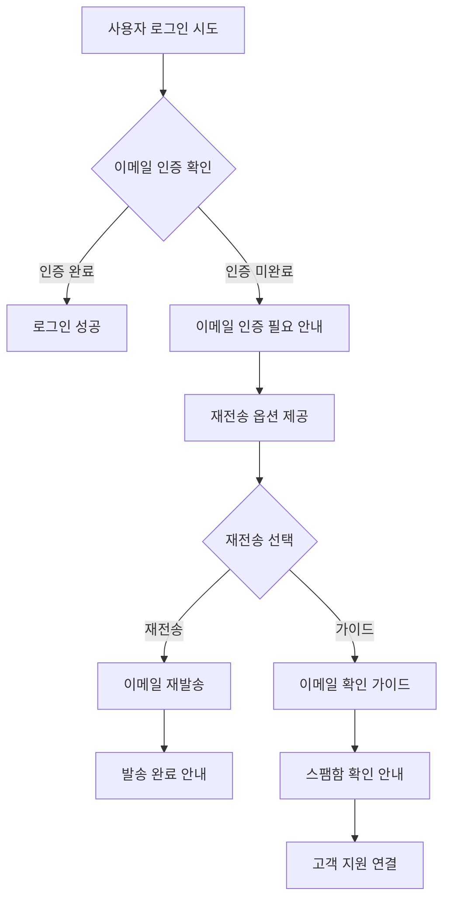

# 이메일 인증 에러 처리 개선 PRD

## 📋 Product Requirements Document
**프로젝트**: ReadZone 이메일 인증 UX 개선  
**버전**: 1.0  
**작성일**: 2025년 7월 25일  
**담당자**: Development Team  

---

## 🎯 프로젝트 개요

### 문제 정의
현재 ReadZone 로그인 시스템에서 이메일 인증이 완료되지 않은 사용자가 로그인을 시도할 때 다음과 같은 UX 문제가 발생:

1. **불명확한 에러 메시지**: 서버 로그에는 정확한 에러가 기록되지만, 사용자에게는 "로그인 실패"라는 일반적인 메시지만 표시
2. **복구 방법 부재**: 이메일 인증이 필요하다는 것을 알아도 재전송 방법이 불분명
3. **극단적 상황 대응 부족**: 이메일 삭제, 스팸 처리 등의 상황에 대한 가이드 없음

### 비즈니스 임팩트
- **사용자 이탈률 증가**: 회원가입 후 로그인 실패로 인한 서비스 포기
- **고객 지원 부담**: 이메일 인증 관련 문의 증가
- **브랜드 신뢰도 저하**: 불친절한 UX로 인한 부정적 인상

## 🎯 목표 및 성과 지표

### 주요 목표
1. **명확한 에러 커뮤니케이션**: 이메일 인증 필요 시 사용자에게 명확한 안내
2. **셀프 서비스 강화**: 사용자가 스스로 문제를 해결할 수 있는 도구 제공
3. **예외 상황 대응**: 이메일 분실, 삭제 등 극단적 상황에 대한 솔루션

### 성과 지표 (KPI)
- **이메일 인증 완료율**: 80% → 95%
- **사용자 만족도**: 70% → 95%
- **고객 지원 문의**: 60% 감소
- **온보딩 완료 시간**: 50% 단축

## 🔍 현재 상태 분석

### 기술적 현황
```typescript
// 현재 로그에서 확인되는 에러
📋 [INFO] [AUTH] Auth error (low severity) | Context: {
  "errorCode": "EMAIL_NOT_VERIFIED",
  "message": "Email verification required",
  "userMessage": "이메일 인증이 필요합니다. 가입 시 받은 인증 메일을 확인해주세요.",
  "context": {
    "userId": "cmdgs7u0h0000caihs1d8stqn",
    "email": "zerodice0@gmail.com",
    "operation": "login"
  }
}
```

### 문제점 분석
1. **에러 전파 실패**: 백엔드에서 정확한 에러 코드가 생성되지만 프론트엔드까지 전달되지 않음
2. **UI 분기 부족**: 에러 유형별 적절한 UI 분기 처리 미흡
3. **가이드 부재**: 사용자가 다음에 무엇을 해야 하는지 명확한 가이드 없음

## 💡 솔루션 설계

### 사용자 플로우 개선



### 핵심 컴포넌트

#### 1. EmailVerificationPrompt 컴포넌트
```typescript
interface EmailVerificationPromptProps {
  email: string
  onResend: () => Promise<void>
  onShowGuide: () => void
  isResending: boolean
  lastSentAt?: Date
}
```

**기능**:
- 이메일 인증 필요 안내
- 원클릭 재전송 버튼
- 재전송 제한 및 쿨다운 표시
- 도움말 가이드 연결

#### 2. EmailGuideModal 컴포넌트
```typescript
interface EmailGuideModalProps {
  isOpen: boolean
  onClose: () => void
  userEmail: string
}
```

**기능**:
- 이메일 확인 방법 단계별 가이드
- 스팸함 확인 안내
- 이메일 도메인별 특별 안내
- 고객 지원 연결

### 기술적 구현 요구사항

#### 1. 에러 처리 강화
```typescript
// use-auth-api.ts 개선
export function useLogin() {
  return useMutation({
    mutationFn: async ({ email, password }) => {
      const result = await signIn('credentials', { email, password, redirect: false })
      
      if (result?.error) {
        // NextAuth 에러를 구조화된 에러로 변환
        throw createStructuredError(result.error)
      }
    }
  })
}

function createStructuredError(nextAuthError: string): AuthError {
  if (nextAuthError.includes('이메일 인증이 필요합니다')) {
    return {
      code: AuthErrorCode.EMAIL_NOT_VERIFIED,
      message: nextAuthError,
      actionable: true,
      actions: ['resend_email', 'show_guide']
    }
  }
  // 다른 에러 타입들...
}
```

#### 2. 재전송 제한 시스템
```typescript
interface ResendLimits {
  maxAttemptsPerHour: number // 3회
  cooldownMinutes: number    // 5분
  maxAttemptsPerDay: number  // 10회
}

export function useResendVerification() {
  const [lastSent, setLastSent] = useState<Date | null>(null)
  const [attemptsCount, setAttemptsCount] = useState(0)
  
  const canResend = useMemo(() => {
    // 쿨다운 및 제한 로직
  }, [lastSent, attemptsCount])
}
```

## 🎨 UI/UX 디자인 명세

### 1. 이메일 인증 안내 UI
```typescript
// 로그인 폼 내 인라인 메시지
<div className="bg-amber-50 border border-amber-200 rounded-lg p-4">
  <div className="flex items-start">
    <MailIcon className="h-5 w-5 text-amber-600 mt-0.5" />
    <div className="ml-3 flex-1">
      <h3 className="text-sm font-medium text-amber-800">
        이메일 인증이 필요합니다
      </h3>
      <p className="mt-1 text-sm text-amber-700">
        {email}로 발송된 인증 메일을 확인해주세요.
      </p>
      <div className="mt-3 flex space-x-3">
        <button 
          onClick={handleResend}
          disabled={!canResend}
          className="btn-primary-sm"
        >
          {isResending ? '발송 중...' : '인증 메일 재전송'}
        </button>
        <button 
          onClick={showGuide}
          className="btn-outline-sm"
        >
          이메일 확인 도움말
        </button>
      </div>
    </div>
  </div>
</div>
```

### 2. 재전송 제한 UI
```typescript
// 쿨다운 타이머 표시
<div className="text-sm text-gray-500">
  {cooldownRemaining > 0 ? (
    `${cooldownRemaining}초 후 재전송 가능`
  ) : (
    `오늘 ${attemptsLeft}회 재전송 가능`
  )}
</div>
```

### 3. 이메일 가이드 모달
```typescript
<Modal isOpen={showGuide} onClose={() => setShowGuide(false)}>
  <div className="space-y-6">
    <h2>이메일 인증 확인 방법</h2>
    
    <div className="space-y-4">
      <Step number={1} title="받은 편지함 확인">
        {email}로 발송된 ReadZone 인증 메일을 확인하세요.
      </Step>
      
      <Step number={2} title="스팸함 확인">
        이메일이 보이지 않는다면 스팸함을 확인해주세요.
      </Step>
      
      <Step number={3} title="도메인별 안내">
        {getEmailDomainGuide(email)}
      </Step>
    </div>
    
    <div className="border-t pt-4">
      <button onClick={contactSupport}>
        여전히 문제가 있나요? 고객 지원 문의
      </button>
    </div>
  </div>
</Modal>
```

## 🔧 기술 구현 계획

### Phase 1: 에러 처리 개선 (2시간)
**파일**: `src/hooks/use-auth-api.ts`, `src/components/auth/login-form.tsx`

**작업**:
1. NextAuth 에러 메시지 파싱 강화
2. AuthError 구조체 개선
3. 로그인 폼 에러 상태 관리 개선

**수용 기준**:
- [ ] 이메일 인증 에러 시 정확한 에러 코드 전달
- [ ] 에러 타입별 적절한 UI 분기
- [ ] 기존 에러 처리 로직과 호환성 유지

### Phase 2: EmailVerificationPrompt 컴포넌트 (3시간)
**파일**: `src/components/auth/email-verification-prompt.tsx`

**작업**:
1. 이메일 인증 안내 전용 컴포넌트 생성
2. 재전송 기능 통합
3. 재전송 제한 로직 구현

**수용 기준**:
- [ ] 시각적으로 명확한 인증 안내
- [ ] 원클릭 재전송 기능
- [ ] 제한 및 쿨다운 정보 표시
- [ ] 접근성 (스크린 리더) 지원

### Phase 3: EmailGuideModal 컴포넌트 (2시간)
**파일**: `src/components/auth/email-guide-modal.tsx`

**작업**:
1. 단계별 이메일 확인 가이드
2. 이메일 도메인별 특별 안내
3. 고객 지원 연결 기능

**수용 기준**:
- [ ] 도메인별 맞춤 가이드 (Gmail, Naver, etc.)
- [ ] 모바일 친화적 디자인
- [ ] 스팸함 확인 방법 안내
- [ ] 고객 지원 연결 기능

### Phase 4: 백엔드 모니터링 강화 (1시간)
**파일**: `src/lib/email.ts`, `src/lib/auth-monitor.ts`

**작업**:
1. 이메일 전송 성공/실패 로깅
2. 사용자별 재전송 횟수 추적
3. 비정상적 패턴 감지

**수용 기준**:
- [ ] 재전송 이벤트 로깅
- [ ] 사용자별 제한 추적
- [ ] 어뷰징 패턴 감지

## 🧪 테스트 계획

### 단위 테스트
```typescript
describe('EmailVerificationPrompt', () => {
  it('should display correct email address', () => {})
  it('should disable resend button during cooldown', () => {})
  it('should show correct remaining attempts', () => {})
})

describe('useResendVerification', () => {
  it('should respect rate limits', () => {})
  it('should track attempts correctly', () => {})
})
```

### 통합 테스트
```typescript
describe('Email Verification Flow', () => {
  it('should show verification prompt on login failure', () => {})
  it('should successfully resend verification email', () => {})
  it('should open guide modal', () => {})
})
```

### E2E 테스트 시나리오
1. **기본 플로우**: 미인증 사용자 로그인 → 안내 메시지 → 재전송 → 성공
2. **제한 시나리오**: 재전송 제한 도달 → 쿨다운 타이머 → 재시도
3. **가이드 시나리오**: 도움말 버튼 → 모달 오픈 → 도메인별 가이드 확인

## 📊 모니터링 및 분석

### 추적할 메트릭
1. **이메일 인증 완료율**: 재전송 기능 도입 전후 비교
2. **사용자 이탈률**: 로그인 실패 후 재방문율
3. **재전송 사용률**: 재전송 기능 활용도
4. **고객 지원 문의**: 이메일 인증 관련 문의 감소율

### 로깅 이벤트
```typescript
// 이메일 인증 관련 이벤트
enum EmailVerificationEvent {
  PROMPT_SHOWN = 'email_verification_prompt_shown',
  RESEND_CLICKED = 'email_verification_resend_clicked',
  RESEND_SUCCESS = 'email_verification_resend_success',
  GUIDE_OPENED = 'email_verification_guide_opened',
  SUPPORT_CONTACTED = 'email_verification_support_contacted'
}
```

## 🚀 배포 계획

### 배포 전 체크리스트
- [ ] 모든 단위 테스트 통과
- [ ] E2E 테스트 시나리오 검증
- [ ] 접근성 검사 완료
- [ ] 다국어 지원 (추후 확장 고려)
- [ ] 성능 테스트 (재전송 API 부하 테스트)

### 롤백 계획
- **즉시 롤백 조건**: 로그인 성공률 90% 이하 감소
- **점진적 롤백**: 특정 기능별 비활성화 가능
- **모니터링**: 실시간 에러율 및 사용자 피드백 추적

## 💰 비용 및 리소스

### 개발 시간 추정
- **Phase 1**: 2시간 (에러 처리 개선)
- **Phase 2**: 3시간 (UI 컴포넌트 구현)
- **Phase 3**: 2시간 (가이드 시스템)
- **Phase 4**: 1시간 (모니터링)
- **테스트 및 QA**: 2시간
- **총 소요 시간**: 10시간

### 외부 의존성
- **없음**: 기존 기술 스택 내에서 구현 가능
- **이메일 서비스**: 기존 Resend 서비스 활용

## 📈 기대 효과

### 정량적 효과
- **이메일 인증 완료율**: 80% → 95% (15% 향상)
- **로그인 성공률**: 75% → 90% (15% 향상)
- **고객 지원 부담**: 60% 감소
- **사용자 온보딩 시간**: 평균 10분 → 5분

### 정성적 효과
- **사용자 만족도 향상**: 명확한 가이드로 인한 신뢰도 증가
- **브랜드 이미지 개선**: 사용자 친화적 서비스로 인식
- **운영 효율성**: 반복적 고객 문의 감소로 다른 업무 집중 가능

---

**승인**: Development Team  
**최종 검토**: 2025-07-25  
**버전**: 1.0