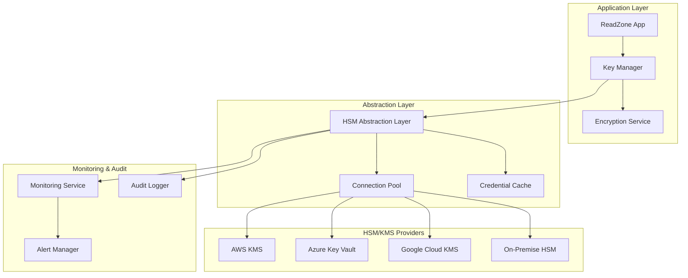

# HSM Integration Architecture Design

**문서 버전**: v1.0  
**작성일**: 2025-02-01  
**작성자**: DevOps Team  
**검토자**: Security Team, Infrastructure Team  
**상태**: 설계 검토 중

---

## 📋 Executive Summary

### 목적
ReadZone 암호화 시스템의 마스터 키를 하드웨어 보안 모듈(HSM) 또는 클라우드 키 관리 서비스(KMS)를 통해 안전하게 보호하여 최고 수준의 보안을 달성한다.

### 핵심 설계 원칙
- **Zero Trust Architecture**: 모든 키 접근은 검증 필수
- **Defense in Depth**: 다층 보안 체계 구축
- **High Availability**: 99.99% 가용성 보장
- **Disaster Recovery**: RPO < 1시간, RTO < 4시간
- **Compliance Ready**: FIPS 140-2 Level 3, Common Criteria EAL4+

---

## 🏗️ Architecture Overview

### System Components



### Key Hierarchy

```
Master Key (HSM/KMS Protected)
    ├── Key Encryption Keys (KEK)
    │   ├── User Key Encryption Key
    │   ├── System Key Encryption Key
    │   └── Backup Key Encryption Key
    └── Data Encryption Keys (DEK)
        ├── User-Specific DEKs
        ├── Service DEKs
        └── Temporary Session Keys
```

---

## 🔐 HSM Integration Design

### 1. HSM Abstraction Layer

```typescript
// HSM Abstraction Interface
interface IHSMProvider {
  // Initialization
  initialize(config: HSMConfig): Promise<void>
  healthCheck(): Promise<HealthStatus>
  
  // Key Operations
  generateKey(spec: KeySpec): Promise<KeyHandle>
  importKey(keyMaterial: Buffer, spec: KeySpec): Promise<KeyHandle>
  exportKey(handle: KeyHandle): Promise<never> // Keys never leave HSM
  deleteKey(handle: KeyHandle): Promise<void>
  
  // Cryptographic Operations
  encrypt(handle: KeyHandle, plaintext: Buffer): Promise<EncryptedData>
  decrypt(handle: KeyHandle, ciphertext: Buffer): Promise<Buffer>
  sign(handle: KeyHandle, data: Buffer): Promise<Signature>
  verify(handle: KeyHandle, data: Buffer, signature: Signature): Promise<boolean>
  
  // Key Wrapping (for DEK protection)
  wrapKey(kekHandle: KeyHandle, dek: Buffer): Promise<WrappedKey>
  unwrapKey(kekHandle: KeyHandle, wrappedKey: WrappedKey): Promise<Buffer>
  
  // Session Management
  createSession(credentials: Credentials): Promise<Session>
  closeSession(session: Session): Promise<void>
  
  // Audit & Compliance
  getAuditLogs(timeRange: TimeRange): Promise<AuditLog[]>
  getComplianceInfo(): Promise<ComplianceInfo>
}

// Configuration Types
interface HSMConfig {
  provider: 'AWS_KMS' | 'AZURE_KEY_VAULT' | 'GCP_KMS' | 'LUNA_HSM' | 'THALES_HSM'
  connection: {
    endpoint?: string
    region?: string
    partition?: string
    slot?: number
  }
  credentials: {
    type: 'IAM_ROLE' | 'SERVICE_PRINCIPAL' | 'CERTIFICATE' | 'TOKEN'
    data: Record<string, any>
  }
  performance: {
    connectionPoolSize: number
    requestTimeout: number
    retryPolicy: RetryPolicy
  }
  highAvailability?: {
    replicas: HSMReplica[]
    loadBalancing: 'ROUND_ROBIN' | 'LEAST_CONNECTIONS' | 'FAILOVER'
  }
}
```

### 2. Provider-Specific Implementations

#### AWS KMS Integration

```typescript
class AWSKMSProvider implements IHSMProvider {
  private kmsClient: AWS.KMS
  private credentialProvider: AWS.CredentialProvider
  private connectionPool: ConnectionPool<AWS.KMS>
  
  async initialize(config: HSMConfig): Promise<void> {
    // Configure AWS SDK v3
    this.credentialProvider = this.setupCredentials(config.credentials)
    
    // Initialize connection pool
    this.connectionPool = new ConnectionPool({
      factory: () => new AWS.KMS({
        region: config.connection.region,
        credentials: this.credentialProvider,
        maxRetries: 3,
        retryMode: 'adaptive'
      }),
      size: config.performance.connectionPoolSize,
      validation: async (client) => {
        await client.describeKey({ KeyId: 'alias/readzone-master' })
        return true
      }
    })
    
    // Verify connectivity and permissions
    await this.verifySetup()
  }
  
  async generateKey(spec: KeySpec): Promise<KeyHandle> {
    const client = await this.connectionPool.acquire()
    
    try {
      const response = await client.createKey({
        KeySpec: this.mapKeySpec(spec),
        KeyUsage: spec.usage,
        Origin: 'AWS_KMS',
        MultiRegion: true, // For disaster recovery
        Tags: [
          { TagKey: 'Application', TagValue: 'ReadZone' },
          { TagKey: 'Purpose', TagValue: spec.purpose },
          { TagKey: 'Environment', TagValue: process.env.NODE_ENV }
        ]
      })
      
      // Set key policy for least privilege
      await this.setKeyPolicy(response.KeyMetadata.KeyId, spec)
      
      return {
        id: response.KeyMetadata.KeyId,
        arn: response.KeyMetadata.Arn,
        provider: 'AWS_KMS',
        createdAt: response.KeyMetadata.CreationDate
      }
    } finally {
      this.connectionPool.release(client)
    }
  }
  
  async wrapKey(kekHandle: KeyHandle, dek: Buffer): Promise<WrappedKey> {
    const client = await this.connectionPool.acquire()
    
    try {
      const response = await client.encrypt({
        KeyId: kekHandle.id,
        Plaintext: dek,
        EncryptionContext: {
          purpose: 'DEK_WRAPPING',
          timestamp: new Date().toISOString()
        }
      })
      
      return {
        ciphertext: response.CiphertextBlob,
        keyId: kekHandle.id,
        algorithm: 'AWS_KMS_WRAPPED',
        context: response.EncryptionContext
      }
    } finally {
      this.connectionPool.release(client)
    }
  }
  
  private async setKeyPolicy(keyId: string, spec: KeySpec): Promise<void> {
    const policy = {
      Version: '2012-10-17',
      Statement: [
        {
          Sid: 'Enable IAM User Permissions',
          Effect: 'Allow',
          Principal: { AWS: `arn:aws:iam::${process.env.AWS_ACCOUNT_ID}:root` },
          Action: 'kms:*',
          Resource: '*'
        },
        {
          Sid: 'Allow ReadZone Service',
          Effect: 'Allow',
          Principal: { AWS: process.env.READZONE_SERVICE_ROLE_ARN },
          Action: [
            'kms:Decrypt',
            'kms:GenerateDataKey',
            'kms:CreateGrant'
          ],
          Resource: '*',
          Condition: {
            StringEquals: {
              'kms:ViaService': `s3.${process.env.AWS_REGION}.amazonaws.com`
            }
          }
        }
      ]
    }
    
    await this.kmsClient.putKeyPolicy({
      KeyId: keyId,
      PolicyName: 'default',
      Policy: JSON.stringify(policy)
    })
  }
}
```

#### Azure Key Vault Integration

```typescript
class AzureKeyVaultProvider implements IHSMProvider {
  private keyClient: KeyClient
  private cryptoClient: CryptographyClient
  private credentials: TokenCredential
  
  async initialize(config: HSMConfig): Promise<void> {
    // Setup Azure credentials
    this.credentials = this.setupAzureCredentials(config.credentials)
    
    // Initialize Key Vault clients
    const vaultUrl = `https://${config.connection.endpoint}.vault.azure.net`
    this.keyClient = new KeyClient(vaultUrl, this.credentials)
    
    // Enable managed HSM features if available
    if (config.connection.endpoint.includes('managedhsm')) {
      await this.enableManagedHSMFeatures()
    }
    
    // Verify setup
    await this.verifySetup()
  }
  
  async generateKey(spec: KeySpec): Promise<KeyHandle> {
    const keyName = `readzone-${spec.purpose}-${Date.now()}`
    
    const key = await this.keyClient.createKey(keyName, spec.keyType, {
      keyOps: this.mapKeyOperations(spec),
      hsm: true, // Force HSM-backed keys
      exportable: false,
      tags: {
        application: 'ReadZone',
        purpose: spec.purpose,
        environment: process.env.NODE_ENV
      }
    })
    
    // Setup crypto client for this key
    const cryptoClient = new CryptographyClient(key, this.credentials)
    
    return {
      id: key.id,
      name: key.name,
      version: key.properties.version,
      provider: 'AZURE_KEY_VAULT',
      cryptoClient // Cache for performance
    }
  }
  
  async wrapKey(kekHandle: KeyHandle, dek: Buffer): Promise<WrappedKey> {
    const cryptoClient = kekHandle.cryptoClient || 
                        new CryptographyClient(kekHandle.id, this.credentials)
    
    const result = await cryptoClient.wrapKey(
      'RSA-OAEP-256',
      dek,
      {
        additionalAuthenticatedData: Buffer.from(JSON.stringify({
          purpose: 'DEK_WRAPPING',
          timestamp: new Date().toISOString()
        }))
      }
    )
    
    return {
      ciphertext: result.result,
      keyId: kekHandle.id,
      algorithm: result.algorithm,
      context: { keyVersion: kekHandle.version }
    }
  }
}
```

#### On-Premise HSM Integration (Luna/Thales)

```typescript
class LunaHSMProvider implements IHSMProvider {
  private pkcs11: PKCS11
  private session: Session
  private slots: SlotInfo[]
  
  async initialize(config: HSMConfig): Promise<void> {
    // Load PKCS#11 library
    this.pkcs11 = new PKCS11()
    this.pkcs11.load(config.connection.libraryPath || '/usr/safenet/lunaclient/lib/libCryptoki2_64.so')
    
    // Initialize PKCS#11
    this.pkcs11.C_Initialize()
    
    // Get available slots
    this.slots = this.pkcs11.C_GetSlotList(true)
    const slot = this.slots[config.connection.slot || 0]
    
    // Open session
    this.session = this.pkcs11.C_OpenSession(
      slot.slotID,
      CKF_SERIAL_SESSION | CKF_RW_SESSION
    )
    
    // Login to HSM
    await this.login(config.credentials)
    
    // Setup high availability if configured
    if (config.highAvailability) {
      await this.setupHA(config.highAvailability)
    }
  }
  
  async generateKey(spec: KeySpec): Promise<KeyHandle> {
    const keyTemplate = [
      { type: CKA_CLASS, value: CKO_SECRET_KEY },
      { type: CKA_KEY_TYPE, value: CKK_AES },
      { type: CKA_VALUE_LEN, value: spec.keySize / 8 },
      { type: CKA_TOKEN, value: true },
      { type: CKA_PRIVATE, value: true },
      { type: CKA_ENCRYPT, value: true },
      { type: CKA_DECRYPT, value: true },
      { type: CKA_WRAP, value: true },
      { type: CKA_UNWRAP, value: true },
      { type: CKA_EXTRACTABLE, value: false },
      { type: CKA_LABEL, value: `ReadZone-${spec.purpose}` }
    ]
    
    const keyHandle = this.pkcs11.C_GenerateKey(
      this.session,
      { mechanism: CKM_AES_KEY_GEN },
      keyTemplate
    )
    
    return {
      handle: keyHandle,
      provider: 'LUNA_HSM',
      slot: this.session.slot,
      created: new Date()
    }
  }
  
  async wrapKey(kekHandle: KeyHandle, dek: Buffer): Promise<WrappedKey> {
    const mechanism = {
      mechanism: CKM_AES_KEY_WRAP_PAD,
      parameter: null
    }
    
    const wrapped = this.pkcs11.C_WrapKey(
      this.session,
      mechanism,
      kekHandle.handle,
      dek
    )
    
    return {
      ciphertext: wrapped,
      keyId: kekHandle.handle.toString(),
      algorithm: 'AES_KEY_WRAP_PAD',
      context: { slot: this.session.slot }
    }
  }
  
  private async setupHA(haConfig: HighAvailabilityConfig): Promise<void> {
    // Configure Luna HA group
    for (const replica of haConfig.replicas) {
      // Add replica to HA group
      await this.addHAMember(replica)
    }
    
    // Set load balancing policy
    await this.setHAPolicy(haConfig.loadBalancing)
  }
}
```

### 3. Connection Management

```typescript
class HSMConnectionPool<T> {
  private available: T[] = []
  private inUse: Map<T, ConnectionMetadata> = new Map()
  private factory: ConnectionFactory<T>
  private validator: ConnectionValidator<T>
  
  constructor(config: PoolConfig<T>) {
    this.factory = config.factory
    this.validator = config.validator
    this.initializePool(config.size)
  }
  
  async acquire(): Promise<T> {
    // Try to get available connection
    let connection = this.available.pop()
    
    if (!connection) {
      // Create new connection if under limit
      if (this.inUse.size < this.config.maxSize) {
        connection = await this.createConnection()
      } else {
        // Wait for available connection
        connection = await this.waitForConnection()
      }
    }
    
    // Validate connection health
    if (!await this.validator(connection)) {
      await this.destroyConnection(connection)
      return this.acquire() // Retry with new connection
    }
    
    // Track connection usage
    this.inUse.set(connection, {
      acquiredAt: Date.now(),
      lastUsed: Date.now()
    })
    
    return connection
  }
  
  release(connection: T): void {
    const metadata = this.inUse.get(connection)
    if (!metadata) return
    
    // Update usage stats
    metadata.lastUsed = Date.now()
    
    // Check if connection should be recycled
    if (this.shouldRecycle(metadata)) {
      this.destroyConnection(connection)
      this.createConnection() // Maintain pool size
    } else {
      this.inUse.delete(connection)
      this.available.push(connection)
    }
  }
  
  private shouldRecycle(metadata: ConnectionMetadata): boolean {
    const age = Date.now() - metadata.acquiredAt
    return age > this.config.maxConnectionAge
  }
}
```

### 4. High Availability & Disaster Recovery

```typescript
class HSMHighAvailability {
  private providers: Map<string, IHSMProvider> = new Map()
  private activeProvider: string
  private healthChecker: HealthChecker
  
  constructor(private config: HAConfig) {
    this.healthChecker = new HealthChecker(this)
    this.setupProviders()
  }
  
  private async setupProviders(): Promise<void> {
    // Setup primary provider
    const primary = await this.createProvider(this.config.primary)
    this.providers.set('primary', primary)
    this.activeProvider = 'primary'
    
    // Setup secondary providers
    for (const [name, config] of Object.entries(this.config.secondary)) {
      const provider = await this.createProvider(config)
      this.providers.set(name, provider)
    }
    
    // Start health monitoring
    this.healthChecker.start()
  }
  
  async executeOperation<T>(
    operation: (provider: IHSMProvider) => Promise<T>
  ): Promise<T> {
    const maxRetries = 3
    let lastError: Error
    
    for (let i = 0; i < maxRetries; i++) {
      try {
        const provider = this.providers.get(this.activeProvider)
        if (!provider) {
          await this.failover()
          continue
        }
        
        return await operation(provider)
      } catch (error) {
        lastError = error
        console.error(`HSM operation failed on ${this.activeProvider}:`, error)
        
        if (this.isFailoverRequired(error)) {
          await this.failover()
        }
      }
    }
    
    throw new HSMOperationError('All HSM providers failed', lastError)
  }
  
  private async failover(): Promise<void> {
    console.log(`Initiating failover from ${this.activeProvider}`)
    
    // Find healthy provider
    for (const [name, provider] of this.providers) {
      if (name === this.activeProvider) continue
      
      try {
        const health = await provider.healthCheck()
        if (health.status === 'HEALTHY') {
          this.activeProvider = name
          console.log(`Failover completed to ${name}`)
          
          // Sync keys if needed
          await this.syncKeys()
          return
        }
      } catch (error) {
        console.error(`Provider ${name} health check failed:`, error)
      }
    }
    
    throw new Error('No healthy HSM providers available')
  }
  
  private async syncKeys(): Promise<void> {
    // Implement key synchronization between HSM providers
    // This is provider-specific and may require:
    // 1. Export from old provider (if supported)
    // 2. Import to new provider
    // 3. Or use pre-shared replicated keys
  }
}
```

### 5. Security & Compliance

```typescript
class HSMSecurityManager {
  private auditLogger: AuditLogger
  private complianceChecker: ComplianceChecker
  
  constructor(private provider: IHSMProvider) {
    this.auditLogger = new AuditLogger()
    this.complianceChecker = new ComplianceChecker()
  }
  
  async executeSecureOperation<T>(
    operation: () => Promise<T>,
    context: OperationContext
  ): Promise<T> {
    // Pre-operation validation
    await this.validateContext(context)
    
    // Start audit trail
    const auditId = await this.auditLogger.startOperation({
      operation: context.operationType,
      user: context.userId,
      timestamp: new Date(),
      hsm: this.provider.getIdentifier()
    })
    
    try {
      // Execute with monitoring
      const result = await this.monitoredExecution(operation)
      
      // Log success
      await this.auditLogger.completeOperation(auditId, {
        status: 'SUCCESS',
        result: this.sanitizeResult(result)
      })
      
      return result
    } catch (error) {
      // Log failure
      await this.auditLogger.completeOperation(auditId, {
        status: 'FAILED',
        error: error.message
      })
      
      // Alert on critical failures
      if (this.isCriticalError(error)) {
        await this.alertSecurityTeam(error, context)
      }
      
      throw error
    }
  }
  
  private async validateContext(context: OperationContext): Promise<void> {
    // Validate user permissions
    if (!await this.hasPermission(context.userId, context.operationType)) {
      throw new UnauthorizedError('Insufficient permissions for HSM operation')
    }
    
    // Check compliance requirements
    const compliance = await this.complianceChecker.check(context)
    if (!compliance.passed) {
      throw new ComplianceError(compliance.violations)
    }
    
    // Rate limiting
    if (!await this.rateLimiter.allow(context.userId)) {
      throw new RateLimitError('HSM operation rate limit exceeded')
    }
  }
}
```

### 6. Performance Optimization

```typescript
class HSMPerformanceOptimizer {
  private cache: HSMOperationCache
  private batchProcessor: BatchProcessor
  private metrics: MetricsCollector
  
  constructor(private provider: IHSMProvider) {
    this.cache = new HSMOperationCache()
    this.batchProcessor = new BatchProcessor(provider)
    this.metrics = new MetricsCollector()
  }
  
  async optimizedEncrypt(
    keyHandle: KeyHandle,
    data: Buffer[]
  ): Promise<EncryptedData[]> {
    // Check cache for repeated operations
    const cacheKeys = data.map(d => this.getCacheKey(keyHandle, d))
    const cached = await this.cache.getMany(cacheKeys)
    
    // Filter out cached results
    const toProcess: Array<{index: number, data: Buffer}> = []
    const results: EncryptedData[] = new Array(data.length)
    
    cached.forEach((result, index) => {
      if (result) {
        results[index] = result
      } else {
        toProcess.push({ index, data: data[index] })
      }
    })
    
    if (toProcess.length === 0) {
      this.metrics.recordCacheHit(data.length)
      return results
    }
    
    // Batch process remaining items
    const batchResults = await this.batchProcessor.processBatch(
      toProcess.map(item => ({
        operation: 'encrypt',
        keyHandle,
        data: item.data
      }))
    )
    
    // Update results and cache
    batchResults.forEach((result, i) => {
      const item = toProcess[i]
      results[item.index] = result
      this.cache.set(cacheKeys[item.index], result)
    })
    
    // Record metrics
    this.metrics.recordOperation({
      operation: 'encrypt',
      itemCount: data.length,
      cacheHits: data.length - toProcess.length,
      duration: Date.now() - startTime
    })
    
    return results
  }
}

class BatchProcessor {
  private queue: OperationQueue
  private processing: boolean = false
  
  constructor(
    private provider: IHSMProvider,
    private config: BatchConfig = { maxBatchSize: 100, maxWaitTime: 50 }
  ) {
    this.queue = new OperationQueue()
    this.startProcessing()
  }
  
  async processBatch(operations: Operation[]): Promise<any[]> {
    // Add to queue
    const promises = operations.map(op => {
      const promise = new Promise((resolve, reject) => {
        this.queue.add({ ...op, resolve, reject })
      })
      return promise
    })
    
    // Trigger immediate processing if queue is full
    if (this.queue.size() >= this.config.maxBatchSize) {
      this.processQueue()
    }
    
    return Promise.all(promises)
  }
  
  private async processQueue(): Promise<void> {
    if (this.processing || this.queue.isEmpty()) return
    
    this.processing = true
    const batch = this.queue.takeBatch(this.config.maxBatchSize)
    
    try {
      // Group by operation type for efficiency
      const grouped = this.groupByOperation(batch)
      
      // Process each group
      for (const [opType, ops] of grouped) {
        await this.processOperationGroup(opType, ops)
      }
    } finally {
      this.processing = false
      
      // Continue processing if more items
      if (!this.queue.isEmpty()) {
        setImmediate(() => this.processQueue())
      }
    }
  }
}
```

---

## 🚀 Implementation Plan

### Phase 1: Foundation (Week 1)
1. **HSM Abstraction Layer**
   - Core interfaces and types
   - Provider factory pattern
   - Connection management

2. **AWS KMS Provider**
   - Basic implementation
   - IAM configuration
   - Testing infrastructure

### Phase 2: Multi-Provider Support (Week 2)
1. **Azure Key Vault Provider**
   - Implementation
   - Managed HSM features
   - Cross-region support

2. **On-Premise HSM Support**
   - PKCS#11 integration
   - Luna HSM provider
   - High availability setup

### Phase 3: Production Features (Week 3)
1. **High Availability**
   - Failover mechanism
   - Health monitoring
   - Key synchronization

2. **Performance Optimization**
   - Connection pooling
   - Batch processing
   - Intelligent caching

### Phase 4: Security & Compliance (Week 4)
1. **Security Hardening**
   - Audit logging
   - Access control
   - Threat detection

2. **Compliance Features**
   - FIPS validation
   - Compliance reporting
   - Key lifecycle management

---

## 📊 Configuration Examples

### Production AWS Configuration

```yaml
hsm:
  provider: AWS_KMS
  connection:
    region: us-east-1
    endpoint: null # Use default
  credentials:
    type: IAM_ROLE
    data:
      roleArn: arn:aws:iam::123456789012:role/ReadZone-KMS-Role
  performance:
    connectionPoolSize: 20
    requestTimeout: 5000
    retryPolicy:
      maxRetries: 3
      backoffMultiplier: 2
  highAvailability:
    replicas:
      - region: us-west-2
        roleArn: arn:aws:iam::123456789012:role/ReadZone-KMS-Role-West
    loadBalancing: FAILOVER
  monitoring:
    cloudwatch:
      enabled: true
      namespace: ReadZone/HSM
    alerts:
      - metric: ErrorRate
        threshold: 0.01
        action: sns:alert-topic
```

### Enterprise Luna HSM Configuration

```yaml
hsm:
  provider: LUNA_HSM
  connection:
    libraryPath: /usr/safenet/lunaclient/lib/libCryptoki2_64.so
    slot: 0
    partition: ReadZone-Prod
  credentials:
    type: CERTIFICATE
    data:
      certPath: /etc/luna/client.pem
      keyPath: /etc/luna/client.key
  performance:
    connectionPoolSize: 10
    sessionCacheSize: 100
  highAvailability:
    haGroupName: ReadZone-HA
    members:
      - serial: 1234567890
        hostname: hsm1.datacenter.local
      - serial: 0987654321
        hostname: hsm2.datacenter.local
    synchronization:
      automatic: true
      interval: 300 # seconds
```

---

## 🔒 Security Considerations

### Key Protection
1. **Hardware-Based Protection**: All master keys stored in HSM hardware
2. **Access Control**: Role-based access with least privilege
3. **Audit Trail**: Complete audit log of all key operations
4. **Key Escrow**: Optional key escrow for compliance

### Network Security
1. **TLS 1.3**: All HSM communications encrypted
2. **Mutual TLS**: Client certificate authentication
3. **IP Whitelisting**: Restrict HSM access by IP
4. **VPN/Private Link**: Use private connectivity where available

### Operational Security
1. **Separation of Duties**: Different roles for key management
2. **Dual Control**: Critical operations require two operators
3. **Time-Based Access**: Temporary elevated permissions
4. **Regular Audits**: Automated compliance scanning

---

## 📈 Monitoring & Alerting

### Key Metrics
- **Operation Latency**: p50, p95, p99 response times
- **Error Rate**: Failed operations per minute
- **Throughput**: Operations per second
- **Connection Pool**: Active/idle connections
- **Cache Hit Rate**: Percentage of cached operations

### Alerts
- **Critical**: HSM unavailable, authentication failures
- **High**: Error rate > 1%, latency > 1s
- **Medium**: Cache hit rate < 50%, connection pool exhausted
- **Low**: Certificate expiration warning, quota usage

### Dashboards
1. **Operations Dashboard**: Real-time operation metrics
2. **Security Dashboard**: Access patterns and anomalies
3. **Compliance Dashboard**: Audit trail and compliance status
4. **Cost Dashboard**: HSM usage and optimization opportunities

---

## 🎯 Success Criteria

1. **Security**
   - Zero master key exposure incidents
   - 100% audit trail coverage
   - Compliance with FIPS 140-2 Level 3

2. **Performance**
   - HSM operation latency < 100ms (p95)
   - Support 10,000 operations/second
   - 99.99% availability

3. **Operations**
   - Automated failover < 30 seconds
   - Key rotation without downtime
   - Full disaster recovery < 4 hours

---

**문서 승인**: DevOps Team Lead  
**보안 검토**: Security Team Lead  
**구현 시작**: 2025-02-01