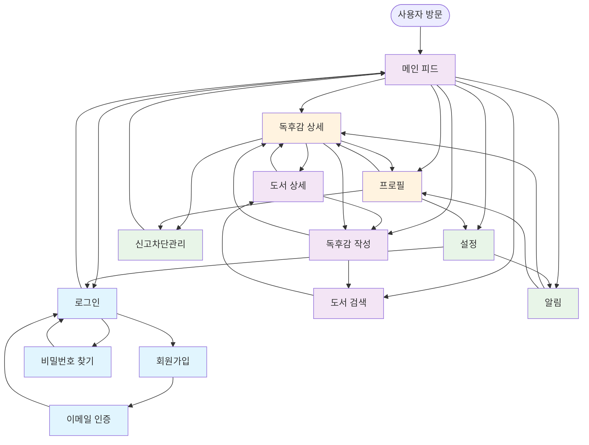

# ReadZone 구현 페이지 목록 및 연결 관계

## 개요
ReadZone 프로젝트의 구현에 필요한 모든 페이지들과 그들 간의 연결 관계를 정리한 문서입니다. 이 문서는 user-flows 분석을 기반으로 작성되었습니다.

## 📱 구현 필요 페이지 목록 (총 13개)

### 1. 인증 관련 페이지 (4개)
| 페이지 | 경로 | 설명 | 핵심 기능 |
|--------|------|------|----------|
| 로그인 | `/login` | 서비스 소개 + 로그인 폼 | JWT 토큰 기반 인증, 서비스 소개 |
| 회원가입 | `/register` | 이메일 인증 포함 | 실시간 검증, 이메일 인증 |
| 비밀번호 찾기 | `/forgot-password` | 이메일 재설정 | 이메일 재설정, 미가입자 초대 |
| 이메일 인증 | `/verify-email` | 회원가입 후 처리 | 이메일 토큰 확인, 재발송 |

### 2. 메인 콘텐츠 페이지 (4개)
| 페이지 | 경로 | 설명 | 핵심 기능 |
|--------|------|------|----------|
| 메인 피드 | `/` | Threads 스타일 무한 스크롤 | 3단계 피드, 비로그인 읽기 가능 |
| 도서 검색 | `/search` | 카카오 API + 수동 입력 | 3단계 검색, 통합 검색 |
| 도서 상세 | `/books/[id]` | 도서 정보 + 독후감 목록 | 도서 정보, 관련 독후감 표시 |
| 독후감 작성 | `/write` | Markdown 에디터 + 자동저장 | 실시간 미리보기, 30초 자동저장 |

### 3. 상세 보기 페이지 (2개)
| 페이지 | 경로 | 설명 | 핵심 기능 |
|--------|------|------|----------|
| 독후감 상세 | `/review/[id]` | 안전한 HTML 렌더링 + 댓글 | DOMPurify, 댓글 시스템 |
| 프로필 | `/profile/[userId]` | 기본 정보 + 활동 통계 | 팔로우 기능, 활동 통계 |

### 4. 관리 및 설정 페이지 (3개)
| 페이지 | 경로 | 설명 | 핵심 기능 |
|--------|------|------|----------|
| 설정 | `/settings` | 프로필 편집 + 계정 관리 | 프로필 편집, 알림 설정 |
| 알림 | `/notifications` | 실시간 알림 목록 | 3가지 알림 유형, 실시간 업데이트 |
| 신고/차단 관리 | `/moderation` | 커뮤니티 안전 기능 | 6가지 신고 유형, 차단 관리 |

---

## 🔗 페이지 연결 관계 다이어그램



---

## 🎯 주요 연결 패턴 분석

### 1. **메인 허브: 피드 페이지 (`/`)**
- 모든 사용자의 첫 진입점
- 비로그인시에도 콘텐츠 탐색 가능
- 상호작용 시 로그인 유도
- 7개 주요 페이지로 직접 연결

### 2. **인증 체인 (Authentication Chain)**
```
/ → /login → /register → /verify-email → /login → /
```
- 순차적 인증 프로세스
- 각 단계에서 이전 단계로 복귀 가능
- 최종적으로 메인 피드로 복귀

### 3. **콘텐츠 생성 체인 (Content Creation Chain)**
```
/ → /write → /search → /books/:id → /write → /review/:id → /
```
- 도서 검색을 통한 콘텐츠 생성
- 3단계 도서 검색 지원
- 작성 완료 후 상세 페이지로 이동

### 4. **소셜 상호작용 체인 (Social Interaction Chain)**
```
/ → /review/:id → /profile/:userId → /notifications → /
```
- 콘텐츠 기반 사용자 발견
- 팔로우 시스템을 통한 관계 형성
- 실시간 알림을 통한 상호작용

### 5. **관리 및 설정 체인 (Management Chain)**
```
/ → /settings → /notifications → /moderation → /
```
- 개인 설정 및 계정 관리
- 커뮤니티 안전 기능
- 알림 설정 및 관리

---

## 📊 페이지별 중요도 및 구현 우선순위

### 🟥 1순위: 핵심 페이지 (MVP)
**즉시 구현 필요**
- **메인 피드** (`/`) - 서비스의 핵심, 모든 연결의 허브
- **로그인** (`/login`) - 인증 시스템의 핵심
- **회원가입** (`/register`) - 사용자 획득의 핵심
- **독후감 작성** (`/write`) - 주요 기능

### 🟨 2순위: 주요 페이지 (Core Features)
**MVP 직후 구현**
- **독후감 상세** (`/review/:id`) - 콘텐츠 소비 핵심
- **도서 검색** (`/search`) - 콘텐츠 생성 지원
- **프로필** (`/profile/:userId`) - 소셜 기능 핵심
- **설정** (`/settings`) - 사용자 관리

### 🟩 3순위: 보조 페이지 (Enhanced Features)
**기본 기능 완료 후 구현**
- **도서 상세** (`/books/:id`) - 탐색 기능 향상
- **알림** (`/notifications`) - 참여도 향상
- **이메일 인증** (`/verify-email`) - 보안 강화
- **비밀번호 찾기** (`/forgot-password`) - 사용자 편의성
- **신고/차단 관리** (`/moderation`) - 커뮤니티 안전

---

## 🔧 기술적 고려사항

### 라우팅 구조
```
readzone/
├── pages/
│   ├── index.tsx                    # 메인 피드 (/)
│   ├── login.tsx                    # 로그인
│   ├── register.tsx                 # 회원가입
│   ├── forgot-password.tsx          # 비밀번호 찾기
│   ├── verify-email.tsx             # 이메일 인증
│   ├── search.tsx                   # 도서 검색
│   ├── write.tsx                    # 독후감 작성
│   ├── settings.tsx                 # 설정
│   ├── notifications.tsx            # 알림
│   ├── moderation.tsx               # 신고/차단 관리
│   ├── books/
│   │   └── [id].tsx                 # 도서 상세
│   ├── review/
│   │   └── [id].tsx                 # 독후감 상세
│   └── profile/
│       └── [userId].tsx             # 프로필
```

### 상태 관리 전략
- **전역 상태**: 사용자 인증, 알림 상태
- **로컬 상태**: 폼 데이터, UI 상태
- **서버 상태**: React Query로 캐싱 및 동기화

### 성능 최적화
- **코드 스플리팅**: 페이지별 청크 분할
- **지연 로딩**: 이미지 및 컴포넌트 지연 로딩
- **캐싱**: 검색 결과, 독후감 목록 캐싱

---

## 🚀 구현 로드맵

### Phase 1: MVP (4주)
- 메인 피드, 로그인, 회원가입, 독후감 작성
- 기본 인증 시스템
- 기본 CRUD 기능

### Phase 2: Core Features (3주)
- 독후감 상세, 도서 검색, 프로필, 설정
- 소셜 기능 (좋아요, 댓글, 팔로우)
- 검색 시스템

### Phase 3: Enhanced Features (3주)
- 알림 시스템
- 도서 상세 페이지
- 커뮤니티 안전 기능

### Phase 4: Polish & Optimization (2주)
- 성능 최적화
- UI/UX 개선
- 테스트 및 버그 수정

**총 예상 기간**: 12주