# ReadZone Security Architecture Diagram

## 🏗️ **4-Layer Security Architecture Overview**

```mermaid
graph TB
    subgraph "Client Layer"
        WEB[Web Browser]
        API_CLIENT[API Client]
        MOBILE[Mobile App]
    end

    subgraph "Security Gateway"
        RATE_LIMIT[Rate Limiting]
        DDoS[DDoS Protection]
        SSL[SSL/TLS Termination]
    end

    subgraph "Layer 1: Authentication & Identity"
        JWT[JWT Validator<br/>⚡ <0.5ms cached]
        SESSION[Session Manager<br/>🔒 Context isolation]
        MFA[Multi-Factor Auth<br/>👨‍💼 Admin required]
        BLACKLIST[Token Blacklist<br/>⚡ Redis cache]
    end

    subgraph "Layer 2: Authorization & Access Control"
        OWNERSHIP[Ownership Verifier<br/>🎯 100% enforcement]
        RBAC[RBAC Engine<br/>👥 Role hierarchy]
        PERMISSIONS[Permission Matrix<br/>🔐 Fine-grained]
        EMERGENCY[Emergency Controls<br/>🚨 Auto-lockdown]
    end

    subgraph "Layer 3: Data Access Control"
        RLS[Row Level Security<br/>🗄️ Database policies]
        QUERY_FILTER[Query Filter<br/>🔍 User context injection]
        AUDIT_TRIGGER[Audit Triggers<br/>📝 All access logged]
        DATA_PARTITION[Data Partitioning<br/>🏗️ Logical separation]
    end

    subgraph "Layer 4: Monitoring & Response"
        ANOMALY[Anomaly Detection<br/>🤖 ML behavioral]
        SIEM[SIEM Integration<br/>📊 Enterprise SOC]
        AUTO_RESPONSE[Auto Response<br/>⚡ Immediate action]
        THREAT_INTEL[Threat Intelligence<br/>🌐 External feeds]
    end

    subgraph "ReadZone Application"
        API[API Routes]
        BUSINESS[Business Logic]
        RESPONSE[Response Handler]
    end

    subgraph "Database Layer"
        POSTGRES[(PostgreSQL<br/>with RLS)]
        AUDIT_DB[(Audit Database)]
        CACHE_DB[(Redis Cache)]
    end

    subgraph "External Systems"
        NOTIFICATION[Alert System]
        COMPLIANCE[Compliance Tools]
        BACKUP[Backup Systems]
    end

    %% Request Flow
    WEB --> RATE_LIMIT
    API_CLIENT --> RATE_LIMIT
    MOBILE --> RATE_LIMIT

    RATE_LIMIT --> DDoS
    DDoS --> SSL
    SSL --> JWT

    JWT --> SESSION
    SESSION --> MFA
    MFA --> BLACKLIST

    BLACKLIST --> OWNERSHIP
    OWNERSHIP --> RBAC
    RBAC --> PERMISSIONS
    PERMISSIONS --> EMERGENCY

    EMERGENCY --> RLS
    RLS --> QUERY_FILTER
    QUERY_FILTER --> AUDIT_TRIGGER
    AUDIT_TRIGGER --> DATA_PARTITION

    DATA_PARTITION --> ANOMALY
    ANOMALY --> SIEM
    SIEM --> AUTO_RESPONSE
    AUTO_RESPONSE --> THREAT_INTEL

    THREAT_INTEL --> API
    API --> BUSINESS
    BUSINESS --> RESPONSE

    %% Database Connections
    BUSINESS -.-> POSTGRES
    AUDIT_TRIGGER -.-> AUDIT_DB
    SESSION -.-> CACHE_DB
    OWNERSHIP -.-> CACHE_DB

    %% External Integrations
    AUTO_RESPONSE -.-> NOTIFICATION
    SIEM -.-> COMPLIANCE
    AUDIT_DB -.-> BACKUP

    %% Styling
    classDef layer1 fill:#e1f5fe,stroke:#01579b,stroke-width:2px
    classDef layer2 fill:#f3e5f5,stroke:#4a148c,stroke-width:2px
    classDef layer3 fill:#e8f5e8,stroke:#1b5e20,stroke-width:2px
    classDef layer4 fill:#fff3e0,stroke:#e65100,stroke-width:2px
    classDef database fill:#fce4ec,stroke:#880e4f,stroke-width:2px
    classDef external fill:#f1f8e9,stroke:#33691e,stroke-width:2px

    class JWT,SESSION,MFA,BLACKLIST layer1
    class OWNERSHIP,RBAC,PERMISSIONS,EMERGENCY layer2
    class RLS,QUERY_FILTER,AUDIT_TRIGGER,DATA_PARTITION layer3
    class ANOMALY,SIEM,AUTO_RESPONSE,THREAT_INTEL layer4
    class POSTGRES,AUDIT_DB,CACHE_DB database
    class NOTIFICATION,COMPLIANCE,BACKUP external
```



## 🔄 **Security Request Flow Diagram**


## 🎯 **Performance vs Security Balance**

```mermaid
graph LR
    subgraph "Performance Optimization"
        CACHE[Redis Caching<br/>⚡ 95% hit rate]
        ASYNC[Async Processing<br/>📝 Non-blocking audit]
        INDEX[Database Indexes<br/>🗄️ <2ms queries]
        BATCH[Batch Processing<br/>📦 Efficient I/O]
    end

    subgraph "Security Enforcement"
        AUTH[Authentication<br/>🔐 100% validation]
        AUTHZ[Authorization<br/>👮 100% ownership check]
        AUDIT[Audit Logging<br/>📊 100% coverage]
        MONITOR[Monitoring<br/>👁️ Real-time detection]
    end

    subgraph "Result"
        PERF[<2% Overhead<br/>✅ Target Achieved]
        SEC[100% Security<br/>✅ Zero Compromise]
        SCALE[Linear Scalability<br/>✅ Enterprise Ready]
    end

    CACHE --> PERF
    ASYNC --> PERF
    INDEX --> PERF
    BATCH --> PERF

    AUTH --> SEC
    AUTHZ --> SEC
    AUDIT --> SEC
    MONITOR --> SEC

    PERF --> SCALE
    SEC --> SCALE

    %% Styling
    classDef performance fill:#e8f5e8,stroke:#2e7d32,stroke-width:2px
    classDef security fill:#e3f2fd,stroke:#1565c0,stroke-width:2px
    classDef result fill:#fff3e0,stroke:#f57c00,stroke-width:3px

    class CACHE,ASYNC,INDEX,BATCH performance
    class AUTH,AUTHZ,AUDIT,MONITOR security
    class PERF,SEC,SCALE result
```



## 🛡️ **RBAC Hierarchy Visualization**


## 📊 **Security Monitoring Dashboard Layout**

```mermaid
graph TB
    subgraph "Security Operations Center Dashboard"
        subgraph "Real-Time Metrics"
            M1[🚨 Active Threats<br/>Current: 0]
            M2[👥 Active Users<br/>Current: 1,247]
            M3[⚡ Security Overhead<br/>Current: 1.76%]
            M4[🛡️ Blocked Attempts<br/>Last 24h: 23]
        end

        subgraph "Security Status"
            S1[🟢 Authentication System<br/>Healthy - 99.9% uptime]
            S2[🟢 Authorization Engine<br/>Healthy - <1ms avg]
            S3[🟢 Database Security<br/>Healthy - RLS active]
            S4[🟢 Monitoring System<br/>Healthy - All alerts active]
        end

        subgraph "Recent Security Events"
            E1[⚠️ Failed Login Attempt<br/>IP: 192.168.1.100<br/>User: unknown<br/>Time: 5 min ago]
            E2[✅ Admin Access Granted<br/>User: admin@readzone.com<br/>Resource: User Management<br/>Time: 15 min ago]
            E3[🔍 Anomaly Detected<br/>User: user123@email.com<br/>Pattern: Unusual access time<br/>Time: 1 hour ago]
        end

        subgraph "Performance Metrics"
            P1[📈 Response Time Trend<br/>Avg: 98ms (↓2ms)]
            P2[💾 Cache Hit Rate<br/>Current: 94.2% (↑1.1%)]
            P3[🔄 Request Volume<br/>1,247 req/min (→)]
            P4[⚡ Security Processing<br/>1.7ms avg (target: <2ms)]
        end

        subgraph "Compliance Status"
            C1[✅ Audit Trail Complete<br/>100% logged events]
            C2[✅ Access Control Active<br/>100% ownership verified]
            C3[✅ Data Isolation Verified<br/>0 cross-user access]
            C4[✅ Performance Compliant<br/>1.76% < 2% target]
        end
    end

    %% Styling for status indicators
    classDef healthy fill:#e8f5e8,stroke:#2e7d32,stroke-width:2px
    classDef warning fill:#fff3e0,stroke:#f57c00,stroke-width:2px
    classDef critical fill:#ffebee,stroke:#c62828,stroke-width:2px
    classDef metric fill:#e3f2fd,stroke:#1565c0,stroke-width:2px

    class S1,S2,S3,S4,C1,C2,C3,C4 healthy
    class E1,E3 warning
    class M1,M2,M3,M4,P1,P2,P3,P4 metric
```

## 🔄 **Incident Response Flow**


---

**🎯 This comprehensive architecture diagram visualizes the complete ReadZone security system, showing how all four layers work together to provide enterprise-grade security while maintaining optimal performance.**