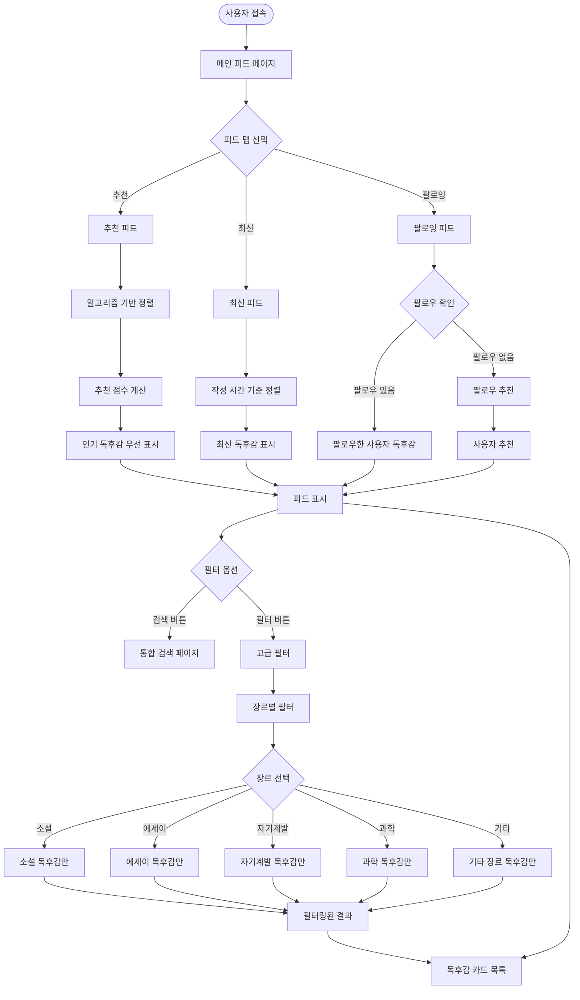
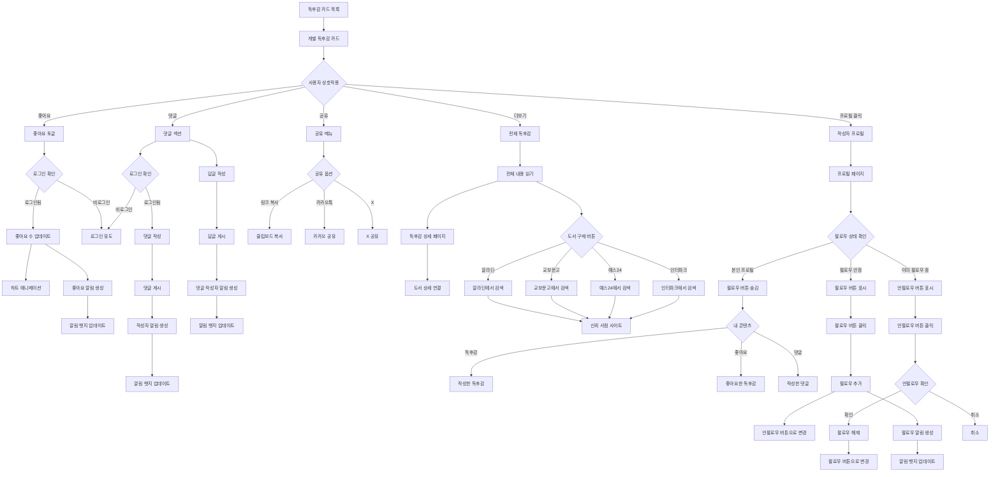
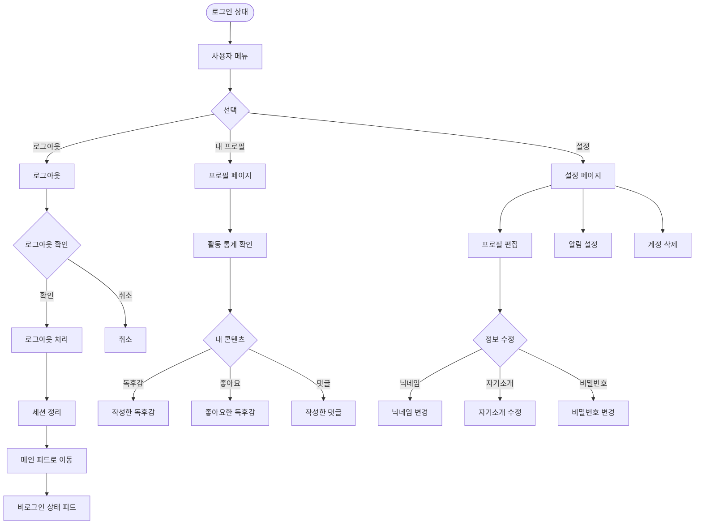
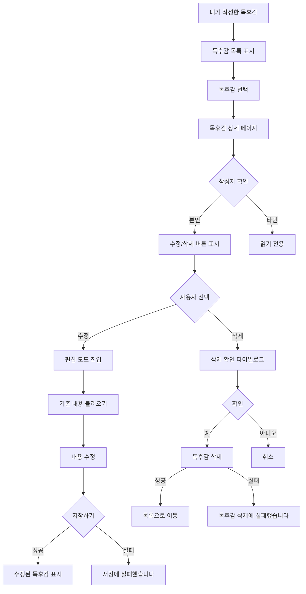
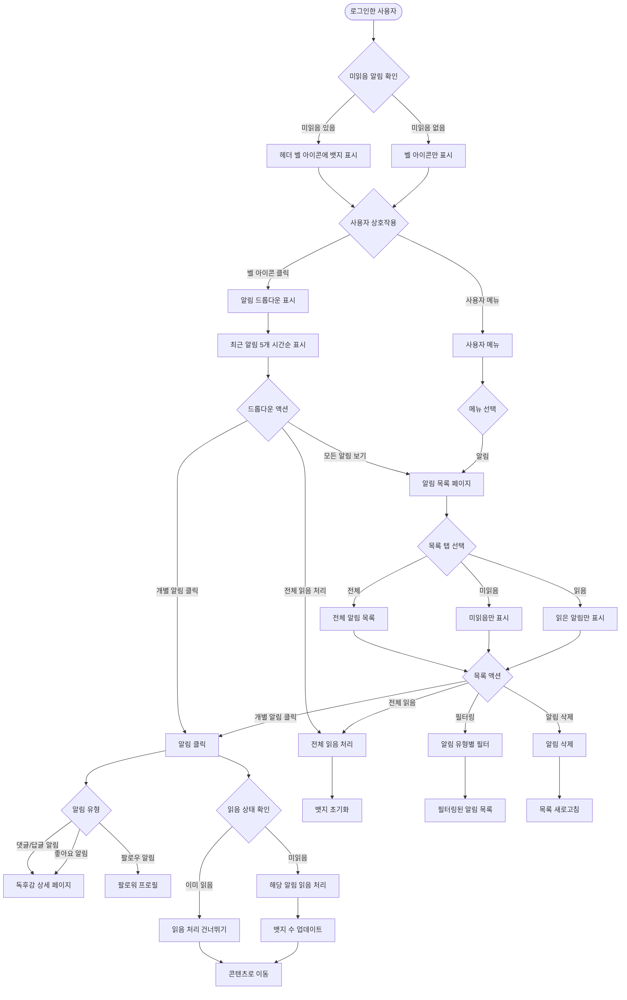
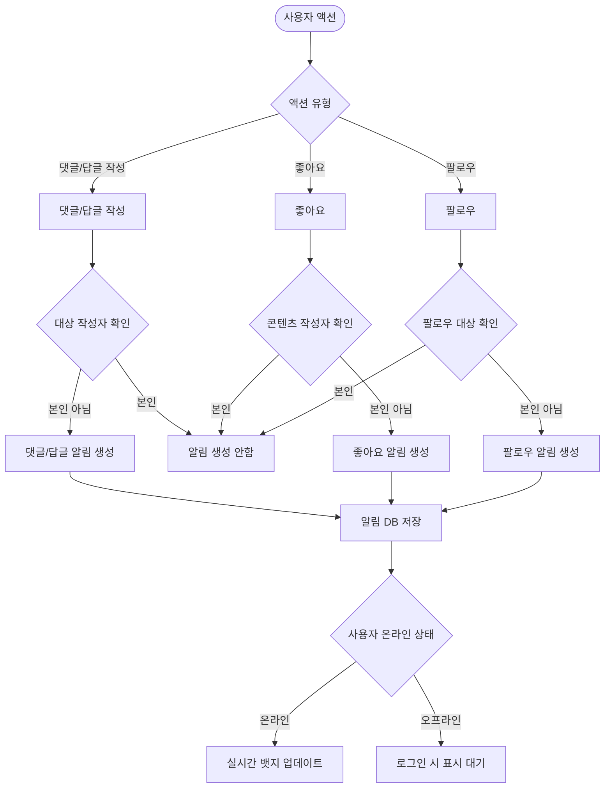
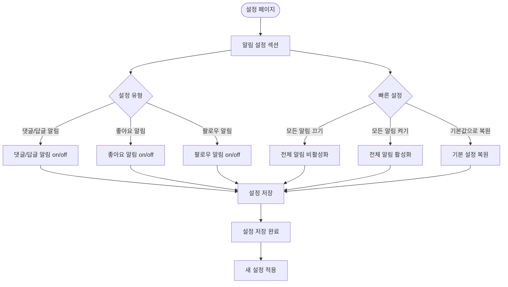
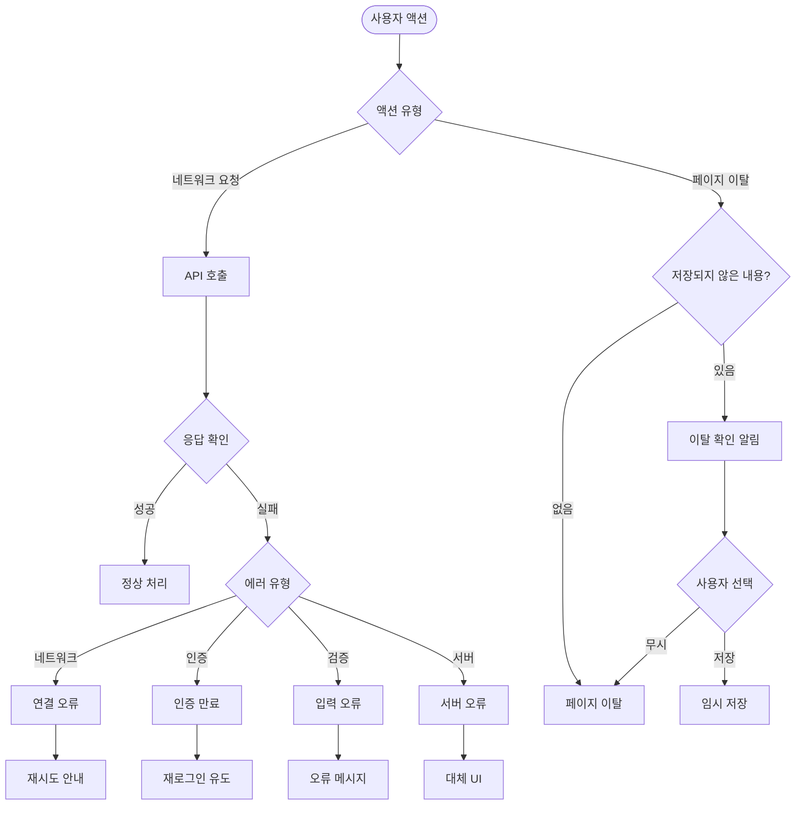

# ReadZone 사용자 흐름도

## 개요
ReadZone 서비스의 주요 사용자 여정과 상호작용 흐름을 정리한 문서입니다.

**📁 구조화된 문서**: 
- 이 문서는 개요 및 주요 시나리오를 포함합니다
- 각 섹션의 상세 흐름은 별도 파일로 분할되어 있습니다
- `user-flows/` 디렉토리에서 각 도메인별 상세 문서를 확인하세요

## 📋 문서 구조

### 상세 플로우 문서
1. **[신규 사용자 여정](./user-flows/onboarding.md)** - 회원가입, 로그인, JWT 토큰 관리, 이메일 인증
2. **[독후감 작성](./user-flows/content-creation.md)** - 도서 검색, 에디터, 임시저장, 자동저장
3. **[도서 탐색 및 검색](./user-flows/discovery.md)** - 도서 검색, 통합 검색, 필터링
4. **[소셜 상호작용](./user-flows/social-interaction.md)** - 피드, 무한 스크롤, 좋아요, 댓글, 팔로우
5. **[프로필 관리](./user-flows/profile-management.md)** - 프로필 편집, 프로필 사진, 계정 삭제
6. **[알림 시스템](./user-flows/notifications.md)** - 실시간 알림, 뱃지, 설정
7. **[오류 처리](./user-flows/error-handling.md)** - 네트워크 오류, 검증 오류, 복구
8. **[커뮤니티 안전](./user-flows/safety.md)** - 신고 기능, 차단, 커뮤니티 가이드라인

### 이 문서의 내용
- 주요 사용자 시나리오 (9-11번 섹션)
- 접근성 및 성능 고려사항 (12번 섹션)

## 📋 핵심 사용자 흐름 요약

### 1. [신규 사용자 여정](./user-flows/onboarding.md)
- **비로그인 접근**: 독후감 읽기 가능, 상호작용 시 로그인 유도
- **회원가입**: 이메일 인증 포함, 실패 시 재발송 및 복구 옵션
- **로그인**: JWT 토큰 기반, 자동 갱신 및 만료 처리
- **비밀번호 찾기**: 이메일 재설정, 미가입자 초대 링크

### 2. [독후감 작성](./user-flows/content-creation.md)
- **3단계 도서 검색**: DB → 카카오 API → 수동 입력
- **마크다운 에디터**: 실시간 미리보기, 이미지 업로드
- **자동저장**: 30초마다 자동저장, 페이지 이탈 보호
- **임시저장 복구**: 브라우저 재시작 시 작성 중인 내용 복구

### 3. [도서 탐색 및 검색](./user-flows/discovery.md)
- **다양한 검색**: 키워드, 태그, 최근 활동, 이달의 인기
- **통합 검색**: 도서/독후감/사용자 통합 검색
- **정렬 옵션**: 최신순, 좋아요순, 댓글순
- **중복 작성**: 재독 시 새 독후감 또는 기존 수정 선택

### 4. [소셜 상호작용](./user-flows/social-interaction.md)
- **3단계 피드**: 추천(알고리즘), 최신(시간순), 팔로잉(개인화)
- **무한 스크롤**: 페이지당 20개, 가상 스크롤 최적화
- **소셜 기능**: 좋아요, 댓글, 답글, 팔로우/언팔로우
- **안전한 구매**: 신뢰 서점 자동 검색 (알라딘, 교보문고 등)

### 5. [프로필 관리](./user-flows/profile-management.md)
- **프로필 편집**: 닉네임, 자기소개, 비밀번호 변경
- **프로필 사진**: 업로드, 크롭, 편집, 다중 크기 생성
- **계정 삭제**: 30일 유예기간, 개인정보 익명화, 복구 옵션
- **독후감 관리**: 수정/삭제, 소유권 확인

### 6. [알림 시스템](./user-flows/notifications.md)
- **실시간 알림**: 헤더 뱃지, 드롭다운, WebSocket 실시간 업데이트
- **알림 유형**: 댓글/답글, 좋아요, 팔로우 (3가지 핵심 유형)
- **스마트 관리**: 배치 처리, 피로감 방지, 설정별 제어
- **완전한 히스토리**: 읽은 알림도 확인 가능, 검색 및 필터링

### 7. [오류 처리](./user-flows/error-handling.md)
- **네트워크 오류**: 자동 재시도, 지수 백오프, 오프라인 모드
- **검증 오류**: 실시간 필드 검증, 사용자 친화적 메시지
- **파일 업로드**: 크기/형식 검증, 진행률 표시, 재개 기능
- **컨텍스트 보존**: 작성 중 데이터 보호, 세션 상태 유지

### 8. [커뮤니티 안전](./user-flows/safety.md)
- **신고 시스템**: 6가지 신고 유형, 24시간 내 검토, AI+인간 검토
- **사용자 차단**: 콘텐츠 숨김, 상호작용 차단, 차단 목록 관리
- **교육 시스템**: 가이드라인 교육, 위반 시 단계적 조치
- **운영진 도구**: 실시간 신고 대시보드, 자동화 시스템

---

## 9. 이전 콘텐츠 (구조 변경으로 삭제 예정)

### 4-1. 피드 탐색 및 필터링 흐름


### 4-2. 소셜 상호작용 흐름


### 주요 기능
- **3단계 피드 구조**: 
  - **추천**: 알고리즘 기반 인기 독후감 (비로그인/신규 사용자 최적)
  - **최신**: 시간순 정렬로 새로운 콘텐츠 발견
  - **팔로잉**: 개인화된 피드 경험
- **선택적 장르 필터링**: 
  - 메인 피드는 심플하게 유지
  - 고급 필터에서 장르별 세분화
  - 소설, 에세이, 자기계발, 과학, 기타 등
- **점진적 개인화**: 
  - 비로그인도 콘텐츠 탐색 가능
  - 상호작용 시점에서 로그인 유도
  - 팔로우 기능은 선택사항
- **안전한 도서 구매 연결**: 
  - 사용자 임의 링크 대신 신뢰 서점 자동 검색
  - 알라딘, 교보문고, 예스24, 인터파크 지원
  - 스미싱/피싱 위험 완전 차단
  - 여러 서점 가격 비교 가능

### 추천 알고리즘 상세 (추천 탭)

#### Phase 1: 가중치 기반 점수 시스템
```
추천점수 = 품질점수 × 시간가중치 × 다양성보너스

품질점수 = (좋아요 × 3) + (댓글 × 2) + (조회수 × 0.1) + (공유 × 5)
시간가중치 = 1 / (1 + 경과시간(일) × 0.5)
다양성보너스 = 동일책/저자 중복 시 0.7, 아니면 1.0
```

#### Phase 2: 개인화 추가 (로그인 사용자)
```
개인화점수 = 팔로우사용자보너스(+10) + 선호장르보너스(+5) + 읽은책유사도(+3)
최종점수 = 추천점수 + 개인화점수
```

#### Phase 3: 머신러닝 기반 (향후)
- 사용자 행동 패턴 학습 (클릭, 체류시간, 스크롤 속도)
- 협업 필터링 (유사 취향 사용자 기반)
- 콘텐츠 기반 필터링 (장르, 저자, 키워드 유사도)

#### 성능 지표
- **참여도**: 좋아요/댓글 비율 >5%
- **체류시간**: 피드 평균 체류시간 >3분
- **클릭률**: 독후감 클릭률 >15%
- **다양성**: 상위 10개 중 서로 다른 책 비율 >70%

## 5. 프로필 및 활동 관리 흐름 (Profile Management Flow)

### 5-1. 프로필 관리 흐름


### 5-2. 독후감 수정/삭제 흐름


### 주요 기능
- **독후감 수정**: 작성한 독후감의 내용, 태그, 추천 여부 수정 가능
- **독후감 삭제**: 삭제 확인 후 영구 삭제
- **소유권 확인**: 본인이 작성한 독후감만 수정/삭제 가능
- **안전한 로그아웃**: 
  - 로그아웃 확인 다이얼로그로 실수 방지
  - 세션 완전 정리 후 메인 피드로 복귀
  - 비로그인 상태에서도 콘텐츠 탐색 가능

### 내 독후감 접근 경로
- **메인 메뉴**: 사용자 메뉴 → 내 프로필 → 내 콘텐츠 → 독후감
- **본인 프로필**: 다른 플로우에서 본인 프로필 진입 시 내 콘텐츠 섹션 표시
- **독후감 작성 후**: 독후감 상세 페이지 → "내 독후감 보기" 버튼
- **소셜 상호작용**: 피드에서 본인 프로필 클릭 → 내 콘텐츠 바로 표시

## 6. 검색 및 발견 흐름 (Discovery Flow)


## 7. 알림 시스템 흐름 (Notification System Flow)

### 7-1. 알림 표시 및 확인 흐름


### 7-2. 알림 발생 및 전송 흐름


### 7-3. 알림 설정 관리 흐름


### 주요 알림 유형
- **댓글/답글 알림**: "사용자명이 '독후감 제목'에 댓글을 남겼습니다" / "사용자명이 회원님의 댓글에 답글을 남겼습니다"
- **좋아요 알림**: "사용자명이 '독후감 제목'을 좋아합니다"
- **팔로우 알림**: "사용자명이 회원님을 팔로우하기 시작했습니다"

### 알림 UI 요소
- **헤더 뱃지**: 벨 아이콘 위 빨간 원형 뱃지 (미읽음 개수)
- **벨 아이콘**: 미읽음 없어도 항상 표시, 클릭하면 드롭다운 열림
- **드롭다운**: 최근 알림 5개를 시간순으로 표시
  - 미읽음: 굵은 텍스트 + 배경색 강조
  - 읽음: 일반 텍스트 + 연한 배경색
- **알림 목록**: 
  - 전체/미읽음/읽음 탭으로 구분
  - 시간순 정렬, 필터링 및 삭제 기능
- **알림 설정**: 설정 페이지 내 알림 관련 섹션

### 주요 기능
- **실시간 업데이트**: 온라인 사용자에게 실시간 뱃지 업데이트
- **중복 방지**: 본인 액션에 대한 알림 생성 방지
- **설정 기반**: 사용자 설정에 따른 선택적 알림 발송
- **컨텍스트 연결**: 알림 클릭 시 관련 콘텐츠로 직접 이동
- **읽음 관리**: 개별/전체 읽음 처리 및 뱃지 업데이트
- **완전한 알림 히스토리**: 
  - 읽은 알림도 항상 확인 가능
  - 드롭다운에서 최근 읽은 알림 표시
  - 알림 목록에서 전체/미읽음/읽음 탭 제공
- **직관적 드롭다운**: 
  - 시간순 정렬로 자연스러운 히스토리 확인
  - 시각적 구분으로 읽음/미읽음 상태 즉시 파악
- **알림 피로감 방지**:
  - 팔로잉 활동 알림 제거 (피드에서 확인 가능)
  - 댓글/답글 알림 통합으로 중복 방지
  - 핵심 상호작용만 알림 (3가지 유형)

## 8. 오류 처리 및 복구 흐름 (Error Handling Flow)



## 9. 주요 사용자 시나리오

### 시나리오 1: 첫 방문자의 회원가입
1. 메인 페이지 방문 → 독후감 둘러보기
2. 좋아요 클릭 시도 → 로그인 필요 알림
3. 로그인 페이지 → 서비스 소개 확인
4. 회원가입 선택 → 정보 입력
5. 이메일 인증 → 서비스 이용 시작

### 시나리오 2: 독후감 작성
1. 작성 버튼 클릭 → 작성 페이지
2. 도서 검색 → 원하는 책 선택
3. 마크다운으로 독후감 작성
4. 추천/비추천 선택 및 태그 추가
5. 게시 → 피드에 즉시 반영

### 시나리오 3: 도서 탐색 및 독후감 확인
1. 도서 검색 → 관심 도서 찾기
2. 도서 상세 페이지 → 다른 사람들의 독후감 확인
3. 독후감 작성 → 나의 감상 공유
4. 피드에서 반응 확인 → 댓글 및 좋아요 상호작용

### 시나리오 4: 알림 확인 및 소셜 상호작용
1. 로그인 → 헤더 벨 아이콘에 뱃지 확인 (3개 미읽음)
2. 벨 아이콘 클릭 → 드롭다운에서 최근 알림 5개 시간순 확인
3. 굵은 텍스트로 표시된 미읽음 "김독서님이 '어린왕자' 독후감에 댓글을 남겼습니다" 클릭
4. 독후감 상세 페이지로 이동 → 새 댓글 확인 → 답글 작성
5. 모든 알림 보기 → '읽음' 탭에서 지난 주 받은 좋아요 알림 확인

### 시나리오 5: 읽은 알림 재확인
1. 미읽음 알림 없는 상태에서 벨 아이콘 클릭
2. 드롭다운에 최근 알림 5개 시간순 표시 (모두 연한 배경색으로 읽음 상태)
3. 어제 받은 팔로우 알림 다시 클릭 → 팔로워 프로필 재방문
4. 알림 목록 → '읽음' 탭 → 한 달 전 받은 댓글 알림 확인

## 10. 접근성 고려사항

### 모바일 최적화
- 터치 친화적 인터페이스
- 스와이프 제스처 지원
- 반응형 레이아웃

### 오프라인 지원
- 읽은 독후감 캐싱
- 작성 중 내용 로컬 저장
- 네트워크 복구 시 자동 동기화

### 성능 최적화
- 이미지 지연 로딩
- 무한 스크롤 가상화
- 검색 결과 캐싱

### 알림 접근성
- 스크린 리더 호환 알림 텍스트
- 키보드 탐색 지원 (Tab, Enter)
- 색상에 의존하지 않는 뱃지 디자인
- 알림 소리 on/off 설정 (향후 확장)