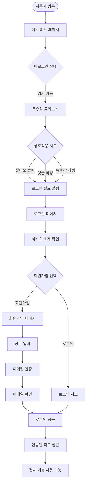
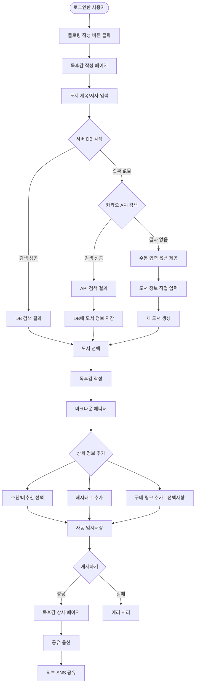
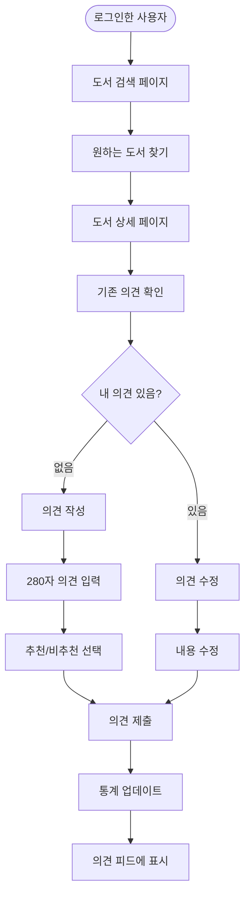
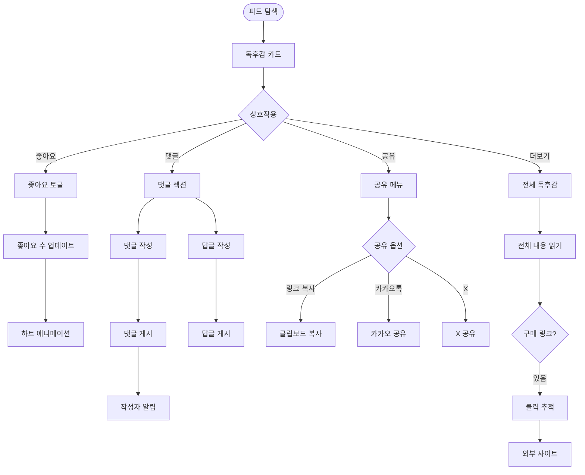
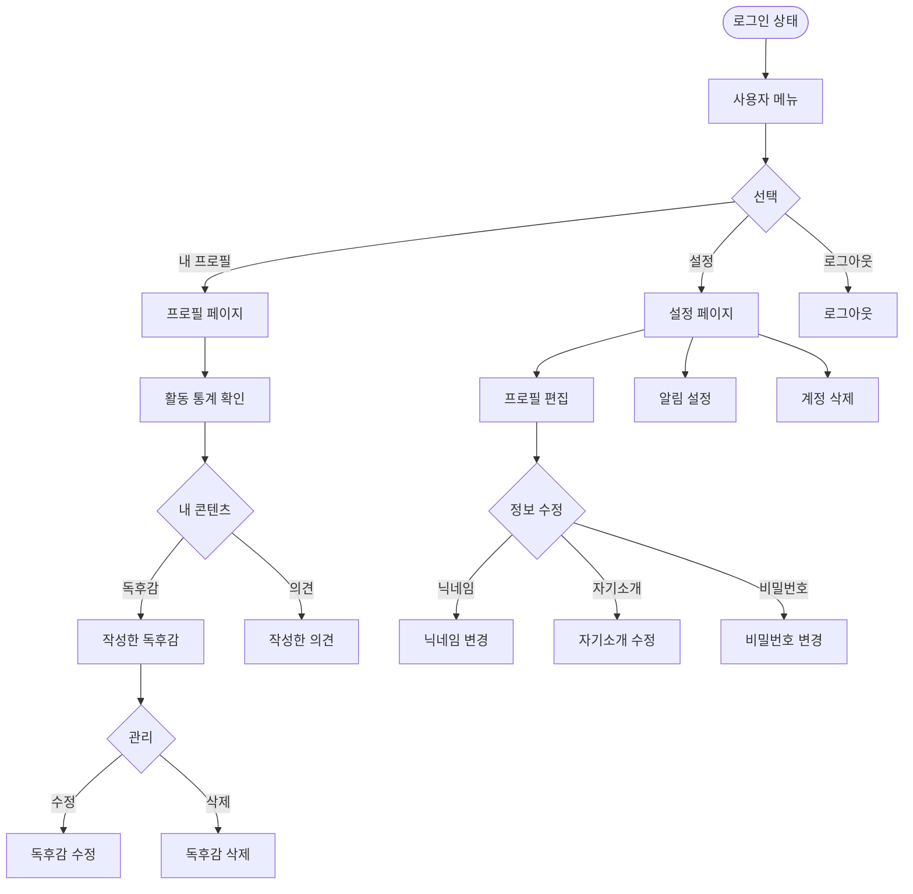
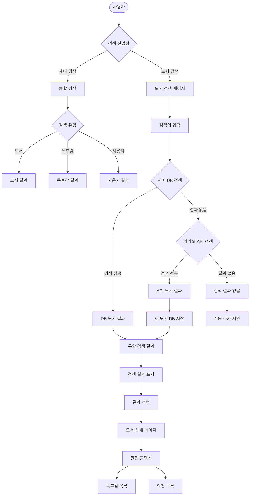
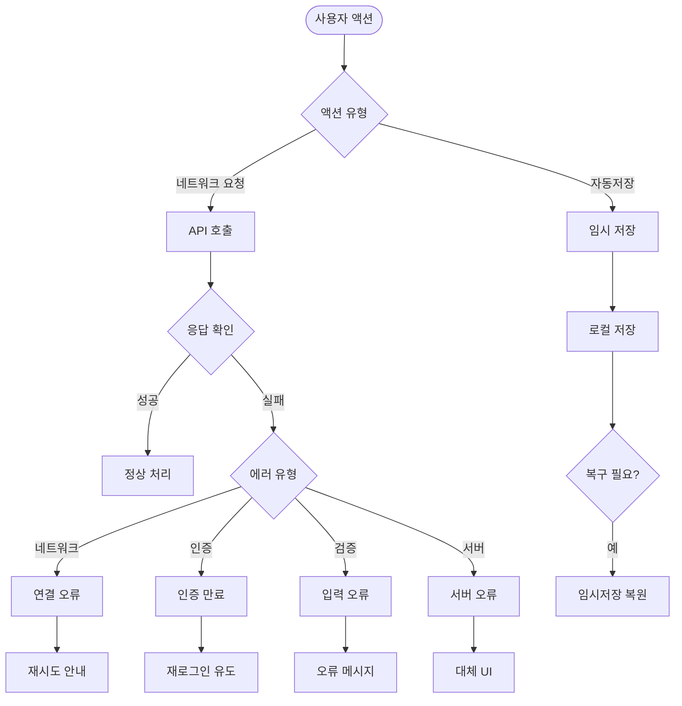

# ReadZone 사용자 흐름도

## 개요
ReadZone 서비스의 주요 사용자 여정과 상호작용 흐름을 정리한 문서입니다.

## 1. 신규 사용자 여정 (User Onboarding Flow)

### 주요 포인트
- **비로그인 접근성**: 독후감 읽기는 로그인 없이 가능
- **점진적 참여 유도**: 상호작용 시점에서 로그인 유도
- **서비스 이해**: 로그인 페이지에서 서비스 가치 전달

## 2. 독후감 작성 흐름 (Review Creation Flow)

### 주요 기능
- **3단계 도서 검색**: 
  1. 서버 DB 우선 검색 (기존 등록 도서)
  2. 카카오 API 검색 (미등록 도서)
  3. 수동 입력 (API에도 없는 도서)
- **자동 저장**: 작성 중 데이터 손실 방지
- **풍부한 콘텐츠**: 마크다운, 태그, 구매 링크

## 3. 도서 의견 작성 흐름 (Book Opinion Flow)

### 제약사항
- **1인 1의견**: 도서당 사용자별 하나의 의견만 가능
- **글자 수 제한**: 280자 이내로 간결하게
- **수정 가능**: 기존 의견 수정 허용

## 4. 소셜 상호작용 흐름 (Social Interaction Flow)

## 5. 프로필 및 활동 관리 흐름 (Profile Management Flow)

## 6. 검색 및 발견 흐름 (Discovery Flow)

## 7. 오류 처리 및 복구 흐름 (Error Handling Flow)

## 주요 사용자 시나리오

### 시나리오 1: 첫 방문자의 회원가입
1. 메인 페이지 방문 → 독후감 둘러보기
2. 좋아요 클릭 시도 → 로그인 필요 알림
3. 로그인 페이지 → 서비스 소개 확인
4. 회원가입 선택 → 정보 입력
5. 이메일 인증 → 서비스 이용 시작

### 시나리오 2: 독후감 작성
1. 플로팅 버튼 클릭 → 작성 페이지
2. 도서 검색 → 원하는 책 선택
3. 마크다운으로 독후감 작성
4. 추천/비추천 선택 및 태그 추가
5. 게시 → 피드에 즉시 반영

### 시나리오 3: 도서 탐색 및 의견
1. 도서 검색 → 관심 도서 찾기
2. 도서 상세 페이지 → 다른 사람들 의견 확인
3. 280자 의견 작성 → 추천/비추천 표시
4. 관련 독후감 확인 → 상세 읽기

## 접근성 고려사항

### 모바일 최적화
- 터치 친화적 인터페이스
- 스와이프 제스처 지원
- 반응형 레이아웃

### 오프라인 지원
- 읽은 독후감 캐싱
- 작성 중 내용 로컬 저장
- 네트워크 복구 시 자동 동기화

### 성능 최적화
- 이미지 지연 로딩
- 무한 스크롤 가상화
- 검색 결과 캐싱