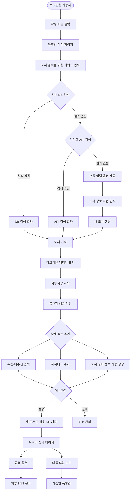
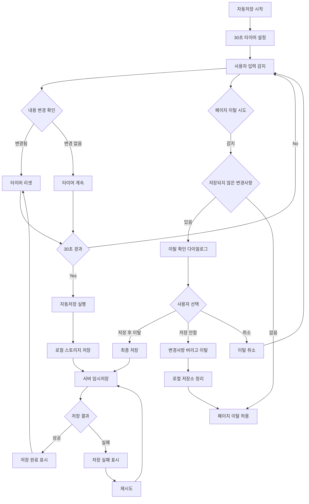
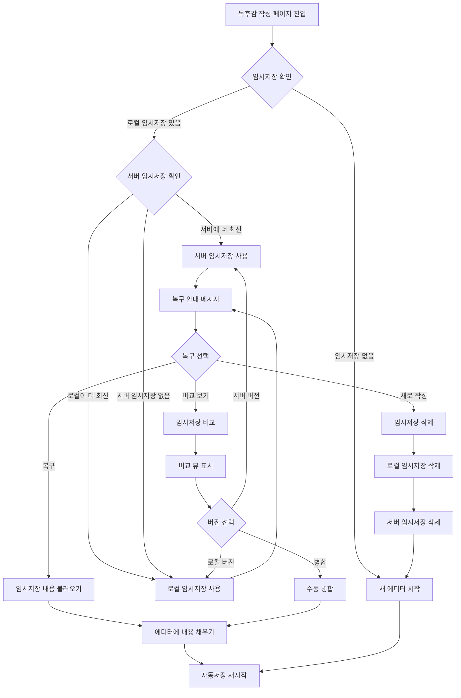
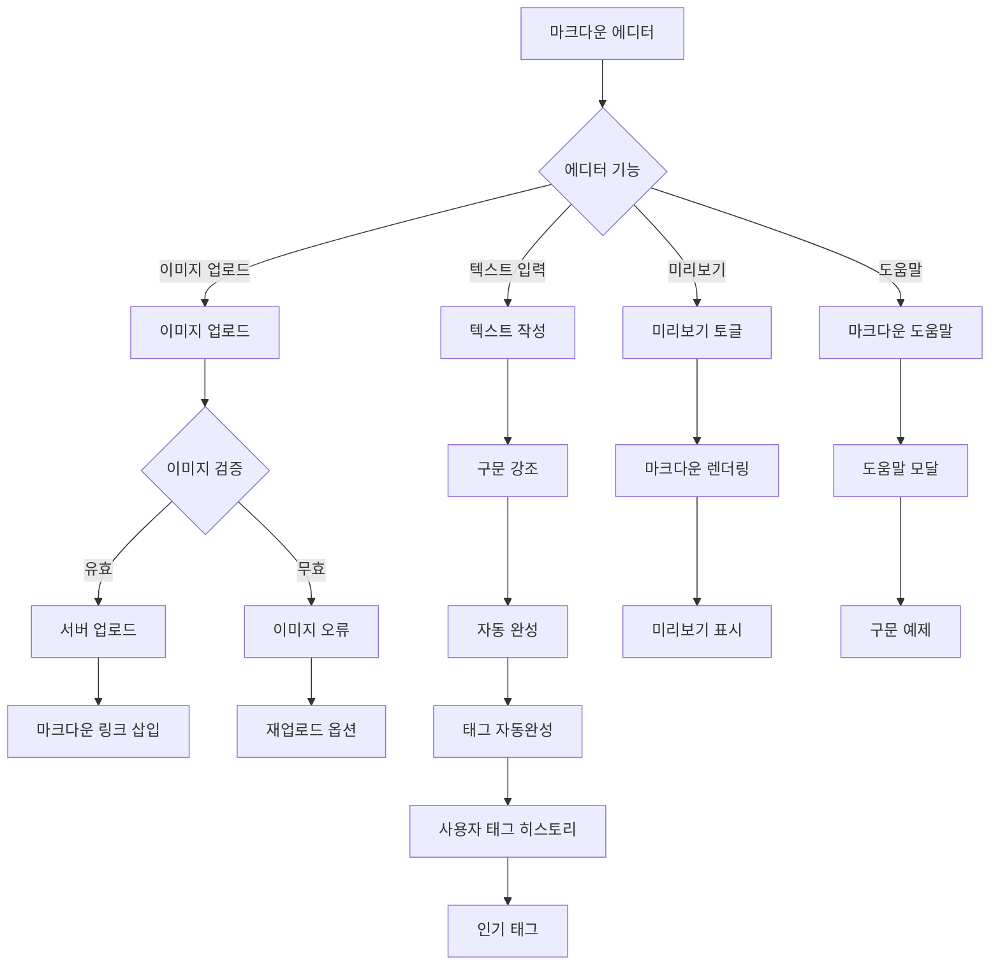

# 2. 독후감 작성 흐름 (Content Creation Flow)

## 2-1. 기본 작성 흐름

## 2-2. 임시저장 및 자동저장 흐름

## 2-3. 임시저장 복구 흐름

## 2-4. 마크다운 에디터 상세 기능

## 주요 기능

### 기본 작성 기능
- **3단계 도서 검색**: 
  1. 서버 DB 우선 검색 (기존 등록 도서)
  2. 카카오 API 검색 (미등록 도서)
  3. 수동 입력 (API에도 없는 도서)
- **풍부한 콘텐츠**: 마크다운, 태그, 신뢰 서점 자동 연결
- **새 도서 저장**: 독후감 게시 시점에 DB 저장

### 임시저장 시스템
- **자동저장 주기**: 30초마다 또는 내용 변경 시
- **저장 위치**: 로컬 스토리지 + 서버 백업
- **복구 기능**: 
  - 페이지 재진입 시 자동 복구 제안
  - 로컬/서버 버전 비교 및 선택
  - 수동 병합 옵션 제공
- **페이지 이탈 보호**: 
  - 저장되지 않은 변경사항 감지
  - 이탈 확인 다이얼로그
  - 저장 후 이탈 옵션

### 마크다운 에디터
- **실시간 기능**:
  - 구문 강조 표시
  - 미리보기 토글 (분할/전체)
  - 이미지 드래그 앤 드롭 업로드
- **사용자 지원**:
  - 마크다운 도움말 및 예제
  - 태그 자동완성 (개인 히스토리 + 인기 태그)
  - 키보드 단축키 지원
- **이미지 처리**:
  - 파일 크기 제한 (최대 5MB)
  - 지원 형식: JPG, PNG, GIF, WebP
  - CDN 업로드 및 최적화