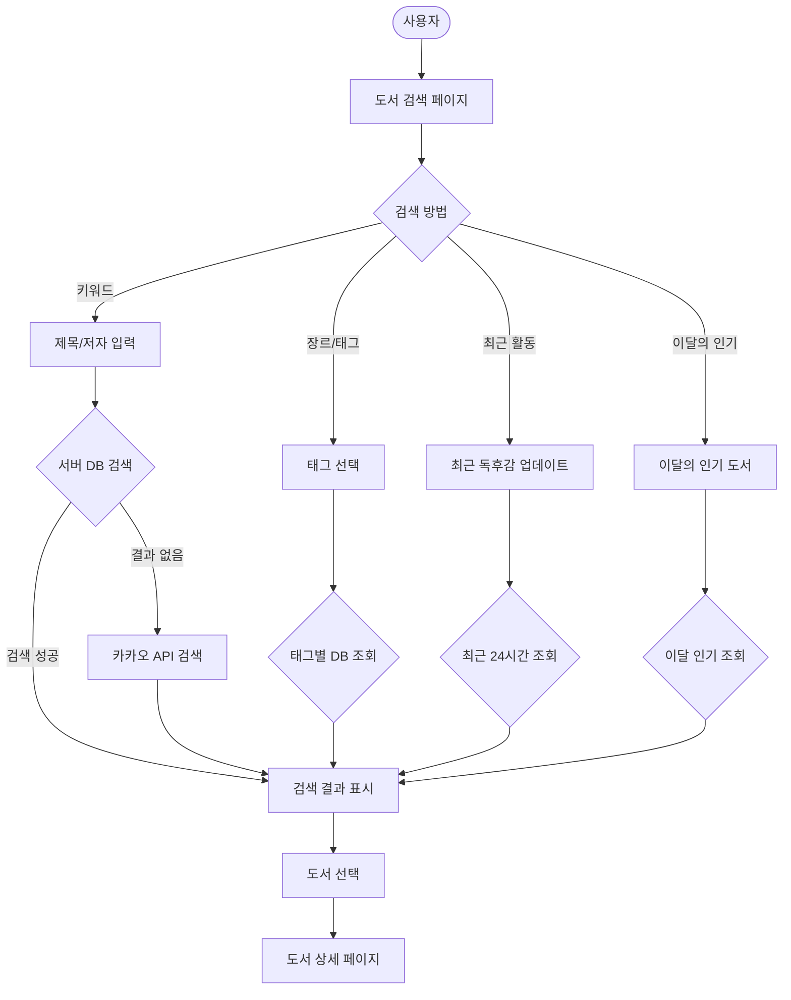
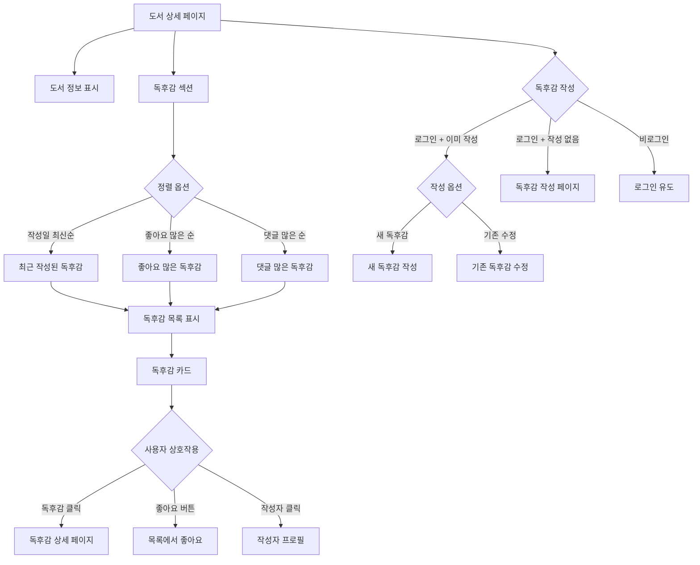
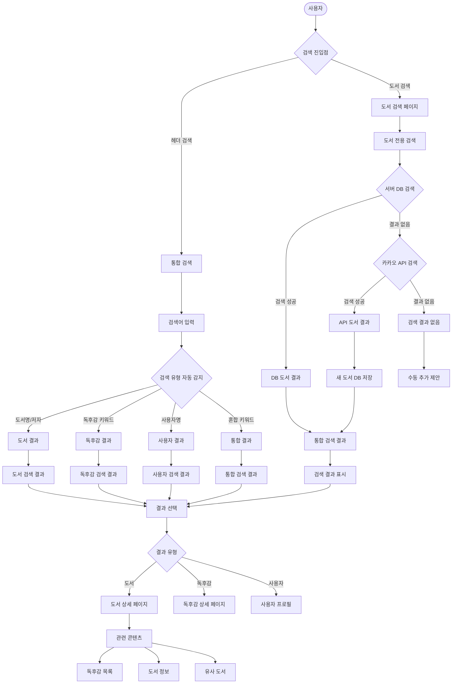

# 3,6. 도서 탐색 및 검색 흐름 (Discovery Flow)

## 3-1. 도서 검색 흐름

## 3-2. 도서 상세 및 독후감 목록 흐름

## 6. 통합 검색 및 발견 흐름

## 검색 기능 상세

### 다양한 검색 방법
- **키워드 검색 (제목/저자)**:
  - 한글/영어 통합 검색
  - 초성 검색 지원
  - 오타 교정 기능
  - 동의어/유의어 처리

- **태그/장르별 필터링**:
  - 사전 정의된 장르 카테고리
  - 사용자 생성 태그
  - 복합 태그 검색
  - 인기 태그 자동완성

- **최근 활동 (24시간 내 독후감 작성된 도서)**:
  - 실시간 활동 반영
  - 트렌딩 도서 식별
  - 커뮤니티 관심도 기반

- **이달의 인기 (이달 좋아요 최다 독후감의 도서)**:
  - 월별 통계 기반
  - 좋아요, 댓글, 조회수 종합 점수
  - 계절별/이벤트별 특별 큐레이션

### 명확한 정렬 옵션
- **작성일 최신순** (CREATE_DATE DESC): 최신 트렌드 파악
- **좋아요 많은 순** (LIKE_COUNT DESC): 인기 독후감 우선
- **댓글 많은 순** (COMMENT_COUNT DESC): 활발한 토론 우선
- **관련도순**: 검색 키워드와의 매칭 점수
- **평점순**: 독후감 평균 평점 기준

### 도서별 독후감 집계
- 한 도서에 대한 모든 독후감을 한 곳에서 확인
- 다양한 관점과 의견 비교 가능
- 독후감 통계 (평균 평점, 추천 비율 등)

### 중복 작성 선택
- **이미 작성한 경우**: 새로 작성 또는 기존 수정 선택 가능
- **재독 지원**: 시간 경과 후 다른 감상 등 지원
- **버전 관리**: 수정 이력 추적

### 통합 검색 시스템
- **자동 유형 감지**:
  - 도서명/저자명 패턴 인식
  - 사용자명 (@기호 또는 프로필 패턴)
  - 독후감 키워드 (일반 텍스트)

- **검색 결과 통합**:
  - 관련도 기반 정렬
  - 유형별 탭 구분
  - 무한 스크롤 지원

- **고급 검색 옵션**:
  - 기간 필터 (최근 1주일, 1개월, 1년)
  - 평점 범위 필터
  - 독후감 길이 필터 (짧은글/긴글)
  - 작성자 팔로우 여부

### 성능 최적화
- **검색 결과 캐싱**: 인기 검색어 결과 사전 캐시
- **자동완성**: 입력과 동시에 실시간 제안
- **검색 히스토리**: 개인별 최근 검색어 저장
- **인기 검색어**: 실시간 트렌딩 검색어 표시