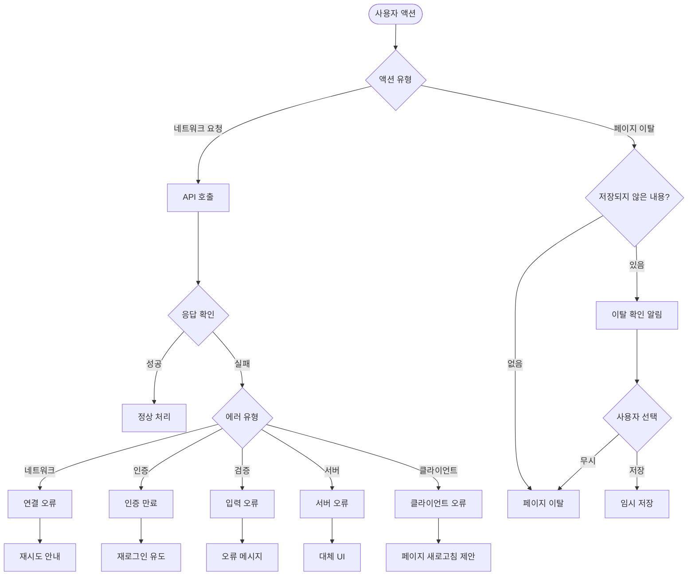
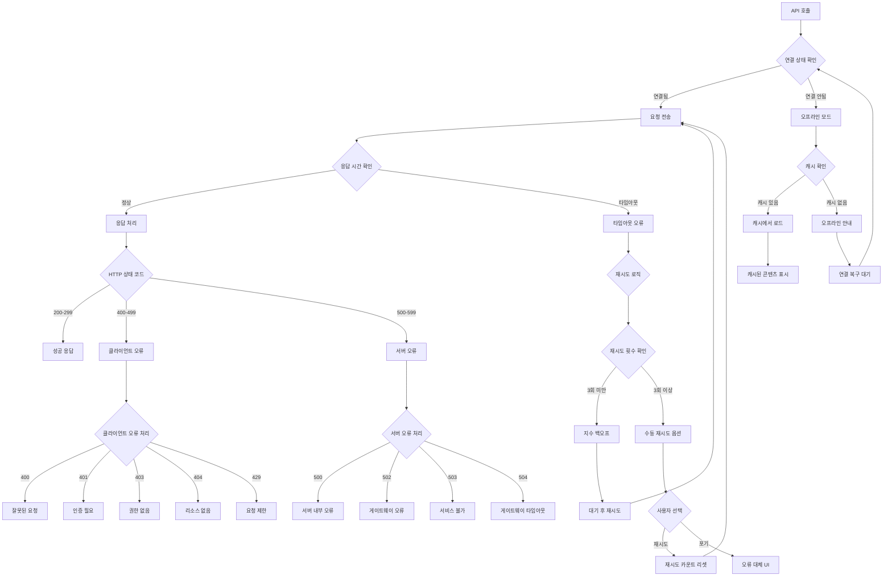
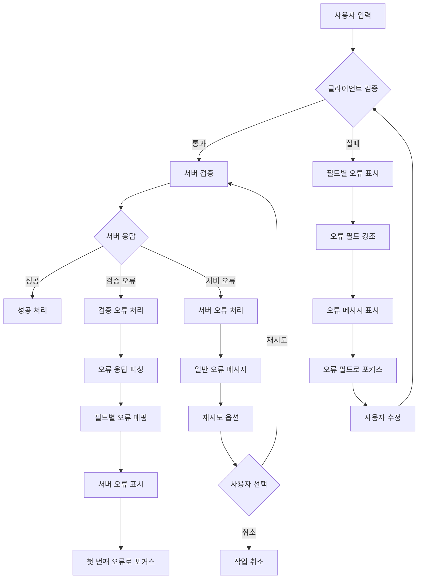
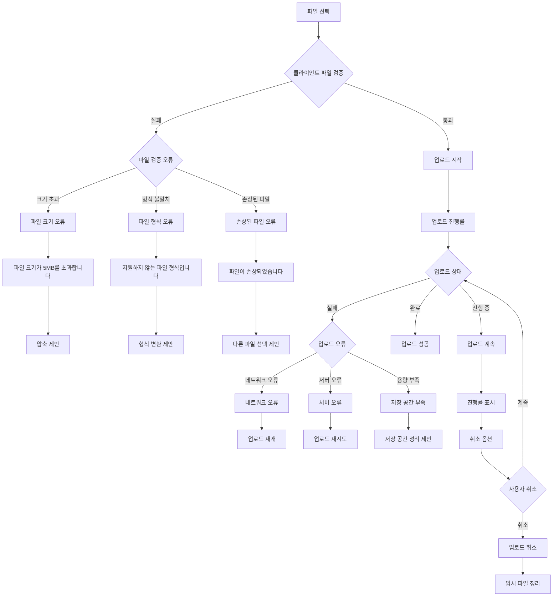
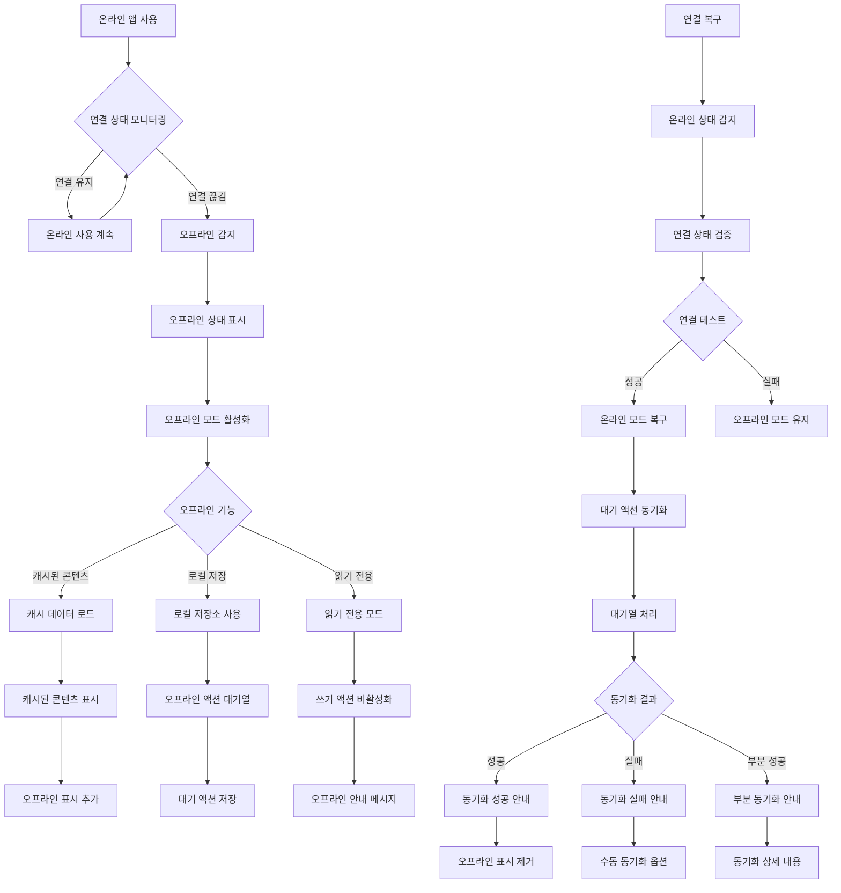

# 8. 오류 처리 및 복구 흐름 (Error Handling Flow)

## 8-1. 기본 오류 처리 흐름

## 8-2. 네트워크 및 서버 오류 처리 흐름

## 8-3. 폼 및 입력 검증 오류 처리 흐름

## 8-4. 파일 업로드 오류 처리 흐름

## 8-5. 오프라인 및 연결 복구 흐름

## 주요 오류 처리 원칙

### 1. 사용자 친화적 메시지
- **기술적 용어 피하기**: "서버 오류"보다는 "일시적 문제가 발생했습니다"
- **구체적 안내**: 다음 단계나 해결 방법 제시
- **감정적 배려**: 사과 표현과 이해 구하기

### 2. 점진적 오류 복구
- **자동 재시도**: 네트워크 오류 등 일시적 문제
- **사용자 옵션**: 수동 재시도, 대안 제시
- **우아한 성능 저하**: 핵심 기능 우선 유지

### 3. 컨텍스트 보존
- **사용자 입력 보존**: 폼 데이터, 작성 중인 콘텐츠
- **세션 상태 유지**: 로그인 상태, 설정값
- **진행 상황 저장**: 업로드 진행률, 임시 저장

### 4. 예방적 검증
- **클라이언트 사이드 검증**: 즉시 피드백
- **서버 사이드 검증**: 보안 및 무결성
- **실시간 피드백**: 입력 중 검증 상태 표시

## 오류 메시지 가이드라인

### 네트워크 오류
- **일반**: "인터넷 연결을 확인해주세요"
- **타임아웃**: "응답 시간이 초과되었습니다. 잠시 후 다시 시도해주세요"
- **서버 불가**: "서비스 점검 중입니다. 잠시 후 이용해주세요"

### 인증 오류
- **로그인 만료**: "로그인이 만료되었습니다. 다시 로그인해주세요"
- **권한 없음**: "이 기능을 사용할 권한이 없습니다"
- **계정 제한**: "계정에 제한이 있습니다. 고객센터에 문의해주세요"

### 입력 검증 오류
- **필수 입력**: "필수 입력 항목입니다"
- **형식 오류**: "올바른 이메일 형식을 입력해주세요"
- **길이 제한**: "20자 이내로 입력해주세요"

### 파일 업로드 오류
- **크기 초과**: "파일 크기는 5MB 이하만 가능합니다"
- **형식 불일치**: "JPG, PNG, GIF 파일만 업로드 가능합니다"
- **업로드 실패**: "파일 업로드에 실패했습니다. 다시 시도해주세요"

## 성능 모니터링 및 로깅

### 오류 추적
- **오류 발생률**: 전체 요청 대비 오류 비율 모니터링
- **오류 패턴**: 특정 시간대, 기능별 오류 집중 분석
- **사용자 영향**: 오류로 인한 사용자 이탈률 추적

### 로그 수집
- **클라이언트 로그**: JavaScript 오류, 네트워크 실패
- **서버 로그**: API 응답 시간, 오류 상태 코드
- **사용자 행동**: 오류 발생 시점의 사용자 액션

### 개선 피드백 루프
- **오류 빈도 분석**: 자주 발생하는 오류 우선 수정
- **사용자 피드백**: 오류 보고 및 개선 제안 수집
- **A/B 테스트**: 오류 처리 개선안 효과 검증