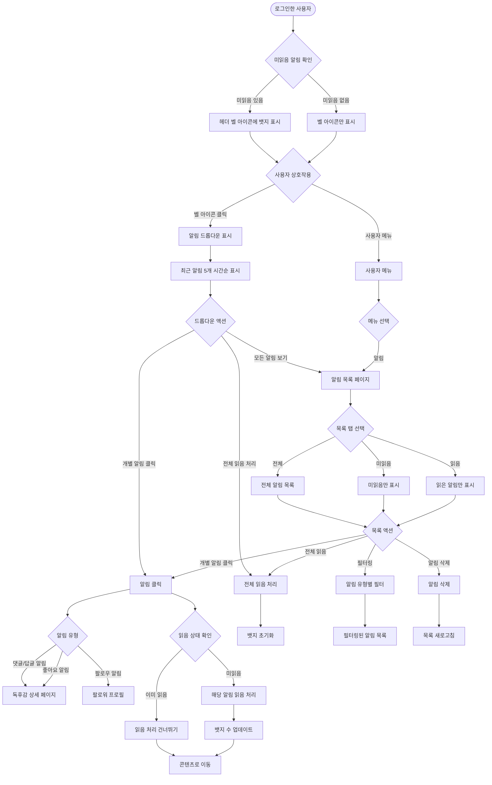
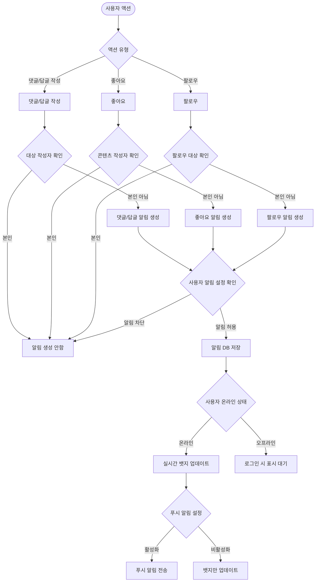
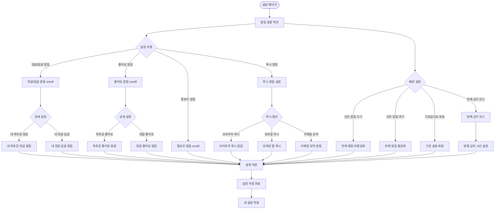
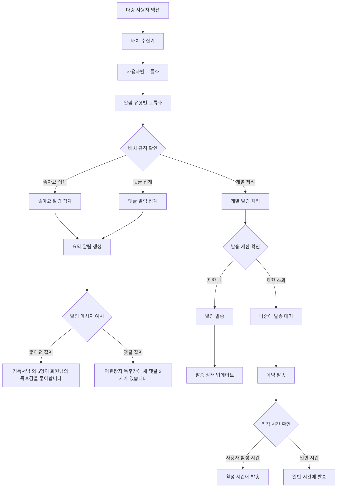

# 7. 알림 시스템 흐름 (Notification System Flow)

## 7-1. 알림 표시 및 확인 흐름

## 7-2. 알림 발생 및 전송 흐름

## 7-3. 알림 설정 관리 흐름

## 7-4. 알림 성능 최적화 및 배치 처리 흐름

## 주요 알림 유형

### 핵심 알림 (3가지)
- **댓글/답글 알림**: "사용자명이 '독후감 제목'에 댓글을 남겼습니다" / "사용자명이 회원님의 댓글에 답글을 남겼습니다"
- **좋아요 알림**: "사용자명이 '독후감 제목'을 좋아합니다"
- **팔로우 알림**: "사용자명이 회원님을 팔로우하기 시작했습니다"

### 집계 알림 (성능 최적화)
- **다중 좋아요**: "김독서님 외 5명이 회원님의 '어린왕자' 독후감을 좋아합니다"
- **다중 댓글**: "'어린왕자' 독후감에 새 댓글 3개가 있습니다"
- **다중 팔로우**: "김독서님 외 2명이 회원님을 팔로우하기 시작했습니다"

## 알림 UI 요소

### 헤더 알림
- **헤더 뱃지**: 벨 아이콘 위 빨간 원형 뱃지 (미읽음 개수)
- **벨 아이콘**: 미읽음 없어도 항상 표시, 클릭하면 드롭다운 열림
- **실시간 업데이트**: WebSocket으로 즉시 반영

### 드롭다운 알림
- **최근 알림 5개**를 시간순으로 표시
- **미읽음**: 굵은 텍스트 + 배경색 강조
- **읽음**: 일반 텍스트 + 연한 배경색
- **빠른 액션**: 전체 읽음 처리, 모든 알림 보기

### 알림 목록 페이지
- **탭 구조**: 전체/미읽음/읽음 탭으로 구분
- **무한 스크롤**: 과거 알림까지 모두 확인 가능
- **필터링**: 알림 유형별 필터
- **일괄 처리**: 선택된 알림들 일괄 읽음/삭제

## 주요 기능

### 실시간 업데이트
- 온라인 사용자에게 실시간 뱃지 업데이트
- WebSocket 연결을 통한 즉시 반영
- 오프라인 시 로그인 후 일괄 동기화

### 스마트 알림 관리
- **중복 방지**: 본인 액션에 대한 알림 생성 방지
- **설정 기반**: 사용자 설정에 따른 선택적 알림 발송
- **배치 처리**: 동일 유형 알림 집계로 스팸 방지
- **발송 제한**: 시간당 최대 알림 수 제한

### 컨텍스트 연결
- 알림 클릭 시 관련 콘텐츠로 직접 이동
- 독후감 상세 페이지의 해당 댓글로 스크롤
- 프로필 페이지로 자연스러운 연결

### 완전한 알림 히스토리
- **읽은 알림도 항상 확인 가능**
- 드롭다운에서 최근 읽은 알림 표시
- 알림 목록에서 전체/미읽음/읽음 탭 제공
- 검색 기능으로 과거 알림 찾기

### 직관적 드롭다운
- 시간순 정렬로 자연스러운 히스토리 확인
- 시각적 구분으로 읽음/미읽음 상태 즉시 파악
- 호버 효과와 클릭 가능한 영역 명확화

### 알림 피로감 방지
- **팔로잉 활동 알림 제거**: 피드에서 확인 가능하므로 중복 제거
- **댓글/답글 알림 통합**: 중복 방지로 깔끔한 관리
- **핵심 상호작용만 알림**: 3가지 유형으로 단순화
- **방해 금지 모드**: 특정 시간대 알림 차단

### 고급 설정
- **세분화된 알림 제어**: 유형별 개별 on/off
- **푸시 알림 지원**: 브라우저/모바일 푸시
- **이메일 요약**: 일별/주별 알림 요약 이메일
- **최적 시간 발송**: 사용자 활성 패턴 기반 발송