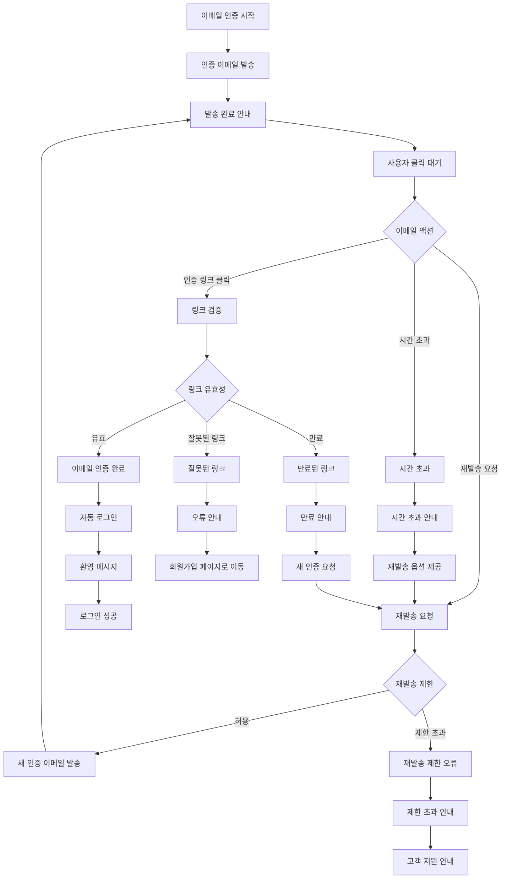

# 1. 신규 사용자 여정 (User Onboarding Flow)

## 1-1. 기본 온보딩 흐름

```mermaid
flowchart TD
    Start([사용자 방문]) --> MainFeed[메인 피드 페이지]
    MainFeed --> ReadOnly{비로그인 상태}
    
    ReadOnly -->|읽기 가능| BrowseReviews[독후감 둘러보기]
    BrowseReviews --> TryInteraction{상호작용 시도}
    
    TryInteraction -->|좋아요 클릭| LoginPrompt[로그인 필요 알림]
    TryInteraction -->|댓글 작성| LoginPrompt
    TryInteraction -->|독후감 작성| LoginPrompt
    
    LoginPrompt --> LoginPage[로그인 페이지]
    LoginPage --> ServiceIntro[서비스 소개 확인]
    ServiceIntro --> SignupChoice{회원가입 선택}
    
    SignupChoice -->|회원가입| RegisterPage[회원가입 페이지]
    RegisterPage --> InputInfo[정보 입력]
    InputInfo --> EmailVerification[이메일 인증]
    EmailVerification --> VerifyEmail[이메일 확인]
    VerifyEmail --> LoginSuccess[로그인 성공]
    
    SignupChoice -->|로그인| LoginProcess[로그인 시도]
    LoginProcess --> LoginAttempt{로그인 결과}
    LoginAttempt -->|성공| LoginSuccess
    LoginAttempt -->|실패| LoginFailed[로그인 실패]
    LoginFailed --> ForgotPassword[비밀번호 찾기]
    ForgotPassword --> ForgotPasswordPage[비밀번호 찾기 페이지]
    
    ForgotPasswordPage --> EnterEmail[이메일 주소 입력]
    EnterEmail --> CheckEmail{이메일 확인}
    
    CheckEmail -->|가입된 이메일| SendResetLink[비밀번호 재설정 링크 전송]
    SendResetLink --> EmailSent[이메일 발송 완료 안내]
    EmailSent --> CheckInbox[메일함 확인 안내]
    CheckInbox --> ClickResetLink[재설정 링크 클릭]
    ClickResetLink --> ResetPasswordPage[새 비밀번호 입력 페이지]
    ResetPasswordPage --> SetNewPassword[새 비밀번호 설정]
    SetNewPassword --> PasswordResetSuccess[비밀번호 재설정 완료]
    PasswordResetSuccess --> AutoLogin[자동 로그인]
    AutoLogin --> LoginSuccess
    
    CheckEmail -->|미가입 이메일| NotRegistered[가입되지 않은 이메일]
    NotRegistered --> SuggestSignup[회원가입 안내]
    SuggestSignup --> SignupInvitation[회원가입 초대 이메일 발송]
    SignupInvitation --> RegisterPage
    
    LoginSuccess --> AuthenticatedFeed[인증된 피드 접근]
    AuthenticatedFeed --> CheckTokenValidity{JWT 토큰 유효성 검사}
    CheckTokenValidity -->|유효| FullFeatures[전체 기능 사용 가능]
    CheckTokenValidity -->|만료| HandleTokenExpiry[토큰 만료 처리]
    
    FullFeatures --> APIRequest{API 요청 발생}
    APIRequest -->|200 응답| ContinueUsage[정상 사용 계속]
    APIRequest -->|401 응답| TokenExpired[토큰 만료 감지]
    
    HandleTokenExpiry --> TokenExpired
    TokenExpired --> AttemptRefresh{토큰 갱신 시도}
    
    AttemptRefresh -->|갱신 성공| UpdateTokens[새 토큰 저장]
    UpdateTokens --> ContinueUsage
    
    AttemptRefresh -->|갱신 실패| ForceReauth[재인증 필요]
    ForceReauth --> ClearSession[세션 정리]
    ClearSession --> ShowReauthModal[재로그인 모달 표시]
    ShowReauthModal --> UserReauthChoice{사용자 선택}
    
    UserReauthChoice -->|로그인| LoginPage
    UserReauthChoice -->|취소| RedirectToFeed[메인 피드로 이동]
    RedirectToFeed --> UnauthenticatedFeed[비로그인 상태 피드]
    
    ContinueUsage --> PeriodicTokenCheck[주기적 토큰 검사]
    PeriodicTokenCheck --> CheckTokenValidity
```

## 1-2. 이메일 인증 상세 흐름

## 주요 포인트

### 기본 온보딩
- **비로그인 접근성**: 독후감 읽기는 로그인 없이 가능
- **점진적 참여 유도**: 상호작용 시점에서 로그인 유도
- **서비스 이해**: 로그인 페이지에서 서비스 가치 전달
- **비밀번호 찾기 기능**: 
  - 가입된 이메일: 재설정 링크 전송 → 새 비밀번호 설정 → 자동 로그인
  - 미가입 이메일: 회원가입 초대 이메일 발송 → 회원가입 유도
  - 보안 고려: 이메일 존재 여부를 직접 노출하지 않고 적절한 안내 제공

### JWT 토큰 생명주기 관리
- 로그인 성공 시 즉시 토큰 유효성 검사
- 모든 API 요청에서 401 응답 감지하여 토큰 만료 처리
- 토큰 갱신 시도: refresh token을 통한 무중단 갱신
- 갱신 실패 시 사용자에게 재로그인 선택권 제공
- 재인증 거부 시 비로그인 상태로 전환하여 서비스 지속 이용 가능
- 주기적 토큰 검사를 통한 예방적 만료 감지

### 이메일 인증 시스템
- **인증 링크 유효 시간**: 24시간
- **재발송 제한**: 5분 간격, 최대 5회
- **자동 만료 처리**: 만료된 링크 클릭 시 새 인증 요청 안내
- **보안 고려사항**:
  - 인증 토큰은 일회성 사용 후 무효화
  - 브루트 포스 공격 방지를 위한 재발송 제한
  - 이메일 변경 시 새로운 인증 과정 필요
- **사용자 경험**:
  - 명확한 상태 안내 메시지
  - 재발송 버튼의 적절한 활성화/비활성화
  - 인증 완료 후 자동 로그인으로 매끄러운 경험