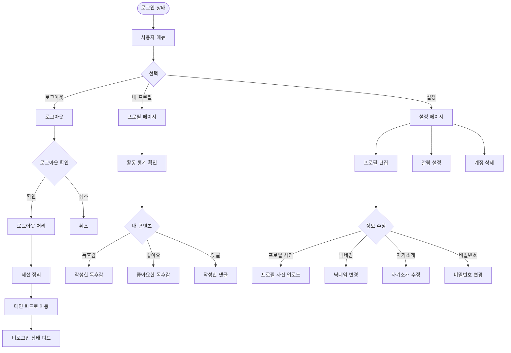
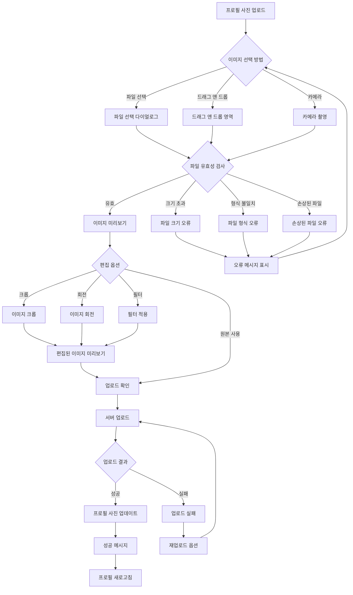
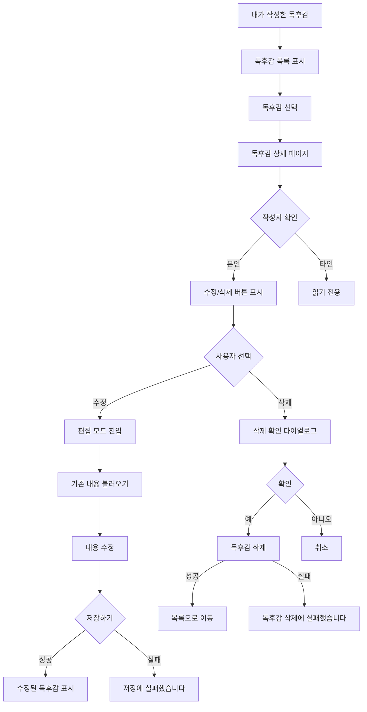
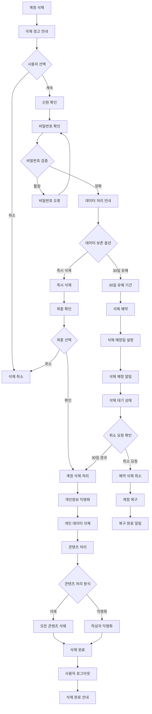

# 5. 프로필 및 활동 관리 흐름 (Profile Management Flow)

## 5-1. 프로필 관리 흐름

## 5-2. 프로필 사진 업로드 흐름

## 5-3. 독후감 수정/삭제 흐름

## 5-4. 계정 삭제 상세 흐름

## 주요 기능

### 기본 프로필 관리
- **독후감 수정**: 작성한 독후감의 내용, 태그, 추천 여부 수정 가능
- **독후감 삭제**: 삭제 확인 후 영구 삭제
- **소유권 확인**: 본인이 작성한 독후감만 수정/삭제 가능
- **안전한 로그아웃**: 
  - 로그아웃 확인 다이얼로그로 실수 방지
  - 세션 완전 정리 후 메인 피드로 복귀
  - 비로그인 상태에서도 콘텐츠 탐색 가능

### 프로필 사진 시스템
- **업로드 방식**: 파일 선택, 드래그 앤 드롭, 카메라 촬영
- **파일 제한**: 
  - 최대 크기: 5MB
  - 지원 형식: JPG, PNG, WebP
  - 최소 해상도: 100x100px
- **편집 기능**:
  - 정사각형 크롭 (1:1 비율)
  - 90도 단위 회전
  - 기본 필터 (밝기, 대비, 채도)
- **처리 과정**:
  - 클라이언트 리사이징 (최대 800x800)
  - 서버 최적화 및 CDN 업로드
  - 다중 크기 생성 (50px, 100px, 200px)

### 계정 삭제 시스템
- **안전장치**:
  - 다단계 확인 과정
  - 비밀번호 재확인 필수
  - 데이터 처리 방식 안내
- **유예 기간**: 
  - 30일 복구 가능 기간
  - 예약 삭제 취소 옵션
  - 삭제 예정 안내 알림
- **데이터 처리**:
  - 개인정보 즉시 익명화
  - 작성 콘텐츠 선택적 보존/삭제
  - GDPR 및 개인정보보호법 준수
- **복구 옵션**:
  - 30일 내 계정 복구 가능
  - 원클릭 복구 링크 제공
  - 복구 완료 알림

### 내 독후감 접근 경로
- **메인 메뉴**: 사용자 메뉴 → 내 프로필 → 내 콘텐츠 → 독후감
- **본인 프로필**: 다른 플로우에서 본인 프로필 진입 시 내 콘텐츠 섹션 표시
- **독후감 작성 후**: 독후감 상세 페이지 → "내 독후감 보기" 버튼
- **소셜 상호작용**: 피드에서 본인 프로필 클릭 → 내 콘텐츠 바로 표시