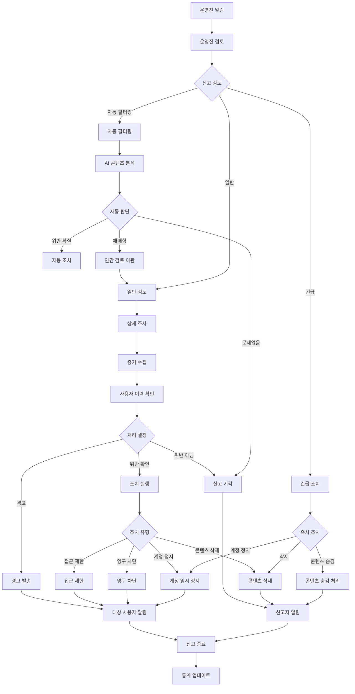
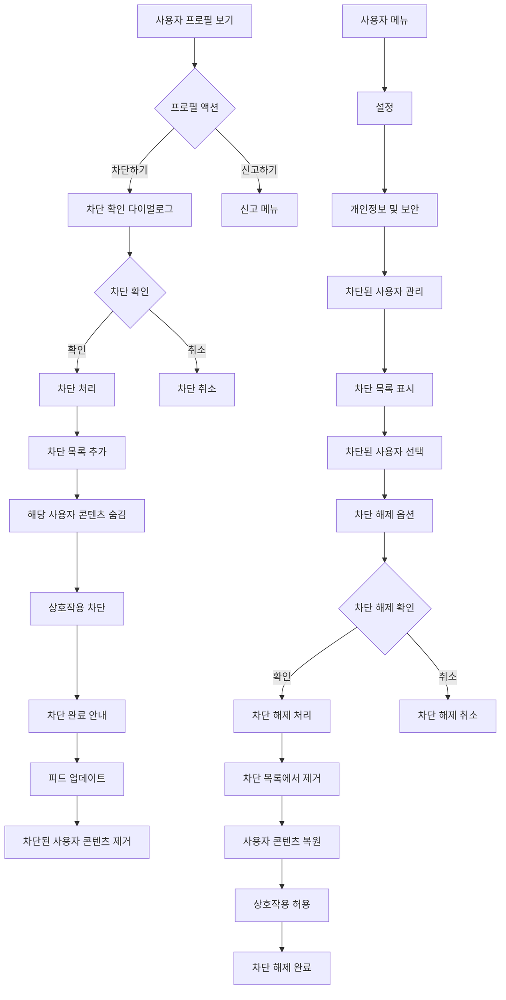
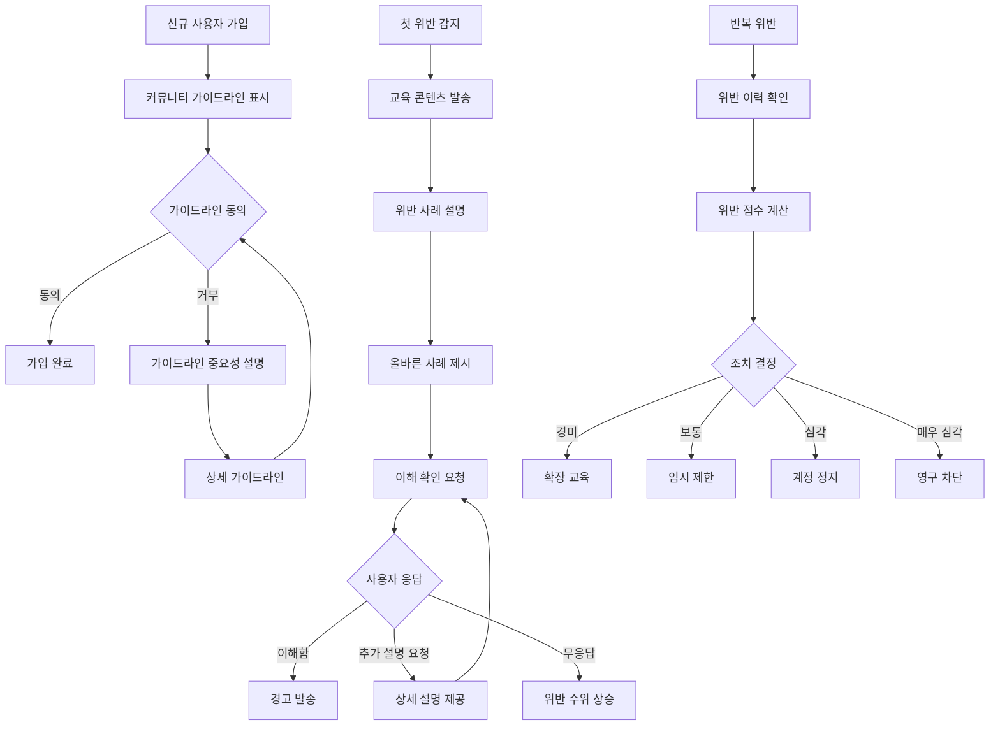

# 11. 커뮤니티 안전 및 신고 시스템 (Safety & Reporting Flow)

## 11-1. 신고 기능 흐름

```mermaid
flowchart TD
    ContentView[콘텐츠 보기] --> UserAction{사용자 액션}
    UserAction -->|신고 버튼 클릭| ShowReportMenu[신고 메뉴 표시]
    UserAction -->|더보기 메뉴| MoreOptions[더보기 옵션]
    
    MoreOptions --> ReportOption[신고하기 옵션]
    ReportOption --> ShowReportMenu
    
    ShowReportMenu --> ReportTypes{신고 유형 선택}
    ReportTypes -->|스팸/광고| SpamReport[스팸/광고 신고]
    ReportTypes -->|부적절한 콘텐츠| InappropriateContent[부적절한 콘텐츠]
    ReportTypes -->|괴롭힘/폭언| HarassmentReport[괴롭힘/폭언 신고]
    ReportTypes -->|저작권 침해| CopyrightReport[저작권 침해 신고]
    ReportTypes -->|가짜 정보| FakeInfoReport[가짜 정보 신고]
    ReportTypes -->|기타| OtherReport[기타 신고]
    
    SpamReport --> ReportDetails[신고 상세 내용]
    InappropriateContent --> ReportDetails
    HarassmentReport --> ReportDetails
    CopyrightReport --> CopyrightDetails[저작권 상세 정보]
    FakeInfoReport --> ReportDetails
    OtherReport --> CustomReportDetails[사용자 정의 신고 내용]
    
    ReportDetails --> OptionalDescription[추가 설명 (선택)]
    CopyrightDetails --> CopyrightEvidence[저작권 증빙 자료]
    CustomReportDetails --> RequiredDescription[상세 설명 (필수)]
    
    OptionalDescription --> SubmitReport[신고 제출]
    CopyrightEvidence --> SubmitReport
    RequiredDescription --> SubmitReport
    
    SubmitReport --> ValidateReport{신고 유효성 검증}
    ValidateReport -->|유효| SaveReport[신고 DB 저장]
    ValidateReport -->|무효| ShowValidationError[유효성 오류]
    
    SaveReport --> NotifyModerators[운영진 알림]
    NotifyModerators --> ShowReportConfirmation[신고 접수 확인]
    ShowReportConfirmation --> UpdateReportStatus[신고 상태 업데이트]
    
    ShowValidationError --> ReportTypes
```

## 11-2. 신고 처리 및 관리자 검토 흐름



## 11-3. 사용자 차단 기능 흐름



## 11-4. 커뮤니티 가이드라인 및 교육 흐름



## 주요 기능

### 신고 시스템
- **신고 유형**:
  - 스팸/광고: 홍보성 콘텐츠, 반복적 게시물
  - 부적절한 콘텐츠: 선정적, 폭력적, 혐오 표현
  - 괴롭힘/폭언: 개인 공격, 악성 댓글
  - 저작권 침해: 무단 복제, 표절
  - 가짜 정보: 허위 사실, 오해의 소지가 있는 정보
  - 기타: 사용자 정의 신고 사유

- **신고 처리**:
  - 24시간 내 1차 검토
  - 중요도에 따른 우선순위 처리
  - AI 자동 필터링 + 인간 검토
  - 신고자/대상자 모두에게 처리 결과 통보

### 사용자 차단 기능
- **차단 효과**:
  - 차단된 사용자의 모든 콘텐츠 숨김
  - 상호 팔로우, 좋아요, 댓글 불가
  - 검색 결과에서 제외
  - 알림 차단

- **차단 관리**:
  - 설정에서 차단 목록 확인
  - 언제든 차단 해제 가능
  - 차단 사유 기록 (선택사항)

### 교육 및 예방
- **신규 사용자 교육**:
  - 가입 시 커뮤니티 가이드라인 필수 확인
  - 주요 규칙 요약 및 예시 제공
  - 건전한 독서 커뮤니티 문화 안내

- **위반 대응**:
  - 1차 위반: 교육 콘텐츠 + 경고
  - 2차 위반: 임시 기능 제한 (7일)
  - 3차 위반: 계정 정지 (30일)
  - 심각한 위반: 즉시 영구 차단

### 운영진 도구
- **신고 관리 대시보드**:
  - 실시간 신고 현황
  - 우선순위별 정렬
  - 처리 상태 추적
  - 통계 및 분석

- **자동화 시스템**:
  - AI 기반 콘텐츠 분석
  - 스팸 패턴 자동 감지
  - 반복 위반자 자동 플래그
  - 대량 신고 알림

### 투명성 및 이의제기
- **처리 과정 투명성**:
  - 신고 접수 알림
  - 검토 중 상태 안내
  - 처리 결과 상세 통보

- **이의제기 시스템**:
  - 조치에 대한 이의제기 가능
  - 재검토 요청 절차
  - 독립적인 검토 과정