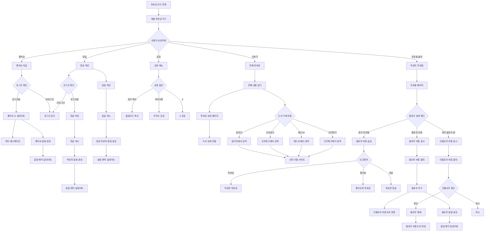
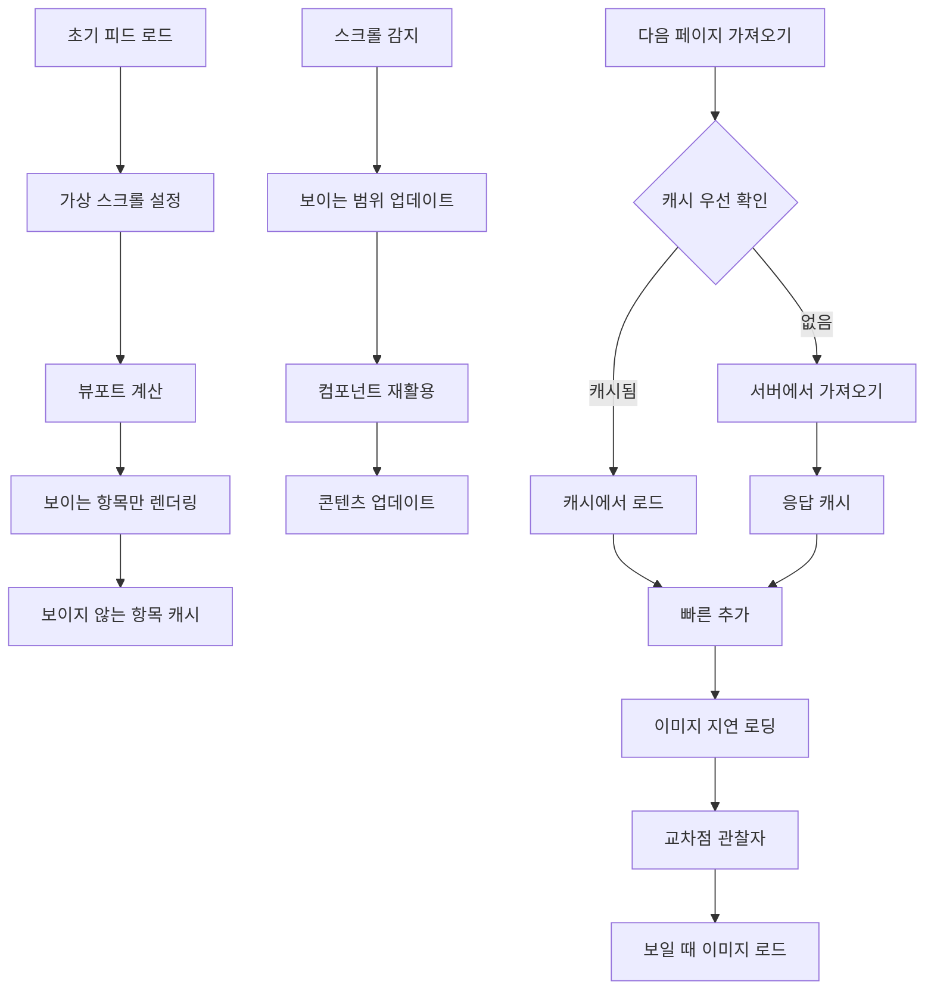

# 4. 피드 탐색 및 소셜 상호작용 흐름 (Social Interaction Flow)

## 4-1. 피드 탐색 및 무한 스크롤 흐름

```mermaid
flowchart TD
    Start([사용자 접속]) --> MainFeed[메인 피드 페이지]
    
    MainFeed --> FeedTabs{피드 탭 선택}
    FeedTabs -->|추천| RecommendedFeed[추천 피드]
    FeedTabs -->|최신| LatestFeed[최신 피드]
    FeedTabs -->|팔로잉| FollowingFeed[팔로잉 피드]
    
    RecommendedFeed --> AlgorithmSort[알고리즘 기반 정렬]
    AlgorithmSort --> CalculateScore[추천 점수 계산]
    CalculateScore --> PopularContent[인기 독후감 우선 표시]
    
    LatestFeed --> TimeSort[작성 시간 기준 정렬]
    TimeSort --> RecentContent[최신 독후감 표시]
    
    FollowingFeed --> CheckFollowing{팔로우 확인}
    CheckFollowing -->|팔로우 있음| FollowingContent[팔로우한 사용자 독후감]
    CheckFollowing -->|팔로우 없음| EmptyState[팔로우 추천]
    
    PopularContent --> LoadInitialFeed[초기 피드 로드]
    RecentContent --> LoadInitialFeed
    FollowingContent --> LoadInitialFeed
    EmptyState --> SuggestUsers[사용자 추천]
    SuggestUsers --> LoadInitialFeed
    
    LoadInitialFeed --> DisplayFirstPage[첫 페이지 표시 (20개)]
    DisplayFirstPage --> SetupInfiniteScroll[무한 스크롤 설정]
    
    SetupInfiniteScroll --> ScrollDetection[스크롤 감지]
    ScrollDetection --> CheckScrollPosition{스크롤 위치 확인}
    
    CheckScrollPosition -->|하단 근접| TriggerLoad[다음 페이지 로드]
    CheckScrollPosition -->|상단/중간| ContinueScrolling[스크롤 계속]
    
    TriggerLoad --> ShowLoadingIndicator[로딩 표시]
    ShowLoadingIndicator --> FetchNextPage[다음 20개 가져오기]
    
    FetchNextPage --> CheckLoadResult{로드 결과}
    CheckLoadResult -->|성공| AppendToFeed[피드에 추가]
    CheckLoadResult -->|실패| ShowLoadError[로드 오류]
    CheckLoadResult -->|끝| ShowEndMessage[더 이상 없음]
    
    AppendToFeed --> HideLoadingIndicator[로딩 숨김]
    HideLoadingIndicator --> ScrollDetection
    
    ShowLoadError --> RetryOption[재시도 옵션]
    RetryOption --> FetchNextPage
    
    ShowEndMessage --> DisableInfiniteScroll[무한 스크롤 비활성화]
    DisableInfiniteScroll --> StaticFeed[정적 피드 상태]
    
    ContinueScrolling --> ScrollDetection
    
    DisplayFirstPage --> FilterOptions{필터 옵션}
    FilterOptions -->|검색 버튼| SearchPage[통합 검색 페이지]
    FilterOptions -->|필터 버튼| AdvancedFilter[고급 필터]
    
    AdvancedFilter --> GenreFilter[장르별 필터]
    GenreFilter --> ReloadFeedWithFilter[필터 적용 피드 재로드]
    ReloadFeedWithFilter --> LoadInitialFeed
```

## 4-2. 소셜 상호작용 흐름



## 4-3. 피드 성능 최적화 흐름



## 주요 기능

### 피드 구조
- **3단계 피드 구조**: 
  - **추천**: 알고리즘 기반 인기 독후감 (비로그인/신규 사용자 최적)
  - **최신**: 시간순 정렬로 새로운 콘텐츠 발견
  - **팔로잉**: 개인화된 피드 경험

### 무한 스크롤 시스템
- **페이지네이션**: 페이지당 20개 항목
- **트리거 포인트**: 하단 200px 지점에서 로딩 시작
- **로딩 상태**: 스켈레톤 UI로 로딩 표시
- **오류 처리**: 네트워크 오류 시 재시도 옵션
- **끝점 처리**: 더 이상 콘텐츠가 없을 때 명확한 안내
- **성능 최적화**:
  - 가상 스크롤로 DOM 노드 수 제한
  - 이미지 지연 로딩
  - 컴포넌트 재활용으로 메모리 사용량 최적화

### 선택적 장르 필터링
- 메인 피드는 심플하게 유지
- 고급 필터에서 장르별 세분화
- 소설, 에세이, 자기계발, 과학, 기타 등

### 점진적 개인화
- 비로그인도 콘텐츠 탐색 가능
- 상호작용 시점에서 로그인 유도
- 팔로우 기능은 선택사항

### 안전한 도서 구매 연결
- 사용자 임의 링크 대신 신뢰 서점 자동 검색
- 알라딘, 교보문고, 예스24, 인터파크 지원
- 스미싱/피싱 위험 완전 차단
- 여러 서점 가격 비교 가능

## 추천 알고리즘 상세 (추천 탭)

### Phase 1: 가중치 기반 점수 시스템
```
추천점수 = 품질점수 × 시간가중치 × 다양성보너스

품질점수 = (좋아요 × 3) + (댓글 × 2) + (조회수 × 0.1) + (공유 × 5)
시간가중치 = 1 / (1 + 경과시간(일) × 0.5)
다양성보너스 = 동일책/저자 중복 시 0.7, 아니면 1.0
```

### Phase 2: 개인화 추가 (로그인 사용자)
```
개인화점수 = 팔로우사용자보너스(+10) + 선호장르보너스(+5) + 읽은책유사도(+3)
최종점수 = 추천점수 + 개인화점수
```

### Phase 3: 머신러닝 기반 (향후)
- 사용자 행동 패턴 학습 (클릭, 체류시간, 스크롤 속도)
- 협업 필터링 (유사 취향 사용자 기반)
- 콘텐츠 기반 필터링 (장르, 저자, 키워드 유사도)

### 성능 지표
- **참여도**: 좋아요/댓글 비율 >5%
- **체류시간**: 피드 평균 체류시간 >3분
- **클릭률**: 독후감 클릭률 >15%
- **다양성**: 상위 10개 중 서로 다른 책 비율 >70%